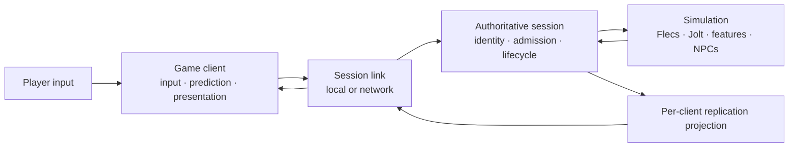

# Incinerator Multiplayer-First Architecture and Delivery Plan

**Status:** MP0-MP6, M4-M6, S10-S11, IV0-IV5, IC5, the open-world
corrective, and S12 automated destination-navigation acceptance are
implemented on Apple Silicon macOS. The S12 human walkthrough remains before
S13; public Internet, Steamworks, hosting, and MMO services remain deferred.

**Last reviewed:** 2026-07-28

**Current platform:** Apple Silicon macOS only

**Architecture health record:** [`ARCHITECTURE_REVIEW.md`](ARCHITECTURE_REVIEW.md)

**Main roadmap:** [`OVERHAUL_PLAN.md`](OVERHAUL_PLAN.md)

**Current phase sequence:**
[`M6 accepted`](docs/validation/m6-transactional-authority-cycle.md)
→ [`MP6 accepted`](docs/validation/mp6-playable-multiplayer-room-flow.md)
→ [`S10 accepted`](docs/validation/s10-damage-death-respawn.md)
→ [`S11 accepted`](docs/validation/s11-npc-encounter-combat-response.md)
→ [`post-S11 manual findings`](docs/validation/post-s11-runtime-corrective-audit.md)
→ [`IV0-IV5 accepted`](docs/validation/gameplay-interaction-validation-and-observability.md)
→ [`IC5 accepted`](docs/validation/human-test-incident-capture.md)
→ [`open-world corrective complete`](docs/design/open-world-spatial-diagnostics-and-playability.md)
→ [`S12 automated acceptance complete; human walkthrough pending`](docs/validation/s12-destination-driven-navigation.md)

**Accepted decisions:**
[ADR-016](docs/adr/016-authority-session-topology.md),
[ADR-017](docs/adr/017-network-identity-protocol-and-replication.md),
[ADR-018](docs/adr/018-gamenetworkingsockets-and-steam-compatible-routing.md),
[ADR-019](docs/adr/019-authoritative-npc-encounter-and-replacement.md),
and [ADR-020](docs/adr/020-gameplay-interaction-validation-and-observability.md)

## Purpose

Incinerator is more likely to be a multiplayer-first sandbox in which a player
may play alone, host or join an invite/party/room instance, and eventually
connect to dedicated or more persistent authority. Multiplayer therefore
cannot remain a late adapter added after most gameplay semantics are fixed.

This plan establishes the minimum authoritative-session architecture early so
future gameplay features are designed with explicit authority, request,
validation, replication, prediction, and persistence semantics. It does not
attempt to build every online service before the game.

## Program Objective

Deliver one game architecture with three placements:

1. **Solo:** a graphical client connects through a typed local link to an
   embedded authoritative session.
2. **Listen/invite:** one process co-locates the hosting player's client and
   authority; remote players connect through a network link.
3. **Dedicated instance:** the existing cold headless product evolves into the
   same authority without a local player, renderer, or editor.

The placement may differ. The source of truth, validation rules, feature
commands, fixed-tick simulation, persistence, and replication semantics may
not.



## Accepted Initial Product Contract

These are the accepted starting constraints. Quantitative evidence may revise
rates and budgets through an explicit plan/ADR update; implementation may not
silently replace the topology or source-of-truth model.

| Concern | Accepted initial contract |
|---|---|
| Session shape | Invite-based 2-8 player room/instance; validate a technical ceiling of 16 participants |
| Authority | Server-authoritative in every mode |
| Solo | Embedded authority through a local typed link |
| Listen host | MP6 accepts a constrained localhost/LAN private-room placement; public Internet/Steam/NAT productization remains later with explicit host trust/performance limits |
| Dedicated | Canonical public topology and first real network proof; provider independent |
| Join model | Join-in-progress plus bounded disconnect/reconnect |
| Host exit | Session ends cleanly; authority may create a canonical capture and the persistence owner owns any durable commit; no host migration initially |
| Persistence | Authority-owned canonical snapshot source plus a server-side persistence owner; no distributed account/world persistence initially |
| Simulation | Start at 60 Hz authority/gameplay, 20 Hz prioritized replication, and client render/prediction up to 120 Hz; measure and revise explicitly |
| Client responsiveness | Predict the local character and locally controlled vehicle; interpolate other replicated entities |
| Physics | Server authoritative; no peer lockstep or cross-machine Jolt determinism claim |
| Relevance | Spatial/district cells plus semantic dependencies and per-client entity/byte budgets |
| Compatibility | Exact protocol, build, and logical-content cohort; no mixed-version session initially |
| Transport | Open-source GameNetworkingSockets flat C API; direct IP first |
| Steam | Optional Steamworks flat-API adapter for identity, P2P, SDR, and hosted-server tickets; never gameplay authority |
| Platform/services | Apple Silicon macOS architecture proof; hosting provider, Linux deployment, orchestration, and non-Steam P2P remain deferred |

### Placement, route, and identity are separate

| Concern | Initial values |
|---|---|
| Authority placement | `embedded`, `listen`, `dedicated` |
| Connection route | `local`, `direct_ip`, `steam_p2p`, `steam_sdr` |
| Identity provider | `development`, `steam`, future engine/account identity |

P2P describes how a guest reaches a listen authority. It never changes the
single-writer server-authority model. A dedicated authority may run locally,
on a community machine, on a rented host, or in a later managed fleet; this
plan does not equate dedicated placement with a proprietary cloud vendor.

The current development identity is self-declared and unauthenticated. MP2
therefore binds loopback unless `--allow-remote` is explicitly selected for a
trusted development network. Public exposure requires a later admitted ticket/
identity provider; transport encryption alone is not authorization.

## Source-of-Truth Model

| State or decision | Authority | Client responsibility |
|---|---|---|
| World tick and time | Server session | Estimate presentation time and buffer snapshots |
| Character/NPC/vehicle physics | Server simulation | Predict only explicitly supported local motion; reconcile |
| Spawn/despawn | Server features | Create/remove replicated presentation state from admitted snapshots/events |
| Vehicle driver and carry ownership | Server features | Request transitions and display confirmed/predicted feedback |
| District logical residency | Server simulation | Maintain relevant visual residency requested by replicated state/content |
| NPC goals and behavior | Server NPC feature | Interpolate/present relevant NPC state |
| Durable save | Authority snapshot source plus persistence owner | Never commit canonical world state |
| Party/lobby membership | Lobby/session service | UI and connection discovery; not gameplay authority |
| Camera, graphics, audio, local UI | Client | Local and non-authoritative |
| Prediction history | Client | Disposable bounded approximation |
| Replication baseline | Server per connection, mirrored by client | Acknowledge and discard when superseded |

## Target Boundaries

The exact file layout will be pulled by implementation, but responsibility
should converge toward:

```text
src/
  engine/
    kernel/                 fixed schedule, IDs, diagnostics, bounded mechanics
    contracts/              physics, rendering, persistence, session primitives

  features/
    character/
      root.zig              narrow feature API
      authority.zig         components and systems
      persistence.zig       durable logical records
      replication.zig       explicit network projection and client commands
    ...

  session/
    protocol.zig            versioned bounded semantic messages
    identity.zig            session/connection/player/replicated IDs
    authority.zig           join, admission, sequencing, routing, lifecycle
    replication.zig         per-client baselines, relevance, snapshot assembly
    local_link.zig          in-process typed delivery

  client/
    session.zig             connection state and protocol ownership
    replicated_world.zig    non-authoritative client state
    prediction.zig          bounded local prediction/reconciliation
    interpolation.zig       remote presentation timeline

  adapters/
    transport/              local link and open-source GNS direct-IP adapter
    lobby/                  optional Steam/platform service integration

  hosts/
    client.zig              graphical game client
    listen.zig              client plus embedded authority composition
    dedicated.zig           cold authority process
    local_solo.zig          client plus embedded authority/local link
```

This is a responsibility map, not permission to create empty framework
directories or a runtime plugin system. The optional Steamworks implementation
belongs to the separately licensed game or another optional integration
package, not the mandatory open-engine/cold-authority source closure.

## Protocol and Identity Principles

### Identity layers

Do not overload one ID across lifetimes:

- **PersistentId:** durable logical identity inside admitted world state.
- **AccountId:** durable engine/game player identity mapped from an external
  provider such as Steam when required.
- **External identity:** authentication/discovery input; never an entity or
  authority handle.
- **RuntimeId:** process-local authority lookup; never serialized or sent.
- **SessionId:** one admitted authority session/instance.
- **ParticipantId:** one logical joined player for the session.
- **ConnectionId:** one generational live connection; reconnect may replace it.
- **ReplicatedEntityId:** server-issued, generational, connection-visible entity
  reference; it may map to a persistent entity without exposing storage policy.
- **InputSequence / ActionSequence / SnapshotSequence:** independent bounded
  ordered input, reliable gameplay-transaction, and state-update streams.

Platform account or Steam IDs are authentication/discovery inputs. They are
not ECS IDs or direct authority handles.

### Message classes

The first protocol should be small and semantic:

- handshake/admission and exact cohort rejection;
- join/leave/reconnect lifecycle;
- tick-addressed player input;
- command acknowledgement/rejection;
- initial relevant state;
- incremental authoritative state;
- ownership and important lifecycle events;
- snapshot/baseline acknowledgement;
- graceful disconnect and authority stop.

Transport reliability is selected per message class. Reliable delivery does
not make stale gameplay input useful; unreliable delivery does not permit
unbounded loss or ambiguous ownership.

### Feature-owned replication

There is no automatic Flecs-component replication. Each participating feature
defines the minimum semantic client request, server validation, replicated
record, event, and prediction policy it needs. Private components, runtime IDs,
backend handles, allocator state, and opaque Jolt state never cross the
protocol.

## Persistence, Replication, and Replay

Three schemas remain distinct:

1. **Durable snapshot:** complete canonical logical authority for healthy
   restart.
2. **Replication snapshot:** per-client relevant approximation optimized for a
   short baseline and network budget.
3. **Accepted-ingress replay:** exact-cohort evidence of what the authority
   admitted, when, and for which participant/sequence.

Replication may use quantized poses, sparse changes, per-feature rates, and
district relevance. Durable state must not inherit those losses. Replay records
semantic admission after decode/authentication and before authority mutation;
raw encrypted packets are transport evidence, not the canonical gameplay log.

## Delivery Roadmap

### MP0 — Strategy, Decisions, and Budgets

**Status:** Complete for the initial architecture contract. These are bounded
starting ceilings and validation profiles, not production Internet claims.

**Outcome:** Product assumptions and architectural decisions are explicit
enough to implement one bounded multiplayer slice without silently committing
to MMO services or a generic replication framework.

- [x] Record the current architecture assessment and weakness register.
- [x] Draft this multiplayer-first program and staged acceptance model.
- [x] Record accepted authority-topology, protocol/replication, and transport
  ADRs.
- [x] Link the strategy from the main roadmap and README.
- [x] Confirm initial player count, host/dedicated expectations, host-exit
  behavior, persistence lifetime, and cheating/fairness tolerance.
- [x] Require join-in-progress and bounded reconnect.
- [x] Select open-source GameNetworkingSockets through its flat C API.
- [x] Select direct IP/loopback as the first remote route and dedicated
  authority as the first real network proof.
- [x] Preserve Steam networking compatibility through a later optional
  Steamworks flat-API adapter without requiring Steam in the open engine.
- [x] Keep listen/Steam P2P as an optional later private topology, not shared
  peer authority or the canonical public product.
- [x] Establish initial RTT, jitter, loss, bandwidth, snapshot-rate, correction,
  command, and per-client memory budgets.
- [x] Accept ADR-016, ADR-017, and ADR-018.

#### MP0 acceptance

- [x] Every source-of-truth category has exactly one owner.
- [x] Solo/listen/dedicated placement and the one-world constraint are explicit.
- [x] Durable, replication, prediction, and replay state are not conflated.
- [x] Deferred services and security nonclaims are explicit.
- [x] The first networked vertical slice has measurable limits and failure
  policy.

### MP1 — Client/Authority Separation and Local Session

**Status:** The character slice, ownership seam, and M5 whole-gameplay embedded
cohesion are accepted. M5 removes the historical separate dispatcher, direct
vehicle/carry bypasses, and graphical save-slot ownership. See
[`docs/design/m5-client-authority-cohesion.md`](docs/design/m5-client-authority-cohesion.md).

**Outcome:** The existing solo sandbox runs as a graphical client connected to
one embedded authority through a typed local link. No network socket is needed,
but direct client-to-`Simulation` mutation is removed.

- [x] Introduce explicit authority-session and graphical-client owners.
- [x] Complete M5 acceptance for authoritative `Simulation` and feature-output
  routing behind the session owner, with only a quiescence-checked snapshot
  source exposed to the durable persistence owner.
- [x] Add a bounded typed local link with the same semantic message/admission
  shapes intended for remote use.
- [x] Route character player input through participant identity, sequence, eligibility,
  validation, and typed results.
- [x] Add a non-authoritative replicated client state and presentation timeline.
- [x] Split `App` into cohesive graphical, streaming, developer, and embedded
  authority owners as pulled by the new boundary.
- [x] Complete M5 acceptance for the extracted canonical value/snapshot
  boundaries and the deliberately retained live-authority responsibilities,
  without widening the authority surface.
- [x] Keep validation composition separate and preserve the product/validation
  binary boundary and complete Debug suite.

#### MP1 acceptance

- [x] Solo behavior, save/restart, replay, diagnostics, editor, streaming, and
  presentation pass through the new topology.
- [x] The graphical client cannot access Flecs, Jolt authority, private feature
  state, or save-slot commit directly.
- [x] Local character delivery cannot bypass remote-equivalent admission or sequencing.
- [x] The authority remains usable headlessly and retains one world/owner.
- [x] The local-session path has no transport, lobby SDK, account system, or
  generic message bus dependency.

### MP2 — Two-Client Localhost Authority Slice

**Status:** Implemented and audited for the bounded character slice. MP3 has
delivered prediction and impaired-link acceptance; MP4 owns replication
baselines, relevance, and the remaining gameplay features.

**Outcome:** Two graphical clients join one authoritative macOS server over
open-source GameNetworkingSockets direct IP, control separate characters,
observe each other, disconnect, and reconnect under one versioned protocol.

- [x] Integrate the narrow open-source GNS flat-C/direct-IP adapter selected by
  ADR-018.
- [x] Add bounded handshake and exact build/content/protocol admission.
- [x] Add session, participant, connection, replicated-entity, input, and
  snapshot identities with stale/generation rejection.
- [x] Spawn and assign two server-authoritative characters.
- [x] Send sequenced tick-addressed character input, not client poses.
- [x] Send initial relevant state and periodic authoritative snapshots.
- [x] Interpolate remote character presentation separately from local
  simulation interpolation.
- [x] Define disconnect, timeout, reconnect, and participant replacement.
- [x] Export connection, queue, snapshot-age, bandwidth, and rejection
  diagnostics.

#### MP2 acceptance

- [x] Two clients connect to the cold authority and receive distinct ownership.
- [x] The server alone creates and mutates canonical character state.
- [x] Join-in-progress constructs a valid GPU-independent relevant state before
  presentation begins.
- [x] Duplicate, stale, malformed, oversized, mismatched, and unauthorized
  messages fail without partial authority mutation.
- [x] Disconnect/reconnect leaves no leaked participant, entity, queue,
  baseline, or transport owner.
- [x] Dedicated authority links no renderer, editor, visual assets, or lobby SDK.

### MP2.1 — Transport Lifecycle Stabilization

**Status:** Complete.

**Detailed design:**
[`docs/design/mp2-1-transport-lifecycle.md`](docs/design/mp2-1-transport-lifecycle.md)

**Outcome:** Recoverable loss retries sanely while rejection and deliberate
authority shutdown terminate cleanly, independent of render cadence.

- [x] Replace frame-count retry with monotonic capped exponential backoff and
  deterministic jitter.
- [x] Deliver explicit reliable authority-stop semantics before transport
  closure and prevent terminal reconnect loops.
- [x] Re-anchor authority/input time on each welcome without catch-up traffic.
- [x] Add pure retry/shutdown tests and retain the real-GNS proof.

### MP3 — Prediction, Reconciliation, and Network Faults

**Status:** Complete and accepted for the bounded on-foot character slice.

**Acceptance evidence:**
[`docs/validation/mp3-acceptance.md`](docs/validation/mp3-acceptance.md)

**Detailed design:**
[`docs/design/mp3-prediction-and-fault-harness.md`](docs/design/mp3-prediction-and-fault-harness.md)

**Outcome:** The locally controlled character remains responsive while the
server retains authority under bounded latency, jitter, loss, duplication, and
reordering.

- [x] Add bounded client input history and local character prediction.
- [x] Acknowledge the last processed input in authoritative snapshots.
- [x] Reconcile and reapply eligible unacknowledged input without treating
  predicted state as authority.
- [x] Define teleport/hard-correction and smoothing thresholds.
- [x] Add per-connection command quotas, stale windows, overflow, and timeout
  policy.
- [x] Pace accumulated GNS input catch-up at the listen/dedicated adapter by
  authority tick; leave excess messages queued and retain the authority quota
  as the untrusted-ingress boundary.
- [x] Add deterministic impaired-link tests and three-run latency/bandwidth/
  correction budgets.
- [x] Extend flight recording to accepted participant/sequence/tick ingress and
  first logical divergence.
- [x] Expose RTT, jitter, loss, reorder, snapshot age, prediction error,
  correction count, and queue pressure.

#### MP3 acceptance

- [x] The character is playable within the accepted impairment envelope.
- [x] A malicious or buggy client cannot set transforms, identities, ownership,
  tick completion, NPC goals, or durable state directly.
- [x] Prediction converges to authority and cannot survive an ownership loss.
- [x] Saturation is bounded and observable; accepted authority outcomes are not
  lost.
- [x] Accepted-ingress replay reproduces the first divergent authority category
  within the exact cohort.

### MP4 — Feature Replication and District Interest

**Status:** Complete. MP4-A through MP4-E and the architecture closeout gate
are accepted.

**Detailed sequence:**
[`docs/design/mp4-feature-replication-sequence.md`](docs/design/mp4-feature-replication-sequence.md)

**Latest acceptance evidence:**
[`docs/validation/mp4-architecture-closeout.md`](docs/validation/mp4-architecture-closeout.md)

**Outcome:** Vehicle, interaction, district, and NPC semantics work through the
same server authority with explicit per-feature replication and bounded
district relevance.

- [x] Add server-authoritative vehicle enter/drive/exit, dynamic seat
  ownership, reconnect retention, graphical presentation, deterministic fault
  evidence, and mixed-ingress replay.
- [x] Implement bounded owned-vehicle prediction/reconciliation with a 200 ms
  horizon, measured correction limits, lifecycle resets, live graphical A/B,
  and no second Flecs/Jolt world.
- [x] Replicate carry/drop requests, outcomes, and ownership transitions.
- [x] Use district ownership/residency as the first relevance partition.
- [x] Replicate relevant NPC state at a measured rate without exposing NPC
  internals or making clients authoritative for AI.
- [x] Define reliable vehicle lifecycle versus replaceable vehicle-state/input
  message classes; repeat the decision per later feature.
- [x] Bound per-client entities, bytes, snapshots, events, and baseline memory.
- [x] Exercise save/restart, join-in-progress, reconnect, district transfer, and
  unload while clients are present.

#### MP4 acceptance

- [x] Character and vehicle seat ownership remain consistent under impairment,
  stale input, contention, reconnect, exit, and replay.
- [x] Interaction, district, and NPC ownership/relevance remain consistent
  under impairment and stale client input.
- [x] Irrelevant districts/entities do not consume unbounded per-client state.
- [x] Join/reconnect restores relevant state without sending durable-save bytes
  or backend handles.
- [x] The vehicle slice projects explicit backend-neutral state through the
  session and remains headless-testable.
- [x] NPC completes the existing narrow interaction/district projections.

### MP5 — Invite, Party, and Room Experience

**Status:** Open-engine room/admission scope complete. The separately supplied
Steamworks adapter and listen/P2P productization remain explicit product
integrations, not open-core blockers. Design:
[`docs/design/mp5-open-room-and-admission-boundary.md`](docs/design/mp5-open-room-and-admission-boundary.md).

**Outcome:** Players can create or join an invite-based room and connect to an
optional private listen or canonical public dedicated authority without making
Steam, a lobby, or a room service the world authority.

- [x] Define the optional Steamworks flat-API identity/lobby/routing seam
  selected by ADR-018 without making it an open-engine requirement; keep the
  proprietary adapter in the separately distributed game integration.
- [x] Implement bounded create, invite, join, leave, ready, connect, and
  actionable failure state for a UI consumer.
- [x] Bind admitted platform identity to a session participant without using it
  as an ECS or replicated entity ID.
- [x] Preserve listen placement through the same authority/session boundary and
  document host advantage and trust limitations; productization remains
  deferred.
- [x] Connect to a dedicated instance through the same game protocol.
- [x] Define drain/close and durable-commit ownership; keep host migration
  deferred unless explicitly selected.
- [x] Keep proprietary service dependencies out of the cold authority and
  open-engine core unless a reviewed integration requires otherwise.

#### MP5 acceptance

- [x] An invited player reaches the correct admitted authority or receives an
  actionable failure without partial session state.
- [x] Lobby departure and network disconnect have explicit, tested, nonidentical
  semantics.
- [x] Placement paths share one gameplay protocol, join contract, and authority
  code; dedicated direct IP is the executable proof.
- [x] Service outage does not mutate or stop a healthy admitted authority.

### M4 — Multiplayer Foundation Gate

**Status:** Complete for the Apple Silicon macOS foundation scope. Evidence:
[`docs/validation/m4-multiplayer-foundation.md`](docs/validation/m4-multiplayer-foundation.md).
The previously recorded broad legacy embedded-authority administration facade
remains in MP1 and is not reclassified as complete by this network gate.

**Outcome:** New gameplay slices can be multiplayer-aware by default without
depending on unfinished online-service infrastructure.

Current evaluation-policy note: MP4 proved bounded NPC interest, but the
current six-NPC sandbox is intentionally too small to justify live culling.
Solo, listen, and dedicated placements now select explicit `full_world` NPC
publication so testing cannot confuse interest removal with gameplay
disappearance. The bounded algorithm remains available and tested for a future
population/scale phase; selecting it again requires measured entity/bandwidth
pressure and a reviewed visibility policy.

- [x] Solo runs through embedded authority and the client/session boundary.
- [x] Two clients use one authoritative server under the accepted impairment
  envelope.
- [x] Character, vehicle, interaction, district, and NPC state have explicit
  server/client semantics.
- [x] Join-in-progress and reconnect are bounded and tested.
- [x] Durable save, replication snapshots, prediction history, and replay
  evidence remain separate.
- [x] District relevance bounds per-client replicated state.
- [x] Embedded, graphical-client, dedicated, validation, and extracted package
  boundaries are independently checked; listen remains an explicitly deferred
  product placement over the same contract.
- [x] Architecture, correctness/security, protocol, performance, and docs-drift
  reviews report no unrecorded actionable P0/P1/P2 finding.

### M5 — Client/Authority Cohesion Gate

**Status:** Complete and accepted. Design:
[`docs/design/m5-client-authority-cohesion.md`](docs/design/m5-client-authority-cohesion.md).
Acceptance evidence is recorded in
[`docs/validation/m5-client-authority-cohesion.md`](docs/validation/m5-client-authority-cohesion.md).

**Outcome:** Close the deliberately retained MP1 physical and semantic cohesion
gap before adding another gameplay slice. Embedded solo must become an actual
placement of the same authority-session behavior as dedicated play, not a broad
local facade with a character-only protocol seam.

- [x] Use one embedded/dedicated authority-session behavior and remove direct
  local vehicle/carry gameplay bypasses.
- [x] Run embedded authority at 60 Hz independently of render cadence and retain
  the declared 20 Hz replication cadence.
- [x] Split graphical, streaming, developer, persistence, and authority owners
  behind narrow request/immutable-view capabilities.
- [x] Prove that canonical capture stays behind the authority-issued snapshot
  source and only the durable persistence owner can encode/commit a save slot.
- [x] Prove the real nested placement trace, four-stage authority trace, nested
  runtime phases, completed failure prefixes, and immutable first authority
  fault.
- [x] Delete the broad local forwarding facade rather than preserving obsolete
  compatibility surfaces or adding aliases for it.
- [x] Retain the complete playable M4 foundation and macOS product/validation/
  cold-authority boundaries.

M5 does not introduce Steamworks, listen/NAT productization, public services,
another platform, a generic bus, automatic ECS replication, or a second client
Flecs/Jolt world.

M5 did not claim a single atomic ingress-to-egress eight-stage authority
transaction. M6 subsequently closed that boundary; its exact evidence is in
[`M6 Transactional Authority Cycle Acceptance`](docs/validation/m6-transactional-authority-cycle.md).

### M6 — Transactional Authority Cycle

**Status:** Complete, independently reviewed, and accepted. Design:
[`docs/design/post-m5-transactional-authority-cycle.md`](docs/design/post-m5-transactional-authority-cycle.md).
Acceptance evidence is recorded in
[`docs/validation/m6-transactional-authority-cycle.md`](docs/validation/m6-transactional-authority-cycle.md).

**Outcome:** One class-reserved stable-prefix mailbox feeds eight explicit
fail-stop authority stages. Admission is preflighted; publication metadata is
double buffered; physical delivery uses generational leases; reliable control
and gameplay use application receipts plus bounded reconnect replay; durable
capture is decided at stage seven while encoding and storage remain outside the
tick. The accepted guarantee is atomic publication, not Jolt solver rollback.

### MP6 — Playable Multiplayer Room Flow

**Status:** Complete, independently reviewed, and accepted. Design:
[`docs/design/mp6-playable-multiplayer-room-flow.md`](docs/design/mp6-playable-multiplayer-room-flow.md).
Acceptance evidence is recorded in
[`docs/validation/mp6-playable-multiplayer-room-flow.md`](docs/validation/mp6-playable-multiplayer-room-flow.md).

**Outcome:** One generation-safe coordinator exposes sanitized create/join,
connect, synchronize, play, reconnect, leave, drain, and close state. A
constrained graphical listen owner composes the host protocol client over the
typed local link and a guest over real GNS; the dedicated product uses the same
ticketed graphical join lifecycle. Account-bound artifacts are bounded and
permission-restricted, stale completions are harmless, and host closure ends
the authority without migration. The developer-facing UX is accepted for this
phase; public Internet/Steam/NAT/social productization remains deferred.

### S10 — Damage, Death, And Respawn

**Status:** Complete, independently reviewed, and accepted. Design:
[`docs/design/s10-damage-death-respawn.md`](docs/design/s10-damage-death-respawn.md).
Acceptance evidence is recorded in
[`docs/validation/s10-damage-death-respawn.md`](docs/validation/s10-damage-death-respawn.md).

**Outcome:** A backend-neutral bounded vitals feature owns integer health,
deterministic damage, exactly-once death facts, and canonical state for players
and NPCs. Client melee is intent only; the authority validates sequence,
incarnation, timing, cooldown, facing, range, closest target, and Jolt
line-of-sight. Death retains the admitted participant while typed cleanup
removes its disposable physical avatar. Dead reconnect is explicit, and a
three-second cooldown plus bounded collision/threat-aware spawn selection
creates a new avatar incarnation. Two real graphical clients prove the full
cycle in constrained listen and dedicated placements.

### S11 — Playable NPC Encounter And Combat Response

**Status:** Complete, independently reviewed, and accepted. Design:
[`docs/design/s11-npc-encounter-combat-response.md`](docs/design/s11-npc-encounter-combat-response.md).
Acceptance evidence is recorded in
[`docs/validation/s11-npc-encounter-combat-response.md`](docs/validation/s11-npc-encounter-combat-response.md).

**Outcome:** An authority-owned hostile NPC perceives eligible players, selects
one deterministic target, pursues through the existing navigation owner,
telegraphs and validates melee, emits damage through the shared vitals boundary,
reacts, searches, disengages, dies, and is safely replaced with a new identity.
Clients receive visible health, hit, cooldown, death, respawn, and attack-state
feedback without owning AI decisions. Accepted solo, constrained-listen, and
dedicated gates prove the same semantics under replay, reconnect, impairment,
saturation, and the declared 64-NPC/16-participant synthetic ceiling.

The post-S11 correction keeps the automatic listen/dedicated product cohort to
six NPCs, one per authored route node, while retaining 64 only for synthetic
scale and saturation. The ordinary embedded product seeds one playable hostile
through its host-managed authority after the player and west district are
ready. A separate product-character lifecycle owner correlates NPC-caused local
death, despawn, cooldown, respawn, and new avatar projection without owning
those authority transitions. Persisted NPC routes now distinguish an exact
prefix from a deferred rebuild across inactive content. Reliable gameplay facts
enter a derived 172-publication-per-participant cycle budget and a two-cycle
344-record ledger, then drain independently beneath the 16-message
per-connection wire ceiling; an exhausted consumer is retired without faulting
the room.

The post-S11 IC5/open-world corrective is also complete and human-accepted.
Incident evidence now survives ordinary and destructive workflows, recipe-5
traversal remains open, dynamic carryables do not depend on district residency,
NPC displacement retains its current route intent through collision rebasing,
and vehicle handling has an objective real-Jolt characterization surface. S12
now proves semantic destinations, bounded replanning, topology gates,
displacement recovery, persistence/replay/fault placement, and schema-4
evidence through the same authority model. Its human walkthrough is next, not
additional transport or service infrastructure.

## Transport and Service Decision

ADR-018 selects the open-source GameNetworkingSockets flat C API and direct IP
for MP2. The selected adapter family must prove each capability when its route
enters scope:

- reliable and unreliable message classes;
- encryption/authentication integration;
- NAT traversal or relay path for invite sessions;
- connection lifecycle and generational handles;
- MTU, fragmentation, congestion, lanes/priorities, and backpressure;
- latency/loss/reordering simulation and connection statistics;
- macOS support and Zig/C integration risk;
- dedicated-server operation and deployment constraints;
- open-engine licensing versus optional proprietary game/service integration.

The open engine owns a `GnsDirectTransport`-sized integration and must build,
test, and run without Steamworks. A later `GnsSteamTransport` may use the
Steamworks flat API for Steam identities, rendezvous, P2P/SDR, and hosted-
dedicated tickets while running the same game protocol. Steam SDK material and
credentials are not vendored into the open-engine core; the separately
licensed game or optional integration package supplies them.

The common API lineage is not treated as proof that every open-source and
Steamworks binary, authentication mode, or route is interchangeable. Each
supported direct/Steam combination receives explicit lifecycle and protocol
compatibility tests.

## Security and Trust Baseline

Before any remote ingress mutates authority:

1. decode within strict byte/count limits;
2. validate protocol/build/content cohort;
3. resolve a live generational connection and participant;
4. validate message class, sequence window, ownership, state, and rate quota;
5. translate to a semantic feature/session command;
6. reserve delivery/backpressure capacity;
7. apply only at a declared authority boundary;
8. record admission/rejection evidence without logging secrets or raw
   unbounded payloads.

Transport encryption is necessary but does not make a client trusted.
Anti-cheat products, account security, abuse systems, and distributed service
hardening remain later programs.

## Explicit Deferrals

- Host migration.
- Public Internet listen-host productization; MP6 owns only a constrained
  localhost/LAN proof over local link plus direct GNS.
- Private Steam P2P remains an optional later route over the same listen
  authority semantics.
- Non-Steam P2P signaling, STUN/TURN, and relay operation.
- Public-server proxy/DDoS design and Steam hosted-dedicated SDR rollout.
- Hosting provider, containers, orchestration, Agones, and autoscaling.
- Persistent always-online worlds.
- Accounts, entitlements, commerce, social graph, and matchmaking backend.
- Distributed databases, shards, zones, orchestration, autoscaling, and MMO
  operations.
- Competitive anti-cheat and moderation platforms.
- Cross-platform clients or Linux dedicated deployment.
- Mixed-version protocol compatibility or schema migrations.
- Peer authority, peer lockstep, rollback of the complete Jolt world, or
  cross-platform deterministic physics.
- Voice, chat, user-generated content, patching, CDN, and live-ops analytics.
- A generic RPC system, generic ECS replication, or runtime plugin ABI.

## Reference Influences

- [Unreal's authoritative client/server and listen/dedicated model](https://dev.epicgames.com/documentation/unreal-engine/setting-up-dedicated-servers-in-unreal-engine)
  is a useful comparison for authority placement and the fairness/operational
  distinction between listen and dedicated servers.
- [Steam matchmaking and lobbies](https://partner.steamgames.com/doc/features/multiplayer/matchmaking?language=english)
  demonstrate that party/discovery state may lead players to either a nominated
  host or game server without becoming gameplay authority.
- [Steam Networking](https://partner.steamgames.com/doc/features/multiplayer/networking)
  and the open-source
  [GameNetworkingSockets project](https://github.com/ValveSoftware/GameNetworkingSockets)
  provide the selected transport family and optional Steam service path with
  reliable/unreliable delivery, encryption, relay/NAT, impairment, and
  statistics—but not entity replication or game authority.

## Post-M4 Delivery Sequence

1. **M5 client/authority cohesion — complete and accepted.** The embedded-solo
   facade, authority-clock, direct gameplay, persistence ownership, and physical
   owner boundaries are closed without adding a new gameplay mechanic.
2. **M6 transactional authority cycle — complete and accepted.** The
   mailbox/publication pressure point is closed with class-reserved ingress,
   preflighted semantic work, immutable derivative preparation, atomic
   publication, generational delivery leases, per-reliable-lane application
   receipts, and queued durable decisions. M6 provides a fail-stop
   atomic-publication guarantee, not rollback of an already-stepped Jolt world.
3. **MP6 playable room flow — complete and accepted.** One generation-safe
   graphical coordinator now drives create/join, ready, connect,
   synchronization, actionable rejection, leave, reconnect, drain, and close.
   The constrained localhost/LAN listen owner composes a host local-link client
   and a guest GNS client on one authority, while dedicated direct IP retains
   the same signed-ticket client lifecycle. Steamworks, NAT/relay, public
   hosting, and host migration remain deferred.
4. **S10 damage/death/respawn — complete and accepted.** Feature-owned integer
   vitals, server-derived melee damage, exactly-once death, typed
   vehicle/carry/character cleanup, stable participant ownership of a
   generational disposable avatar, deterministic safe explicit respawn, dead
   reconnect, reliable result replay, and two-client graphical listen/
   dedicated evidence are closed. Firearms, authoritative ragdolls, and lag
   compensation remain later slices.
5. **S11 NPC encounter/combat response — complete and accepted.** The slice uses
   the accepted NPC, navigation, vitals, session, replication, replay, and
   placement boundaries for authority-owned sight/damage perception,
   deterministic hostility/targeting, pursuit/search/disengagement,
   telegraphed NPC melee, reaction/death/safe replacement, visible client
   feedback, per-NPC inspection and spatial diagnostics, and full
   fault/reconnect/scale evidence. Normal-product bootstrap, installed solo
   combat presentation, and graphical listen/dedicated process gates prove the
   playable path, authoritative NPC death, and generational replacement.
   It adds no generic AI framework, firearms, Recast integration, Smart Object
   system, public service, or MMO infrastructure.
6. **IV0-IV5 gameplay interaction validation and observability — complete and
   accepted.** Shared typed scenario semantics now span solo, listen, and
   dedicated placements. Fixed-capacity causal traces, continuous gameplay
   invariants, readable product/editor feedback, semantic Metal visibility,
   deterministic fault/reconnect profiles, seeded action fuzzing, and routine/
   long soaks exercise the same authority and client owners. The matrix also
   found and closed cross-lane lifecycle ordering through exact protocol
   revision 13 rather than a client-side timing fallback.
7. **IC5/open-world physical closeout — complete and human-accepted.** Schema-3
   incident bundles, failure hardening, open traversal, vehicle/NPC contact,
   carry/drop continuity, navigation intent diagnostics, and measured vehicle
   tuning close the current macOS baseline.
8. **S12 destination-driven navigation — implemented; human acceptance
   pending.** The existing authority/session/replication model now owns dynamic
   destination resolution and replanning without expanding Steam/NAT/service
   scope. Use
   [ADR-023](docs/adr/023-semantic-destinations-and-navigation-recovery.md),
   the [phased implementation plan](docs/design/s12-destination-driven-navigation.md),
   and the [evaluation-world specification](docs/design/s12-navigation-evaluation-world.md)
   with the
   [validation ledger](docs/validation/s12-destination-driven-navigation.md)
   for review. Follow its human checkpoint with authored population, ranged
   combat, and richer districts as separate gameplay slices.

No post-M4 phase silently broadens platform, public-service, Steamworks, public
Internet listen-host, or MMO scope. MP6's explicit listen scope is limited to
the accepted localhost/LAN proof in its linked design and evidence record.
