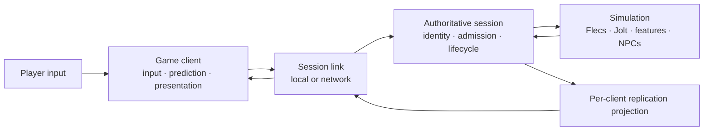

# Incinerator Multiplayer-First Architecture and Delivery Plan

**Status:** MP0-MP3 and MP4-A are implemented and accepted; broader MP1
physical decomposition and MP4-B+ remain open

**Last reviewed:** 2026-07-13

**Current platform:** Apple Silicon macOS only

**Architecture health record:** [`ARCHITECTURE_REVIEW.md`](ARCHITECTURE_REVIEW.md)

**Main roadmap:** [`OVERHAUL_PLAN.md`](OVERHAUL_PLAN.md)

**Accepted decisions:**
[ADR-016](docs/adr/016-authority-session-topology.md),
[ADR-017](docs/adr/017-network-identity-protocol-and-replication.md), and
[ADR-018](docs/adr/018-gamenetworkingsockets-and-steam-compatible-routing.md)

## Purpose

Incinerator is more likely to be a multiplayer-first sandbox in which a player
may play alone, host or join an invite/party/room instance, and eventually
connect to dedicated or more persistent authority. Multiplayer therefore
cannot remain a late adapter added after most gameplay semantics are fixed.

This plan establishes the minimum authoritative-session architecture early so
future gameplay features are designed with explicit authority, request,
validation, replication, prediction, and persistence semantics. It does not
attempt to build every online service before the game.

## Program Objective

Deliver one game architecture with three placements:

1. **Solo:** a graphical client connects through a typed local link to an
   embedded authoritative session.
2. **Listen/invite:** one process co-locates the hosting player's client and
   authority; remote players connect through a network link.
3. **Dedicated instance:** the existing cold headless product evolves into the
   same authority without a local player, renderer, or editor.

The placement may differ. The source of truth, validation rules, feature
commands, fixed-tick simulation, persistence, and replication semantics may
not.



## Accepted Initial Product Contract

These are the accepted starting constraints. Quantitative evidence may revise
rates and budgets through an explicit plan/ADR update; implementation may not
silently replace the topology or source-of-truth model.

| Concern | Accepted initial contract |
|---|---|
| Session shape | Invite-based 2-8 player room/instance; validate a technical ceiling of 16 participants |
| Authority | Server-authoritative in every mode |
| Solo | Embedded authority through a local typed link |
| Listen host | Optional later private-friend topology with explicit host trust/performance limits |
| Dedicated | Canonical public topology and first real network proof; provider independent |
| Join model | Join-in-progress plus bounded disconnect/reconnect |
| Host exit | Session ends cleanly and authority owns any durable commit; no host migration initially |
| Persistence | Session/server-owned world save; no distributed account/world persistence initially |
| Simulation | Start at 60 Hz authority/gameplay, 20 Hz prioritized replication, and client render/prediction up to 120 Hz; measure and revise explicitly |
| Client responsiveness | Predict local character first, later the locally controlled vehicle; interpolate other replicated entities |
| Physics | Server authoritative; no peer lockstep or cross-machine Jolt determinism claim |
| Relevance | Spatial/district cells plus semantic dependencies and per-client entity/byte budgets |
| Compatibility | Exact protocol, build, and logical-content cohort; no mixed-version session initially |
| Transport | Open-source GameNetworkingSockets flat C API; direct IP first |
| Steam | Optional Steamworks flat-API adapter for identity, P2P, SDR, and hosted-server tickets; never gameplay authority |
| Platform/services | Apple Silicon macOS architecture proof; hosting provider, Linux deployment, orchestration, and non-Steam P2P remain deferred |

### Placement, route, and identity are separate

| Concern | Initial values |
|---|---|
| Authority placement | `embedded`, `listen`, `dedicated` |
| Connection route | `local`, `direct_ip`, `steam_p2p`, `steam_sdr` |
| Identity provider | `development`, `steam`, future engine/account identity |

P2P describes how a guest reaches a listen authority. It never changes the
single-writer server-authority model. A dedicated authority may run locally,
on a community machine, on a rented host, or in a later managed fleet; this
plan does not equate dedicated placement with a proprietary cloud vendor.

The current development identity is self-declared and unauthenticated. MP2
therefore binds loopback unless `--allow-remote` is explicitly selected for a
trusted development network. Public exposure requires a later admitted ticket/
identity provider; transport encryption alone is not authorization.

## Source-of-Truth Model

| State or decision | Authority | Client responsibility |
|---|---|---|
| World tick and time | Server session | Estimate presentation time and buffer snapshots |
| Character/NPC/vehicle physics | Server simulation | Predict only explicitly supported local motion; reconcile |
| Spawn/despawn | Server features | Create/remove replicated presentation state from admitted snapshots/events |
| Vehicle driver and carry ownership | Server features | Request transitions and display confirmed/predicted feedback |
| District logical residency | Server simulation | Maintain relevant visual residency requested by replicated state/content |
| NPC goals and behavior | Server NPC feature | Interpolate/present relevant NPC state |
| Durable save | Server session | Never commit canonical world state |
| Party/lobby membership | Lobby/session service | UI and connection discovery; not gameplay authority |
| Camera, graphics, audio, local UI | Client | Local and non-authoritative |
| Prediction history | Client | Disposable bounded approximation |
| Replication baseline | Server per connection, mirrored by client | Acknowledge and discard when superseded |

## Target Boundaries

The exact file layout will be pulled by implementation, but responsibility
should converge toward:

```text
src/
  engine/
    kernel/                 fixed schedule, IDs, diagnostics, bounded mechanics
    contracts/              physics, rendering, persistence, session primitives

  features/
    character/
      root.zig              narrow feature API
      authority.zig         components and systems
      persistence.zig       durable logical records
      replication.zig       explicit network projection and client commands
    ...

  session/
    protocol.zig            versioned bounded semantic messages
    identity.zig            session/connection/player/replicated IDs
    authority.zig           join, admission, sequencing, routing, lifecycle
    replication.zig         per-client baselines, relevance, snapshot assembly
    local_link.zig          in-process typed delivery

  client/
    session.zig             connection state and protocol ownership
    replicated_world.zig    non-authoritative client state
    prediction.zig          bounded local prediction/reconciliation
    interpolation.zig       remote presentation timeline

  adapters/
    transport/              local link and open-source GNS direct-IP adapter
    lobby/                  optional Steam/platform service integration

  hosts/
    client.zig              graphical game client
    listen.zig              client plus embedded authority composition
    dedicated.zig           cold authority process
    local_solo.zig          client plus embedded authority/local link
```

This is a responsibility map, not permission to create empty framework
directories or a runtime plugin system. The optional Steamworks implementation
belongs to the separately licensed game or another optional integration
package, not the mandatory open-engine/cold-authority source closure.

## Protocol and Identity Principles

### Identity layers

Do not overload one ID across lifetimes:

- **PersistentId:** durable logical identity inside admitted world state.
- **AccountId:** durable engine/game player identity mapped from an external
  provider such as Steam when required.
- **External identity:** authentication/discovery input; never an entity or
  authority handle.
- **RuntimeId:** process-local authority lookup; never serialized or sent.
- **SessionId:** one admitted authority session/instance.
- **ParticipantId:** one logical joined player for the session.
- **ConnectionId:** one generational live connection; reconnect may replace it.
- **ReplicatedEntityId:** server-issued, generational, connection-visible entity
  reference; it may map to a persistent entity without exposing storage policy.
- **InputSequence / ActionSequence / SnapshotSequence:** independent bounded
  ordered input, reliable gameplay-transaction, and state-update streams.

Platform account or Steam IDs are authentication/discovery inputs. They are
not ECS IDs or direct authority handles.

### Message classes

The first protocol should be small and semantic:

- handshake/admission and exact cohort rejection;
- join/leave/reconnect lifecycle;
- tick-addressed player input;
- command acknowledgement/rejection;
- initial relevant state;
- incremental authoritative state;
- ownership and important lifecycle events;
- snapshot/baseline acknowledgement;
- graceful disconnect and authority stop.

Transport reliability is selected per message class. Reliable delivery does
not make stale gameplay input useful; unreliable delivery does not permit
unbounded loss or ambiguous ownership.

### Feature-owned replication

There is no automatic Flecs-component replication. Each participating feature
defines the minimum semantic client request, server validation, replicated
record, event, and prediction policy it needs. Private components, runtime IDs,
backend handles, allocator state, and opaque Jolt state never cross the
protocol.

## Persistence, Replication, and Replay

Three schemas remain distinct:

1. **Durable snapshot:** complete canonical logical authority for healthy
   restart.
2. **Replication snapshot:** per-client relevant approximation optimized for a
   short baseline and network budget.
3. **Accepted-ingress replay:** exact-cohort evidence of what the authority
   admitted, when, and for which participant/sequence.

Replication may use quantized poses, sparse changes, per-feature rates, and
district relevance. Durable state must not inherit those losses. Replay records
semantic admission after decode/authentication and before authority mutation;
raw encrypted packets are transport evidence, not the canonical gameplay log.

## Delivery Roadmap

### MP0 — Strategy, Decisions, and Budgets

**Status:** Complete for the initial architecture contract. These are bounded
starting ceilings and validation profiles, not production Internet claims.

**Outcome:** Product assumptions and architectural decisions are explicit
enough to implement one bounded multiplayer slice without silently committing
to MMO services or a generic replication framework.

- [x] Record the current architecture assessment and weakness register.
- [x] Draft this multiplayer-first program and staged acceptance model.
- [x] Record accepted authority-topology, protocol/replication, and transport
  ADRs.
- [x] Link the strategy from the main roadmap and README.
- [x] Confirm initial player count, host/dedicated expectations, host-exit
  behavior, persistence lifetime, and cheating/fairness tolerance.
- [x] Require join-in-progress and bounded reconnect.
- [x] Select open-source GameNetworkingSockets through its flat C API.
- [x] Select direct IP/loopback as the first remote route and dedicated
  authority as the first real network proof.
- [x] Preserve Steam networking compatibility through a later optional
  Steamworks flat-API adapter without requiring Steam in the open engine.
- [x] Keep listen/Steam P2P as an optional later private topology, not shared
  peer authority or the canonical public product.
- [x] Establish initial RTT, jitter, loss, bandwidth, snapshot-rate, correction,
  command, and per-client memory budgets.
- [x] Accept ADR-016, ADR-017, and ADR-018.

#### MP0 acceptance

- [x] Every source-of-truth category has exactly one owner.
- [x] Solo/listen/dedicated placement and the one-world constraint are explicit.
- [x] Durable, replication, prediction, and replay state are not conflated.
- [x] Deferred services and security nonclaims are explicit.
- [x] The first networked vertical slice has measurable limits and failure
  policy.

### MP1 — Client/Authority Separation and Local Session

**Status:** The character slice and ownership seam are implemented. The broad
legacy solo administration facade, save ownership, and physical `App`/
`Simulation` decomposition remain explicitly open; see the MP2 audit.

**Outcome:** The existing solo sandbox runs as a graphical client connected to
one embedded authority through a typed local link. No network socket is needed,
but direct client-to-`Simulation` mutation is removed.

- [x] Introduce explicit authority-session and graphical-client owners.
- [ ] Move authoritative `Simulation`, feature output routing, and durable save
  behind the session owner.
- [x] Add a bounded typed local link with the same semantic message/admission
  shapes intended for remote use.
- [x] Route character player input through participant identity, sequence, eligibility,
  validation, and typed results.
- [x] Add a non-authoritative replicated client state and presentation timeline.
- [ ] Split `App` into cohesive graphical, streaming, developer, and embedded
  authority owners as pulled by the new boundary.
- [ ] Split `Simulation` persistence, replay, and diagnostics into private
  modules without widening its public authority surface.
- [x] Keep validation composition separate and preserve the product/validation
  binary boundary and complete Debug suite.

#### MP1 acceptance

- [x] Solo behavior, save/restart, replay, diagnostics, editor, streaming, and
  presentation pass through the new topology.
- [ ] The graphical client cannot access Flecs, Jolt authority, private feature
  state, or save-slot commit directly.
- [x] Local character delivery cannot bypass remote-equivalent admission or sequencing.
- [x] The authority remains usable headlessly and retains one world/owner.
- [x] The local-session path has no transport, lobby SDK, account system, or
  generic message bus dependency.

### MP2 — Two-Client Localhost Authority Slice

**Status:** Implemented and audited for the bounded character slice. MP3 has
delivered prediction and impaired-link acceptance; MP4 owns replication
baselines, relevance, and the remaining gameplay features.

**Outcome:** Two graphical clients join one authoritative macOS server over
open-source GameNetworkingSockets direct IP, control separate characters,
observe each other, disconnect, and reconnect under one versioned protocol.

- [x] Integrate the narrow open-source GNS flat-C/direct-IP adapter selected by
  ADR-018.
- [x] Add bounded handshake and exact build/content/protocol admission.
- [x] Add session, participant, connection, replicated-entity, input, and
  snapshot identities with stale/generation rejection.
- [x] Spawn and assign two server-authoritative characters.
- [x] Send sequenced tick-addressed character input, not client poses.
- [x] Send initial relevant state and periodic authoritative snapshots.
- [x] Interpolate remote character presentation separately from local
  simulation interpolation.
- [x] Define disconnect, timeout, reconnect, and participant replacement.
- [x] Export connection, queue, snapshot-age, bandwidth, and rejection
  diagnostics.

#### MP2 acceptance

- [x] Two clients connect to the cold authority and receive distinct ownership.
- [x] The server alone creates and mutates canonical character state.
- [x] Join-in-progress constructs a valid GPU-independent relevant state before
  presentation begins.
- [x] Duplicate, stale, malformed, oversized, mismatched, and unauthorized
  messages fail without partial authority mutation.
- [x] Disconnect/reconnect leaves no leaked participant, entity, queue,
  baseline, or transport owner.
- [x] Dedicated authority links no renderer, editor, visual assets, or lobby SDK.

### MP2.1 — Transport Lifecycle Stabilization

**Status:** Complete.

**Detailed design:**
[`docs/design/mp2-1-transport-lifecycle.md`](docs/design/mp2-1-transport-lifecycle.md)

**Outcome:** Recoverable loss retries sanely while rejection and deliberate
authority shutdown terminate cleanly, independent of render cadence.

- [x] Replace frame-count retry with monotonic capped exponential backoff and
  deterministic jitter.
- [x] Deliver explicit reliable authority-stop semantics before transport
  closure and prevent terminal reconnect loops.
- [x] Re-anchor authority/input time on each welcome without catch-up traffic.
- [x] Add pure retry/shutdown tests and retain the real-GNS proof.

### MP3 — Prediction, Reconciliation, and Network Faults

**Status:** Complete and accepted for the bounded on-foot character slice.

**Acceptance evidence:**
[`docs/validation/mp3-acceptance.md`](docs/validation/mp3-acceptance.md)

**Detailed design:**
[`docs/design/mp3-prediction-and-fault-harness.md`](docs/design/mp3-prediction-and-fault-harness.md)

**Outcome:** The locally controlled character remains responsive while the
server retains authority under bounded latency, jitter, loss, duplication, and
reordering.

- [x] Add bounded client input history and local character prediction.
- [x] Acknowledge the last processed input in authoritative snapshots.
- [x] Reconcile and reapply eligible unacknowledged input without treating
  predicted state as authority.
- [x] Define teleport/hard-correction and smoothing thresholds.
- [x] Add per-connection command quotas, stale windows, overflow, and timeout
  policy.
- [x] Add deterministic impaired-link tests and three-run latency/bandwidth/
  correction budgets.
- [x] Extend flight recording to accepted participant/sequence/tick ingress and
  first logical divergence.
- [x] Expose RTT, jitter, loss, reorder, snapshot age, prediction error,
  correction count, and queue pressure.

#### MP3 acceptance

- [x] The character is playable within the accepted impairment envelope.
- [x] A malicious or buggy client cannot set transforms, identities, ownership,
  tick completion, NPC goals, or durable state directly.
- [x] Prediction converges to authority and cannot survive an ownership loss.
- [x] Saturation is bounded and observable; accepted authority outcomes are not
  lost.
- [x] Accepted-ingress replay reproduces the first divergent authority category
  within the exact cohort.

### MP4 — Feature Replication and District Interest

**Status:** MP4-A authoritative vehicle replication and bounded local
responsiveness are complete. MP4-B through MP4-E remain.

**Detailed sequence:**
[`docs/design/mp4-feature-replication-sequence.md`](docs/design/mp4-feature-replication-sequence.md)

**Latest acceptance evidence:**
[`docs/validation/mp4a2-acceptance.md`](docs/validation/mp4a2-acceptance.md)

**Outcome:** Vehicle, interaction, district, and NPC semantics work through the
same server authority with explicit per-feature replication and bounded
district relevance.

- [x] Add server-authoritative vehicle enter/drive/exit, dynamic seat
  ownership, reconnect retention, graphical presentation, deterministic fault
  evidence, and mixed-ingress replay.
- [x] Implement bounded owned-vehicle prediction/reconciliation with a 200 ms
  horizon, measured correction limits, lifecycle resets, live graphical A/B,
  and no second Flecs/Jolt world.
- [ ] Replicate carry/drop requests, outcomes, and ownership transitions.
- [ ] Use district ownership/residency as the first relevance partition.
- [ ] Replicate relevant NPC state at a measured rate without exposing NPC
  internals or making clients authoritative for AI.
- [x] Define reliable vehicle lifecycle versus replaceable vehicle-state/input
  message classes; repeat the decision per later feature.
- [ ] Bound per-client entities, bytes, snapshots, events, and baseline memory.
- [ ] Exercise save/restart, join-in-progress, reconnect, district transfer, and
  unload while clients are present.

#### MP4 acceptance

- [x] Character and vehicle seat ownership remain consistent under impairment,
  stale input, contention, reconnect, exit, and replay.
- [ ] Interaction, district, and NPC ownership/relevance remain consistent
  under impairment and stale client input.
- [ ] Irrelevant districts/entities do not consume unbounded per-client state.
- [ ] Join/reconnect restores relevant state without sending durable-save bytes
  or backend handles.
- [x] The vehicle slice projects explicit backend-neutral state through the
  session and remains headless-testable.
- [ ] Interaction, district, and NPC features own equivalent narrow projections.

### MP5 — Invite, Party, and Room Experience

**Outcome:** Players can create or join an invite-based room and connect to an
optional private listen or canonical public dedicated authority without making
Steam, a lobby, or a room service the world authority.

- [ ] Implement the optional Steamworks flat-API identity/lobby/routing adapter
  selected by ADR-018 without making it an open-engine requirement.
- [ ] Implement create, invite, join, leave, ready, connect, and failure UX.
- [ ] Bind admitted platform identity to a session participant without using it
  as an ECS or replicated entity ID.
- [ ] Support a listen host through the same authority/session boundary and
  document host advantage and trust limitations.
- [ ] Connect to a dedicated instance through the same game protocol.
- [ ] Define host shutdown and durable-commit behavior; keep host migration
  deferred unless explicitly selected.
- [ ] Keep proprietary service dependencies out of the cold authority and
  open-engine core unless a reviewed integration requires otherwise.

#### MP5 acceptance

- [ ] An invited player reaches the correct admitted authority or receives an
  actionable failure without partial session state.
- [ ] Lobby departure and network disconnect have explicit, tested, nonidentical
  semantics.
- [ ] The host and dedicated paths share gameplay protocol and authority code.
- [ ] Service outage does not corrupt a healthy authority save.

### M4 — Multiplayer Foundation Gate

**Outcome:** New gameplay slices can be multiplayer-aware by default without
depending on unfinished online-service infrastructure.

- [ ] Solo runs through embedded authority and the client/session boundary.
- [ ] Two clients use one authoritative server under the accepted impairment
  envelope.
- [ ] Character, vehicle, interaction, district, and NPC state have explicit
  server/client semantics.
- [ ] Join-in-progress and reconnect are bounded and tested.
- [ ] Durable save, replication snapshots, prediction history, and replay
  evidence remain separate.
- [ ] District relevance bounds per-client replicated state.
- [ ] Client, listen, dedicated, validation, and extracted package boundaries
  are independently checked.
- [ ] Architecture, correctness/security, protocol, performance, and docs-drift
  reviews report no unrecorded actionable P0/P1/P2 finding.

## Transport and Service Decision

ADR-018 selects the open-source GameNetworkingSockets flat C API and direct IP
for MP2. The selected adapter family must prove each capability when its route
enters scope:

- reliable and unreliable message classes;
- encryption/authentication integration;
- NAT traversal or relay path for invite sessions;
- connection lifecycle and generational handles;
- MTU, fragmentation, congestion, lanes/priorities, and backpressure;
- latency/loss/reordering simulation and connection statistics;
- macOS support and Zig/C integration risk;
- dedicated-server operation and deployment constraints;
- open-engine licensing versus optional proprietary game/service integration.

The open engine owns a `GnsDirectTransport`-sized integration and must build,
test, and run without Steamworks. A later `GnsSteamTransport` may use the
Steamworks flat API for Steam identities, rendezvous, P2P/SDR, and hosted-
dedicated tickets while running the same game protocol. Steam SDK material and
credentials are not vendored into the open-engine core; the separately
licensed game or optional integration package supplies them.

The common API lineage is not treated as proof that every open-source and
Steamworks binary, authentication mode, or route is interchangeable. Each
supported direct/Steam combination receives explicit lifecycle and protocol
compatibility tests.

## Security and Trust Baseline

Before any remote ingress mutates authority:

1. decode within strict byte/count limits;
2. validate protocol/build/content cohort;
3. resolve a live generational connection and participant;
4. validate message class, sequence window, ownership, state, and rate quota;
5. translate to a semantic feature/session command;
6. reserve delivery/backpressure capacity;
7. apply only at a declared authority boundary;
8. record admission/rejection evidence without logging secrets or raw
   unbounded payloads.

Transport encryption is necessary but does not make a client trusted.
Anti-cheat products, account security, abuse systems, and distributed service
hardening remain later programs.

## Explicit Deferrals

- Host migration.
- Listen-host productization; private Steam P2P remains an optional later path.
- Non-Steam P2P signaling, STUN/TURN, and relay operation.
- Public-server proxy/DDoS design and Steam hosted-dedicated SDR rollout.
- Hosting provider, containers, orchestration, Agones, and autoscaling.
- Persistent always-online worlds.
- Accounts, entitlements, commerce, social graph, and matchmaking backend.
- Distributed databases, shards, zones, orchestration, autoscaling, and MMO
  operations.
- Competitive anti-cheat and moderation platforms.
- Cross-platform clients or Linux dedicated deployment.
- Mixed-version protocol compatibility or schema migrations.
- Peer authority, peer lockstep, rollback of the complete Jolt world, or
  cross-platform deterministic physics.
- Voice, chat, user-generated content, patching, CDN, and live-ops analytics.
- A generic RPC system, generic ECS replication, or runtime plugin ABI.

## Reference Influences

- [Unreal's authoritative client/server and listen/dedicated model](https://dev.epicgames.com/documentation/unreal-engine/setting-up-dedicated-servers-in-unreal-engine)
  is a useful comparison for authority placement and the fairness/operational
  distinction between listen and dedicated servers.
- [Steam matchmaking and lobbies](https://partner.steamgames.com/doc/features/multiplayer/matchmaking?language=english)
  demonstrate that party/discovery state may lead players to either a nominated
  host or game server without becoming gameplay authority.
- [Steam Networking](https://partner.steamgames.com/doc/features/multiplayer/networking)
  and the open-source
  [GameNetworkingSockets project](https://github.com/ValveSoftware/GameNetworkingSockets)
  provide the selected transport family and optional Steam service path with
  reliable/unreliable delivery, encryption, relay/NAT, impairment, and
  statistics—but not entity replication or game authority.

## Remaining MP0 Evidence Before MP1

The topology, transport family, Steam boundary, player target, and initial
rates are accepted. Before MP1 implementation begins, record:

1. RTT, jitter, loss, duplication, reordering, and reconnect validation
   profiles.
2. Per-client bandwidth, relevant-entity, baseline-memory, queue, and decode
   ceilings for the first slice.
3. Snapshot-age, prediction-error, correction-count, and hard-correction
   thresholds.
4. Exact join authorization fields and development identity policy.
5. Initial empty-room lifetime, checkpoint cadence, and reconnect window.
6. Whether Steam integration starts immediately after direct GNS MP2 or waits
   until MP5 lobby/invite work.
