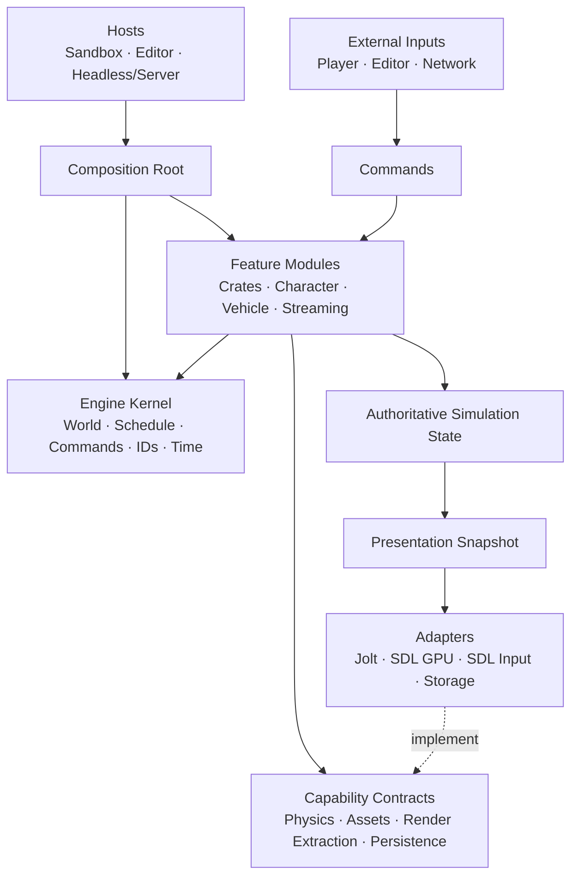

# Incinerator Engine Overhaul Plan

**Status:** Active

**Architecture:** Thin kernel + feature-owned vertical slices + capability adapters

**Last reviewed:** 2026-07-10

**Historical roadmap:** [`PLAN_001.md`](PLAN_001.md)

**Purpose:** Source of truth for turning the current learning prototype into a robust, testable, game-specific engine.

---

## How to Use This Document

- Treat a playable, end-to-end feature as the primary unit of delivery.
- Check off work only after its acceptance criteria and slice contract pass.
- Keep cross-cutting build and safety work small, observable, and explicitly gated.
- Extract shared engine infrastructure only after a real slice requires it; prefer a second consumer before generalizing.
- Record architectural decisions in `docs/adr/` and link them from the decision register.
- Add newly discovered risks to the findings register before expanding scope.
- Keep the build matrix current whenever a toolchain, target, backend, or wrapper changes.
- Do not turn logical feature boundaries into microservices or runtime indirection without a demonstrated need.

Status conventions:

- `[ ]` Not started
- `[x]` Complete and verified
- **Blocked**: waiting on a decision or external dependency
- **Deferred**: intentionally outside the current slice

---

## 1. Objective

Create a game-specific engine capable of supporting a GTA-style 3D sandbox while preserving a credible path to characters, vehicles, streamed districts, persistent tools, and—if selected—authoritative multiplayer.

The overhaul must produce these separable products:

1. A small engine/runtime library with an intentional public API.
2. A sandbox or game host containing game-specific composition and content.
3. An optional editor/debug host built from the same commands and features.
4. A headless simulation host suitable for behavioral tests and authoritative servers.
5. SDL, Jolt, storage, and platform adapters that implement narrow capability contracts.
6. Feature modules that own behavior end to end rather than scattering it across global subsystem folders.

The goal is not to finish a generalized engine before making a game. The engine should emerge from successive playable slices, with each slice proving the APIs and shared capabilities it needs.

---

## 2. Architecture Thesis

Incinerator will use a small horizontal kernel and vertically owned gameplay features.



### 2.1 Engine kernel

The kernel provides only capabilities that every or nearly every feature needs:

- world lifecycle;
- fixed-tick schedule and named phases;
- a fixed command phase and target-tick policy for feature-owned queues;
- stable runtime and persistent identity primitives;
- time/tick services;
- diagnostics and failure reporting;
- feature registration and composition;
- shared lifecycle hooks.

The kernel must not import SDL, Jolt, ImGui, concrete game features, or cooked game content.

### 2.2 Feature modules

Features are the default unit of code organization. A feature owns its behavior across ECS data, simulation, persistence, presentation, and tests.

Each feature may contain:

- components and tags;
- commands it accepts;
- events it emits;
- systems and their schedule placement;
- physics behavior expressed through a narrow capability;
- render-extraction data;
- serialization/versioning;
- assets, prefabs, or content declarations;
- optional editor extensions;
- headless behavioral tests and a visual smoke test.

Examples are `CrateFeature`, `CharacterFeature`, `VehicleFeature`, and `WorldStreamingFeature`.

Feature boundaries are logical and compile-time boundaries, not isolated processes. Features may share one Flecs world and one schedule.

### 2.3 Capability contracts

Feature code depends on narrow, gameplay-shaped capabilities rather than concrete backends. Examples:

- create/destroy/query a rigid body;
- cast a character shape;
- resolve a typed asset handle;
- append a render-extraction record;
- read/write a versioned state record;
- enqueue a chunk-load request.

Do not design broad, hypothetical interfaces that mirror all of SDL or Jolt. Add capability surface when a slice demonstrates the need.

### 2.4 Adapters

Adapters implement capability contracts:

- the engine-owned JoltC adapter implements physics capabilities;
- SDL input produces high-level input commands;
- SDL GPU consumes render snapshots and upload requests;
- filesystem/package storage implements content and persistence capabilities;
- ImGui submits editor commands and reads diagnostics.

Adapters never own gameplay policy and never import private feature implementation.

### 2.5 Hosts and composition roots

Hosts select which adapters and features are present:

- **Sandbox:** runtime + renderer + input + current game features.
- **Editor:** sandbox capabilities + editor extensions and authoring commands.
- **Headless tests:** runtime + selected features + deterministic/fake adapters where useful.
- **Server:** runtime + authoritative features + persistence/networking, without renderer or editor.

Composition happens explicitly at startup. There must be no global service locator or universal `EngineContext` that gives every system mutable access to every subsystem.

---

## 3. Dependency and Interaction Rules

These rules are architectural acceptance criteria, not suggestions.

1. Hosts may depend on the kernel, features, capability contracts, and adapters.
2. Features may depend on the kernel and capability contracts.
3. Adapters may depend on contracts and third-party libraries.
4. The kernel and contracts may not depend on adapters, hosts, editor code, or game features.
5. Adapters may not depend on private feature implementation.
6. Feature-to-feature interaction must use an explicit shared contract, command, event, relationship, or shared component—not arbitrary access to another feature’s private state.
7. Editor and networking code submit the same typed commands used by local gameplay where semantics match.
8. Rendering consumes presentation snapshots/render extraction; it does not write authoritative simulation state.
9. Structural ECS mutations occur through deferred commands at declared schedule boundaries.
10. Worker-thread and Jolt callbacks publish bounded data/events; they do not directly mutate ECS, editor, renderer, or gameplay state.
11. Server/headless targets must compile without SDL GPU, ImGui, renderer assets, or editor dependencies.
12. A feature’s public surface is intentionally small; files inside the feature are private by default.

### Commands, events, and queries

- **Command:** a request to change state at a safe boundary, such as `SpawnCrate`, `EnterVehicle`, or `SetTransform`.
- **Event:** an immutable fact that already occurred, such as `BodyContacted`, `VehicleEntered`, or `ChunkActivated`.
- **Query:** a read of current state with no hidden mutation.

Do not use one mechanism for all three roles.

---

## 4. Feature Module Contract

Every vertical slice exposes one startup registration entry point conceptually equivalent to:

```zig
pub const CharacterFeature = struct {
    pub fn register(registry: *FeatureRegistry) !void {
        // Register only this feature's components and scheduled systems.
    }
};
```

S0 proved this minimum registry contract:

- deterministic registration;
- declared fixed schedule phases;
- component/tag registration and named system registration;
- startup freeze with registration rejected afterward;
- headless composition without renderer/editor hooks.

Typed command/outcome queues, persistence, render extraction, configuration,
and cleanup are feature-owned APIs, not central registries. Host-specific
inclusion happens at composition. Runtime enable/disable, unregistration,
dynamic discovery, and capability metadata remain deferred until a real slice
requires them.

### Feature definition of done

A feature is complete only when:

- its behavior works end to end through commands and scheduled systems;
- it can be constructed and tested headlessly;
- it has a visual/runtime smoke test when presentation is relevant;
- spawn/despawn and resource cleanup are verified;
- state that must persist has versioned serialization;
- failure and cancellation behavior are defined;
- performance measurements exist for its expected scale;
- it introduces no prohibited dependency edges.

---

## 5. Target Repository Shape

The exact file layout may evolve, but dependency direction should resemble:

```text
src/
  engine/
    root.zig
    kernel/
      world.zig
      schedule.zig
      commands.zig
      identity.zig
      time.zig
      diagnostics.zig
    contracts/
      physics.zig
      assets.zig
      rendering.zig
      persistence.zig

  adapters/
    sdl_platform/
    sdl_gpu/
    jolt/
    storage/

  features/
    crates/
    character/
    vehicle/
    world_streaming/

  hosts/
    sandbox.zig
    editor.zig
    headless.zig
    server.zig
```

Do not create every directory up front. Slice 0 should establish only the minimum real structure, and later slices should validate or revise it.

---

## 6. Current Baseline

The repository now contains a small feature-authoring kernel and one owned S1
sandbox composition shared by visual and headless hosts:

- `src/root.zig` exposes backend-neutral contracts plus the type-erased
  `Runtime`/startup registry used by game features.
- `src/main.zig` owns the same crate/character/Jolt `Simulation` as headless plus only
  visual input, camera, GPU resources, renderer, and debug UI.
- `src/hosts/headless.zig` and `src/hosts/simulation.zig` prove the same sandbox
  behavior with no SDL/editor/renderer edge.
- The prototype `GameWorld`, borrowed Flecs/Jolt path, direct ECS render query,
  Scene/Gizmo mutation tools, and their compatibility seams are removed.
- `CrateFeature` and `CharacterFeature` independently own their typed commands,
  outcomes, persistence records, lifecycle, systems, and presentation extraction.
- The composition owns V2 world metadata and cross-feature identity policy;
  character and crate records save and restore together without private coupling,
  and feature-owned character tuning is authoritative on restore.
- The Jolt adapter now exposes a narrow CharacterVirtual capability with
  bottom-anchored capsules, world-qualified handles, slope/ground state, and
  explicit update/destruction semantics.
- The public pure fixed-step accumulator proves 240/80 Hz presentation cadence
  and the 250 ms anti-spiral policy independently of SDL's wall clock.
- ReleaseFast S0 and S1 characterizations are recorded; separate native Metal
  crate and character smokes exit normally above and below 120 Hz.
- A sandbox-owned action latch bridges frame-scoped SDL state to tick-scoped
  character commands without losing or replaying edges/deltas.
- The upgraded application builds in Debug and ReleaseFast, with and without the editor, and cross-links for the selected Linux and Windows GNU targets.
- MSL, SPIR-V, and DXIL shader artifacts are generated from cache-backed
  outputs. Apple Silicon macOS/Metal is the sole current runtime-quality target;
  Linux/Windows retain cross-build, offline shader, and headless portability
  gates without a native client-runtime promise.
- The bootstrap host now uses procedural content only; the tracked game-owned GLBs are not runtime or package dependencies.

### 6.1 Verified build matrix

| Configuration | Verified result | Remaining requirement |
|---|---|---|
| Zig 0.16.0 Debug, editor enabled, Apple Silicon macOS | Pass | Keep as the primary development gate |
| Zig 0.16.0 Debug, editor excluded | Pass; zgui/ImGui are not compiled or linked | Preserve with a clean-cache CI check |
| Zig 0.16.0 Debug and ReleaseFast tests | Pass; aggregate kernel, contracts, feature, simulation, headless, Jolt, visual-host, input/resource, and shader suites | Preserve in CI |
| Zig 0.16.0 ReleaseFast, editor excluded | Pass | Preserve in CI |
| `x86_64-linux-gnu` cross-link from macOS | Pass with editor enabled and excluded | Preserve as a Tier 2 portability gate; reconsider native client validation before S3 content/streaming contracts are finalized |
| `x86_64-windows-gnu` cross-link from macOS | Pass for default D3D12/DXIL and explicit Vulkan/SPIR-V fallback, with editor enabled and excluded | Preserve as a Tier 2 portability gate; native client validation resumes only after selecting Windows for playtesting/release |
| macOS Metal runtime smoke | Pass, including the installed ReleaseFast Mach-O launched from `/tmp` | Preserve the serialized local Tier-1 readiness gate; do not promote graphical smokes to hosted CI until WindowServer/Metal reliability is proven |
| Relocatable non-GPU install probe | Pass from an unrelated working directory | Preserve as the deterministic hosted relocation check; secondary platform packaging is deferred |

### 6.2 Dependency baseline

| Component | Exact current contract | Notes |
|---|---:|---|
| Zig | 0.16.0 | Exact archive checksums are enforced in CI; `.zigversion` records the developer contract |
| SDL | wrapper `0.5.2+SDL3.4.12` at `1b67d371...` | Static linkage selected; target/optimization propagated from the root build |
| Jolt | 5.5.0 at `23dadd0e...` | Built from source through the engine-owned JoltC package |
| JoltC | `amerkoleci/joltc@52d8c98...` | 32-bit object-layer ABI assertions enabled; single precision; cross-platform determinism explicitly off |
| zgui | `bfbebed3...` | Lazy and absent when `-Deditor=false`; engine adapter compiles its backend against SDL 3.4.12 headers |
| zmath / zmesh / zstbi / zflecs | Exact tested commits in `build.zig.zon` | Linkage/features are explicit; Flecs C/Zig ABI options match and `flecs.c` has one owner |
| shaderc / SPIRV-Cross / SDL_shadercross / DXC | vcpkg baseline `cd61e1e...`; shaderc 2026.2; SPIRV-Cross 1.4.350.0; SDL_shadercross 3.0.0-preview2; DXC 2026-05-27 | Separate base and DXIL manifests; official offline DXIL generation passes |

---

## 7. Guiding Principles

1. **Vertical slices deliver value.** Shared infrastructure exists to serve a demonstrated slice.
2. **Builds are evidence.** Debug success does not imply Release, cross-target, packaging, or clean-checkout success.
3. **Ownership is visible in types.** Owning handles live in explicit owner aggregates; copy-safe views and IDs are non-owning. Slice-owned registries eventually replace convention-only owner moves.
4. **Simulation state is serializable.** Runtime state does not depend on GPU pointers or process-local identifiers.
5. **Mutation happens at declared boundaries.** Gameplay, editor, networking, streaming, and workers submit commands/events.
6. **Simulation and presentation are distinct.** Rendering consumes extracted snapshots.
7. **Dependencies are adapters, not architecture.** Flecs, Jolt, SDL, and ImGui remain behind narrow seams.
8. **Headless operation is an architectural test.** Core behavior runs without SDL GPU or ImGui.
9. **Failure paths are first-class.** Partial initialization, cancellation, device loss, malformed assets, and destruction are tested.
10. **Rule of two.** Keep slice-specific logic local until a second real consumer demonstrates a shared abstraction.
11. **No speculative generality.** Prefer a concrete, narrow API that can evolve over a broad “future-proof” interface.
12. **Decisions are versioned.** Superseded ADRs are marked, not left “Accepted.”

---

## 8. Decision Register

| ID | Decision | Status | Required before |
|---|---|---|---|
| D-001 | Product scope: single-player sandbox now; future authoritative online/MMO aspiration | Accepted in ADR-007 | Network/state architecture |
| D-002 | Initial hosts: sandbox and headless; optional in-process editor; server later | Accepted in ADR-007 | Slice 0 |
| D-003 | Exact Zig 0.16.0 toolchain and coordinated wrapper cohort | Implemented | Every build/CI change |
| D-004 | Engine-owned JoltC 5.5 build package plus narrow engine adapter; expand capabilities per slice | Implemented for rigid bodies, CharacterVirtual, and the S2 real-Jolt four-wheel capability; VehicleFeature integration remains | Vehicle feature |
| D-005 | Main thread owns ECS mutation/GPU submission; callbacks publish bounded data | Accepted in ADR-008 | Async assets/contact events |
| D-006 | Allocator and memory-budget strategy | Not started | Asset registry/streaming |
| D-007 | Physics owns dynamic-body simulation transforms; presentation reads interpolated snapshots | Implemented for S0 in amended ADR-005 | Slice 0 scheduling/interpolation |
| D-008 | Stable entity ID and serialization model | Implemented through composition-owned V2 crate/character snapshots, canonical yaw, and authoritative character tuning; multi-world atomic replacement remains open | Save/restore |
| D-009 | Tier 1 Apple Silicon macOS/Metal runtime support; Tier 2 Linux/Windows portability preservation through cross-build, shader-contract, and headless gates | Accepted in amended ADR-007; native secondary client work is trigger-based rather than a current M1 gate | Before S3 content contract, secondary client selection, or server work |
| D-010 | Measured entity, body, draw, memory, and streaming budgets | S0 crate and S1 character tick/extraction baselines recorded; memory/streaming budgets open | Streaming acceptance budgets |
| D-011 | Thin-kernel + feature-module architecture | Accepted by this plan | Slice 0 |
| D-012 | Commands/events/queries as cross-boundary interaction model | Accepted by this plan | Slice 0 |
| D-013 | Source assets, cooked assets, and runtime content packaging policy | Not started | Streaming slice |

### Decision notes

#### D-001: Product scope

Even if the first product is single-player, preserve two inexpensive future-facing properties:

- serializable, GPU-independent simulation state;
- separation between authoritative simulation and presentation snapshots.

If genuine MMO remains the target, authoritative simulation, replication, interest management, persistence, and operational tooling become early product work rather than a late networking feature.

#### D-004: Physics binding

The prototype `zphysics` dependency has been removed. `src/adapters/physics/jolt_c.zig` is the only raw C import, and `src/physics.zig` exposes engine-owned rigid-body types. The engine-owned build package exact-pins Jolt 5.5 and JoltC, compiles upstream ABI assertions, and is tested without SDL/editor linkage.

S1 proved a narrow CharacterVirtual capability without exposing raw Jolt
shapes, filters, pointers, or enums. S2 Stage A now proves a real four-wheel
`VehicleConstraint` capability with engine-neutral configuration/state,
world-qualified handles, explicit native owner rollback, fixed front-drive
tuning, logical wheel-motion reconstruction, and no per-vehicle step. Stage B
will integrate it through one neutral composition-owned shared step. The
adapter still does not expose generic constraints or ragdoll APIs;
later slices must prove those surfaces. Logical game state is serialized and
reconstructed rather than treating opaque Jolt state as a persistence contract.

Cross-platform deterministic Jolt compilation is explicitly disabled. The future online direction is an authoritative server, not peer lockstep; enabling the option later requires measured behavior and performance evidence.

#### D-009: Platform priority

Apple Silicon macOS with Metal is the only current runtime-quality target. It
receives native gameplay, editor, performance, failure, packaging, and installed
runtime evidence. Linux/SteamOS and Windows remain Tier 2
portability-preservation targets: their cross-builds, offline shader contracts,
and headless dependency/linkage gates stay mandatory, but native client polish
and packaging are not current delivery work.

Native secondary-platform work is reactivated by a product milestone, not by
the mere existence of backend code:

- reconsider Linux client behavior before S3 finalizes cooked content,
  filesystem, streaming, memory, and GPU-upload contracts;
- select and validate a secondary native client before public cross-platform
  playtesting or release;
- require native Linux headless/server validation before S4 or any production
  authoritative server host.

This policy preserves future options without allowing three native runtime
targets to compete with the current macOS-first gameplay roadmap.

---

## 9. Delivery Roadmap

| Stage | End-to-end outcome | Status |
|---|---|---|
| M0 | Reproducible baseline and blocking decisions | Complete |
| M1 | Trustworthy macOS build, shader, dependency, CI, and packaging gate plus secondary-platform portability guards | Local Tier-1 closeout complete; first hosted macOS run remains to be recorded after push, and native Vulkan/D3D12 client validation is deliberately deferred |
| M2 | Immediate ownership and correctness hazards removed | Complete for the pre-S2 scope; content-upload failure/cancellation policy remains slice-owned by S3 |
| S0 | Crate lifecycle slice proves the kernel and feature contract | Complete; one-world-per-process and pre-network queue backpressure are accepted follow-on constraints |
| S1 | Character walks around one block | Complete; independent architecture, correctness, and build/evidence reviews pass with no remaining P0/P1/P2 finding |
| S2 | Player enters and drives one vehicle | Stage A design and real-Jolt capability complete; VehicleFeature is next |
| S3 | One district/chunk loads and unloads asynchronously | Not started |
| S4 | Two clients use one authoritative server, if selected | Deferred until multiplayer is selected and scoped |
| S5 | Transform editing supports command, undo, save, and restore | Not started |

M0–M2 are limited cross-cutting gates. S0 onward are vertical slices. Shared engine, renderer, asset, persistence, and tooling capabilities are pulled into existence by those slices rather than completed as independent horizontal milestones.

---

## 10. M0 — Baseline and Blocking Decisions

### Work

- [x] Exact-pin Zig 0.16.0 in `.zigversion`, package metadata, documentation, and CI archive checks.
- [x] Record and run clean-checkout Debug build and test commands.
- [x] Capture ReleaseFast and cross-target failures as regression cases.
- [x] Record a minimal native Metal runtime smoke test.
- [x] Resolve D-001 through D-005 before their dependent slices begin.
- [x] Define the initial host set and composition roots for D-002.
- [x] Mark ADR-002 superseded by the feature-oriented architecture decision.
- [x] Amend ADR-004 to document quaternion storage rather than Euler storage.
- [x] Reconcile ADR-005 with D-007 transform authority.
- [x] Define supported and explicitly unsupported host/target combinations.

### Acceptance criteria

- [x] A new developer can install the exact toolchain without relying on Homebrew’s latest Zig.
- [x] Debug build and tests are reproducible from a clean source copy.
- [x] Blocking decisions have an owner and ADR.
- [x] No accepted ADR contradicts current policy without a superseded marker.

---

## 11. M1 — Toolchain, Build, Shader, CI, and Packaging Gate

### 11.1 Dependency configuration

- [x] Forward `.target` and `.optimize` to every dependency that consumes them.
- [x] Verify native and cross-target artifacts use the requested target and optimization mode.
- [x] Make `-Deditor=false` exclude zgui/ImGui compilation and linkage.
- [x] Remove the incompatible zphysics debug path and explicitly defer its JoltC replacement.
- [x] Make dependency features explicit rather than relying on defaults; align Flecs C/Zig ABI options and compile zgui's backend against the selected SDL headers.

### 11.2 Build correctness

- [x] Make intended optimization modes build or document explicit exclusions.
- [x] Make tests depend on every generated input they embed.
- [x] Add a clean-checkout test without generated source-tree shaders or prior caches.
- [x] Eliminate source-tree mutation from build steps.
- [x] Replace host-specific filesystem commands and undeclared shader outputs with cache-backed `LazyPath` artifacts.
- [x] Ensure `zig fmt --check` passes.

### 11.3 Shader/backend contract

- [x] Complete and validate the locked SDL_shadercross/DXC offline path alongside the exact shaderc/SPIRV-Cross cohort.
- [x] Use `main` for generated SPIR-V and `main0` for generated MSL.
- [x] Move the primitive vertex UBO to SPIR-V set 1.
- [x] Generate DXIL and validate its `DXBC` container before advertising the D3D12 path.
- [x] Advertise only the embedded shader format and explicitly select the compatible implemented driver.
- [x] Validate current SPIR-V entry points, resource counts, sets/bindings, block sizes, stages, and vertex interfaces through reflection.
- [x] Query the claimed window’s swapchain format, select a supported depth format, and supply both to every scene/editor pipeline.
- [x] Preserve offline MSL/SPIR-V/DXIL contracts, macOS Metal runtime smokes,
  and Linux/Windows compile/headless gates.
- **Deferred by platform policy:** native Vulkan/D3D12 client smokes resume only
  when a secondary client platform is selected. Reconsider Linux client
  behavior before S3's content/streaming contract is finalized, and require
  native Linux headless evidence before server implementation.

### 11.4 CI and packaging

- [x] Define formatting, Debug, ReleaseFast, clean-test, primary macOS, and
  compile-only secondary-target workflow gates; record the first hosted macOS
  run after the closeout commit is pushed.
- [x] Add compile-only Linux and Windows cross-target jobs.
- [x] Add reflected shader-contract validation.
- [x] Add a non-GPU package/install probe that runs outside the repository root.
- [x] Remove the bootstrap host’s working-directory/game-content dependency; define the real runtime content-root/VFS contract under D-013 when a slice needs content.
- [x] Keep the bootstrap package procedural, with no runtime assets to install or cook.
- [x] Include required source, shader, local dependency, tool, CI, and documentation paths in `build.zig.zon`.
- [x] Gate Zig-filtered source-package membership and execute the headless test graph from the extracted package so `.paths` and file-mode drift cannot escape checkout-only tests.
- **Deferred by owner:** select and add the engine `LICENSE`. No redistribution/release claim is permitted until then.
- [ ] Record third-party notices and move or remove unprovenanced game-owned assets before distribution.
- [ ] Decide whether large source assets use Git LFS, an artifact store, or small fixtures.

### 11.5 Coordinated dependency migration

- [x] Preserve the Zig 0.15.2 failure/baseline evidence before the greenfield cutover.
- [x] Select a tested Zig 0.16 cohort for SDL and Zig wrappers.
- [x] Upgrade SDL to the selected 3.4.12 package cohort.
- [x] Port engine/build APIs to Zig 0.16.
- [x] Replace zphysics with the exact-pinned Jolt 5.5/JoltC adapter under D-004.
- [x] Re-run the local matrix and exact-pin every selected revision.

### Acceptance criteria

- [x] Debug and ReleaseFast pass on the primary platform.
- [x] Clean tests pass without hidden generated artifacts.
- [x] Supported GNU cross-target builds do not consume host-native libraries.
- [x] Tier 1 macOS passes offline MSL and native Metal validation; Tier 2
  Linux/Windows pass their current offline shader, cross-build, and headless
  portability contracts.
- [x] The installed macOS visual runtime launches outside the repository from
  `/tmp`, completes the S1 Metal behavior contract, and tears down cleanly.
  Secondary-platform installed-runtime validation is deferred until that
  platform is selected.
- [x] Zig support is an exact tested contract.

---

## 12. M2 — Immediate Safety and Correctness Gate

M2 fixes proven hazards. It does not attempt to finish the future engine architecture.

### 12.1 Ownership and failure safety

- [x] Remove freely copied owning `Texture` values and the debug-texture double/triple release.
- [x] Release caller-owned Jolt shape references after successful body creation.
- [x] Create replacement depth resources before releasing active resources.
- [x] Make partial renderer and glTF initialization transactional.
- [x] Destroy initialized glTF meshes on every later failure.
- [x] Remove the unsafe legacy debug-batch path; a future JoltC debug renderer starts from a new lifetime model.
- [x] Remove the obsolete debug-renderer teardown ordering path with that deferred feature.
- [x] Add correct unwinding after process-level Jolt initialization, including multi-world runtime leases and world-qualified handles.
- [x] Prevent body recreation from destroying the old body until replacement succeeds; the editor now replaces box shapes in place.

### 12.2 Input, transforms, and platform behavior

- [x] Always maintain physical input state, including release and focus-loss handling.
- [x] Gate gameplay actions with ImGui `WantCapture*`, not backend event recognition.
- [x] Correct Euler argument order/conversion and add axis-specific plus combined-angle tests.
- [x] Stop named Flecs spawns from aliasing multi-primitive entities; root lookup identities are validated and unique.
- [x] Use body-origin position rather than center-of-mass position for synchronization.
- [x] Transform normals into the declared lighting space.
- [x] Prevent minimized/backpressured rendering from busy-spinning; track the
  main-window minimized/restored state, suspend simulation/presentation while
  minimized, resynchronize the clock, and pass the installed native lifecycle
  smoke across a measured 750 ms dwell.

### 12.3 Error policy and tests

- [x] Distinguish skipped/minimized frames from fatal renderer failures.
- [x] Propagate or centrally report physics and GPU submission failures.
- [x] Add focused failure injection at real production SDL/Metal and Jolt
  initialization ownership transitions, then prove a healthy lifecycle can
  restart in the same process. Per-upload GPU cancellation/failure seams are
  deferred to S3, where the upload queue and asset cancellation policy exist.
- [x] Add create/destroy/recreate tests for bodies and resources, including cross-world/stale body handles.

### Acceptance criteria

- [x] Allocator-backed/fault-sweep tests and real same-process restart smokes
  find no known shape, mesh, texture, or covered partial-initialization leak.
- [x] Resize/resource failures preserve valid subsystem state.
- [x] Repeated body/resource lifecycle tests do not produce stale handles or double release at covered boundaries.
- [x] Input capture/focus transitions do not leave stuck state.
- [x] Current demo behavior remains functional after the safety work on native Metal.

---

## 13. S0 — Crate Lifecycle Slice

### Outcome

Rebuild one falling crate through the target architecture. A command spawns it, physics simulates it, presentation interpolates it, state can be serialized/restored, and a command despawns it without leaking. The same feature runs visually and headlessly.

This is the first proof of the engine architecture and replaces a speculative “engine skeleton” phase.

### Feature-owned scope

- `Crate` components and tags;
- `SpawnCrate`, `DespawnEntity`, and optional impulse commands;
- collision/lifecycle events needed by the slice;
- scheduled crate/physics synchronization systems;
- render-extraction record;
- serialized state;
- headless tests and visual smoke test.

### Minimum shared capabilities pulled by S0

- [x] Replace template `src/root.zig` with the minimum intentional runtime API.
- [x] Create sandbox and headless composition roots.
- [x] Define the minimum `FeatureRegistry`/registration contract.
- [x] Define named schedule phases and a deferred command boundary.
- [x] Separate process Jolt runtime from per-world physics state.
- [x] Define narrow rigid-body create/query/destroy capability methods required by crates.
- [x] Add coordinated entity/body spawn and despawn.
- [x] Define runtime ID versus persistent ID semantics for the slice.
- [x] Introduce the smallest typed/generational mesh and material handles needed by crates.
- [x] Make a minimal resource owner responsible for the crate’s GPU resources.
- [x] Represent transform authority explicitly for dynamic bodies.
- [x] Store previous/current transforms and interpolate presentation.
- [x] Define versioned crate/world serialization sufficient for save/restore.
- [x] Ensure editor, renderer, and SDL are absent from the headless composition.

### Slice tests

- [x] Headless: spawn → tick → serialize → destroy → restore → tick → destroy.
- [x] Headless: run the same input/command timeline twice and compare expected state.
- [x] Lifecycle: repeat crate spawn/despawn returns entity/body counts to baseline; allocation sweeps and visual-owner tests cover owned cleanup boundaries.
- [x] Visual: native Metal renders the interpolated falling/tumbling crate at virtual 240 Hz and 80 Hz, processes a normal SDL quit, and reports clean shutdown.
- [x] Architecture: verify prohibited dependency edges are absent.

### Acceptance criteria

- [x] The public runtime can host the crate feature without importing sandbox code.
- [x] The feature owns its components, typed commands/outcomes, systems, persistence, and presentation; the startup registry registers only components/systems used by S0.
- [x] Headless execution requires no SDL GPU or ImGui linkage.
- [x] Rendering reads an interpolated snapshot and cannot mutate authoritative state.
- [x] Crate destruction coordinates entity, body, and resource lifetime correctly.
- [x] No broader interface was added without a use in this slice.
- [x] Initial tick, extraction, command/outcome, body-count, and teardown measurements are recorded at 0, 1, 128, and 1,024 crates.
- [x] Supported adapter-failure and malformed/non-finite/over-limit persistence cases are covered, including allocation-failure unwind and velocity representability.

### Known S0 limitations

- The current zflecs wrapper permits one owned world per process. A second
  candidate fails cleanly and leaves the live simulation usable, but successful
  atomic old/new world swapping is not yet possible.
- Command/outcome buffers are allocator-backed and unbounded; add measured
  backpressure before accepting network-originated commands.

Evidence: [`docs/validation/s0-acceptance.md`](docs/validation/s0-acceptance.md)
and [`docs/performance/s0-baseline.md`](docs/performance/s0-baseline.md).

---

## 14. S1 — Character Slice

### Outcome

A player-controlled capsule walks, turns, jumps, and collides around one block. Behavior is driven by action commands, not SDL scancodes, and remains headless-testable.

### Feature-owned scope

- character components, controller state, and configuration;
- movement/jump/look commands;
- controller and grounded-state events;
- physics-query/controller systems;
- character presentation and camera intent;
- persistence and behavioral tests.

### Work pulled by the slice

- [x] Resolve character-controller coverage with an engine-owned Jolt
  CharacterVirtual adapter and real lifecycle spike.
- [x] Add high-level action mapping and a frame-to-tick latch outside the feature.
- [x] Add the narrow controller query/update capability required by the slice;
  do not expose a speculative general shape-cast API.
- [x] Keep grounded events backend-neutral; defer body-owner mapping until a
  gameplay consumer needs contacted entity identity.
- [x] Implement grounded movement, walkable/steep slope policy, jumping, stair
  and floor settings, and static/dynamic collision response.
- [x] Define interpolated host-owned follow-camera composition without globals.
- [x] Add only the procedural capsule and typed resource slots required by S1.
- [x] Exercise crate/character coexistence and dynamic collision through the
  shared physics capability without private feature imports.
- [x] Bound long-fall velocity explicitly and reconstruct grounded contacts
  before first-tick actions after spawn/restore.
- [x] Persist simulation-relevant character tuning and canonical yaw while
  leaving host capacity and presentation assets outside authoritative state.

### Acceptance criteria

- [x] The same action-command stream produces expected headless results.
- [x] Character code imports no SDL event, ImGui, or renderer backend APIs.
- [x] Character and crate features coexist without private feature coupling.
- [x] Presentation remains smooth across differing render/simulation rates.
- [x] Character spawn/despawn cleans up all associated state.
- [x] Grounded save/restore preserves an immediate jump and accepted snapshots
  remain byte-stable under canonical character state/tuning.

Evidence: [`docs/design/s1-character-slice.md`](docs/design/s1-character-slice.md),
[`docs/validation/s1-acceptance.md`](docs/validation/s1-acceptance.md), and
[`docs/performance/s1-baseline.md`](docs/performance/s1-baseline.md).

---

## 15. S2 — Vehicle Slice

### Outcome

One vehicle can be spawned, entered, driven, exited, destroyed, and restored. Character/vehicle interaction uses explicit commands, relationships, and events.

### Feature-owned scope

- chassis/wheel/occupancy/control components;
- spawn, enter, exit, drive, reset, and destroy commands;
- ownership/occupancy and lifecycle events;
- vehicle physics systems and presentation extraction;
- tunable vehicle configuration and persistence;
- headless and visual tests.

### Work pulled by the slice

- [x] Land or implement the required Jolt Vehicle API capability.
- [x] Model native body, wheel, constraint, listener, tester, and handle ownership; presentation assets remain with the visual stage.
- [x] Preserve body-origin versus center-of-mass semantics in construction and state queries.
- [x] Add validated suspension, wheel, steering, fixed front-drive, and braking data at the engine-neutral boundary.
- [ ] Extract the shared physics step from the crate capability into a neutral composition-owned capability before registering `VehicleFeature`.
- [ ] Transfer control authority between character and vehicle explicitly.
- [ ] Extend persistence only for state the vehicle slice requires.
- [ ] Extract shared locomotion/possession concepts only if character and vehicle prove the common abstraction.

### Acceptance criteria

- [ ] Vehicle lifecycle leaks no bodies, constraints, shapes, entities, or assets.
- [ ] Character enters/exits through public contracts without private module access.
- [ ] Save/restore preserves required gameplay state.
- [ ] Vehicle behavior is stable under the selected tick and collision-step policy.
- [ ] Server/headless composition can simulate the vehicle without presentation code.

---

## 16. S3 — Streamed District Slice

### Outcome

Approaching one boundary loads a district/chunk asynchronously; leaving it unloads its entities, bodies, and assets safely. Cancellation and memory backpressure are exercised.

### Feature-owned scope

- chunk identity, state, ownership, and dependency components;
- request/cancel/activate/deactivate commands;
- load/fail/activate/unload events;
- streaming state machine and activation systems;
- persistence for stable entities and cross-chunk references;
- diagnostics and tests.

### Work pulled by the slice

- [ ] Decide source versus cooked content policy under D-013.
- [ ] Introduce typed handles for every asset type actually used by the district.
- [ ] Make registries the sole owners of GPU-backed resources.
- [ ] Preserve required glTF nodes, transforms, instancing, materials, and shared resources.
- [ ] Decode assets on workers under D-005.
- [ ] Queue batched GPU uploads through renderer-owned staging resources.
- [ ] Define loading states, cancellation, fallback assets, and structured failures.
- [ ] Add render queues, culling, instancing, and LOD only where measurements require them.
- [ ] Define chunk coordinates, stable identities, ownership, and unload semantics.
- [ ] Resolve cross-chunk references and missing-reference behavior.
- [ ] Add memory/upload budgets and backpressure.

### Acceptance criteria

- [ ] Repeated load/unload cycles leave no stale handles or leaked resources.
- [ ] Cancellation during decode/upload is safe.
- [ ] Simulation remains responsive while content streams.
- [ ] Memory and upload volume stay within recorded budgets.
- [ ] A multi-node, instanced, textured glTF fixture renders with authored transforms.
- [ ] Installed/cooked content works outside the repository root.

---

## 17. S4 — Authoritative Multiplayer Slice (Conditional)

**Status:** Deferred until multiplayer is selected and scoped.

### Outcome

Two clients connect to one headless authoritative server and observe consistent character, crate, and vehicle state under simulated latency and loss.

### Feature-owned scope

- network identity, authority, ownership, and replication components;
- versioned input and state messages;
- connection/join/leave/ownership events;
- server input application and snapshot systems;
- client prediction/reconciliation/interpolation as selected;
- interest management aligned with streamed chunks;
- network diagnostics and fault tests.

### Work pulled by the slice

- [ ] Define authoritative state and trust boundaries.
- [ ] Version command and snapshot serialization.
- [ ] Add server tick, input sequencing, acknowledgements, and reconciliation.
- [ ] Keep network snapshot interpolation distinct from local presentation interpolation.
- [ ] Add interest management using S3 chunk ownership.
- [ ] Deterministically queue/order contact results before replication.
- [ ] Test join-in-progress, reconnect, loss, reordering, and version mismatch.
- [ ] Treat Jolt cross-platform determinism as test input, not a complete lockstep guarantee.

### Acceptance criteria

- [ ] Two clients use one authoritative headless server.
- [ ] Join-in-progress reconstructs valid GPU-independent world state.
- [ ] Character and vehicle ownership transitions remain consistent under latency/loss.
- [ ] Server binaries link no renderer or editor dependencies.

---

## 18. S5 — Persistent Editor Slice

### Outcome

An entity transform can be edited through a typed command, undone, redone, saved, restored, and observed in both simulation and presentation without violating authority.

### Feature-owned scope

- editor selection and transaction state;
- authoring commands and change sets;
- undo/redo and persistence events;
- editor extensions registered by relevant features;
- diagnostics and editor integration tests.

### Work pulled by the slice

- [ ] Replace direct `@constCast` mutation with commands.
- [ ] Add transactional change sets and undo/redo.
- [ ] Use the same versioned serializers proven by earlier slices.
- [ ] Make selection robust to deletion and handle invalidation.
- [ ] Preserve physics body mode/properties during manipulation.
- [ ] Separate debug inspection from persistent authoring.
- [ ] Let character, vehicle, and streaming features register optional editor extensions.
- [ ] Use the same command schema for any future LLM tooling.

### Acceptance criteria

- [ ] Transform edit → undo → redo → save → restore passes.
- [ ] Hiding/closing the editor never changes authority or body state unexpectedly.
- [ ] Editor builds can be excluded completely from runtime/server hosts.
- [ ] Editor code accesses features only through registered extensions, commands, events, and queries.

---

## 19. Continuous Capability Extraction

These are not independent “finish the subsystem” milestones. Slices pull the minimum required work from them.

### 19.1 Kernel evolution

- feature registration and composition;
- schedule phases, deferred mutations, and access declarations;
- runtime/persistent identity;
- diagnostics and configuration;
- deterministic command/event queues;
- world lifecycle and multiple-world behavior.

### 19.2 Rendering evolution

- render extraction and presentation snapshots;
- geometry/material/instance separation;
- actual-format pipeline descriptions and caching;
- render queues and deterministic sorting;
- culling, batching, instancing, and LOD based on evidence;
- GPU upload queues and deferred destruction;
- draw, visibility, upload, and GPU timing metrics.

### 19.3 Asset evolution

- typed generational handles;
- explicit loading states and registries;
- source/cooked separation;
- dependency tracking and safe unload/reload;
- worker decode and renderer-owned upload;
- fallback assets, cancellation, and diagnostics.

### 19.4 Persistence/network evolution

- versioned schemas and migrations;
- stable IDs and cross-entity references;
- chunk ownership and partial loading;
- snapshots, command logs, and replay where slices require them.

### Extraction rule

Before moving code from a feature into shared engine infrastructure, record:

1. the two or more consumers;
2. the invariant they genuinely share;
3. the narrower public API;
4. ownership and thread-affinity rules;
5. tests that remain valid for every consumer.

---

## 20. Findings Register

| ID | Finding | Priority | Target | Status |
|---|---|---:|---|---|
| F-001 | Public engine module is still a template | P0 | S0 | Resolved with the contract/kernel feature-authoring API |
| F-002 | Dependency target/optimization options are not propagated | P0 | M1 | Resolved |
| F-003 | Zig 0.16 and pinned cohort are incompatible | P0 | M1 | Resolved |
| F-004 | SPIR-V shaders use MSL entry point `main0` | P0 | M1 | Resolved |
| F-005 | Primitive vertex UBO uses invalid SPIR-V descriptor set | P0 | M1 | Resolved |
| F-006 | Windows D3D12/DXIL was not implemented | P0 | M1 | Resolved for implementation/offline build; native Windows runtime evidence is deferred until Windows is selected as a Tier 1 client target |
| F-007 | GPU resource ownership permits double/triple release | P0 | M2 | Resolved with explicit `OwnedTexture` owners and copy-safe borrowed views |
| F-008 | Jolt shape references leak on successful body creation | P0 | M2 | Resolved |
| F-009 | No coordinated entity/body despawn lifecycle | P0 | S0 | Resolved for CrateFeature with body-first destruction and invariant-gated entity cleanup |
| F-010 | Input edges/deltas are frame-scoped, not tick-scoped | P0 | S1 | Resolved with the sandbox action latch and zero/multi-tick tests |
| F-011 | Presentation interpolation is not implemented | P1 | S0 | Resolved for CrateFeature with previous/current pose history and shortest-arc normalized extraction |
| F-012 | Debug triangle-batch pool overwrites live batches | P1 | M2 | Superseded by removal/deferment |
| F-013 | Debug renderer is destroyed before retained batches | P1 | M2 | Superseded by removal/deferment |
| F-014 | Depth resize failure leaves a released texture handle | P1 | M2 | Resolved by create-then-commit replacement and state-transition test |
| F-015 | Process-global Jolt initialization is coupled to each world lifetime | P1 | M2/S0 | Resolved with adapter-private runtime leases and owner-thread contract |
| F-016 | JoltC exposes character/vehicle/ragdoll APIs, but the narrow engine adapter has not proven those capabilities or opaque state persistence | P0 | D-004/S1/S2 | CharacterVirtual resolved in S1; S2 Stage A resolves the narrow real-Jolt vehicle capability and declared logical reconstruction limit; ragdoll remains slice-scoped |
| F-017 | ImGui event recognition is mistaken for input capture | P1 | M2 | Resolved with physical/gameplay state separation and `WantCapture*` routing |
| F-018 | No safe schedule or mutation boundary | P0 | S0 | Resolved with frozen named phases, tick-targeted typed commands, and terminal infrastructure fault policy |
| F-019 | Transform authority contradicts ADR-005 | P0 | D-007/S0 | Resolved for dynamic crates with explicit physics authority and post-step publication |
| F-020 | Physics capacities and worker/temp budgets are hard-coded and unmeasured | P1 | D-010/S3 | Open |
| F-021 | glTF loader drops scene graph, transforms, skins, animation | P1 | S3 | Open |
| F-022 | glTF error unwinding leaks GPU resources | P1 | M2 | Resolved with mesh-first transactional prefix cleanup and explicit texture ownership |
| F-023 | Asset uploads synchronously wait per resource | P1 | S3 | Open |
| F-024 | Bootstrap package omits required inputs and uses cwd-relative game content | P0 | M1 | Resolved for procedural bootstrap; D-013 owns future content |
| F-025 | Swapchain/depth formats are assumed | P1 | M1 | Resolved by querying the claimed swapchain and selecting a supported depth format for renderer and ImGui pipelines |
| F-026 | Euler constructor argument order is wrong | P1 | M2 | Resolved with matching zmath forward/inverse conventions and combined-angle tests |
| F-027 | Named Flecs spawns alias multi-primitive entities | P1 | M2 | Resolved with fallible, validated root lookup identities and duplicate rejection |
| F-028 | Physics sync mixes center-of-mass and body origin | P1 | M2/S2 | Resolved |
| F-029 | Model normals are not transformed into lighting space | P2 | M2 | Resolved with an inverse-transpose world-space normal matrix and reflected 128-byte model UBO |
| F-030 | Main loop can busy-spin minimized/backpressured | P2 | M2 | Resolved with explicit main-window suspension, bounded SDL waits, clock resynchronization, the independent unavailable-swapchain path, and installed native minimize/restore evidence |
| F-031 | Editor can leave bodies kinematic while hidden | P1 | M2/S5 | Superseded by removing direct Scene/Gizmo world mutation; S5 authoring must use typed commands |
| F-032 | Scale recreation destroys body before replacement | P1 | M2/S5 | Superseded by removing direct Scene/Gizmo world mutation; future scale authoring is transactional feature work |
| F-033 | CI and behavior coverage are shallow | P0 | M1 | CI implemented; hosted macOS evidence remains open, while Linux/Windows native-client evidence is deferred by D-009 |
| F-034 | Engine license is not selected | P0 | Owner/release | Deferred by owner; distribution blocked |
| F-035 | Accepted ADRs conflict with implementation | P1 | M0 | Resolved by amendments through 2026-07-09 |
| F-036 | Tracked game-owned GLBs lack recorded provenance and do not belong in the eventual engine distribution | P0 | D-013 | Open |
| F-037 | `.zigversion` does not activate Zig automatically; an unconfigured shell may still use 0.15.2 | P1 | M1 | CI enforced; developer activation open |
| F-038 | zflecs wrapper defaults produced different C and Zig ABI layouts in Release builds | P0 | M1 | Resolved with explicit debug, allocator, precision, addon, and layout options |
| F-039 | zgui compiled its SDL backend against SDL 3.2 headers while the engine linked SDL 3.4.12 | P0 | M1 | Resolved by engine-owned backend compilation against the selected SDL headers |
| F-040 | Flecs amalgamation compiled both through its imported module and a redundant static archive | P1 | M1 | Resolved; the imported module is the single C owner |
| F-041 | Zig package version remains the bootstrap placeholder `0.0.0` | P2 | Release | Open; assign the first real version before publishing |
| F-042 | Complete third-party notice texts and a per-platform binary SBOM are not assembled | P0 | Owner/release | Open; notices do not grant an engine license and remain required before distribution |
| F-043 | Raw body IDs can alias bodies in another/recreated world or after Jolt's 8-bit slot generation wraps | P0 | M2/S0 | Resolved with world qualification, an engine-owned 64-bit body serial map, and >256-reuse stale-handle tests |
| F-044 | Mesh and decoded-image byte-size arithmetic can overflow before GPU upload | P0 | M2 | Resolved with checked nonzero `usize` arithmetic and SDL `u32` bounds |
| F-045 | Renderer teardown can release resources with an acquired frame still live | P1 | M2 | Resolved by ending and submitting any live frame before resource teardown |
| F-046 | zflecs permits one owned world, preventing successful atomic old/new snapshot replacement | P0 | pre-server/S4 | Accepted for the single-player S0 host; a shared lease returns a defined error and a wrapper decision is required before multi-world server work |
| F-047 | Flecs/Jolt finite native generations can revive long-lived stale handles | P0 | S0 | Resolved with engine-owned monotonic runtime/body serials and membership validation |
| F-048 | The headless boundary gate depended on executable shell-script mode and failed from Zig packages/Windows | P0 | M1/S0 | Resolved with a host-built Zig verifier and extracted-package headless test |
| F-049 | Command deferral/rejection depended on system order and expected stale commands faulted the world | P0 | S0 | Resolved with tick-targeted queue entries and typed rejected outcomes |
| F-050 | S0 design promised a public game-specific Simulation while the engine package exposes feature-authoring primitives | P1 | S0 | Resolved in the design brief: concrete crate composition is an internal conformance host |
| F-051 | S0 command/outcome buffers have no backpressure | P1 | pre-network/S4 | Open; measure and bound before external/network producers |
| F-052 | Motion-type changes left Jolt bodies in the old collision/object layer | P0 | M2/S0 | Resolved with one motion-to-layer mapping and a static-to-dynamic landing regression |
| F-053 | Teardown/rollback swallowed body-destruction failures and could discard the only live handle | P0 | S0 | Resolved by preserving body-first ordering and treating cleanup failures as terminal invariant violations before entity removal |
| F-054 | Public `RuntimeId` exposed the raw Flecs entity value despite the backend-neutral API claim | P0 | S0 | Resolved with a public runtime-token/serial handle and a kernel-private serial-to-Flecs index |
| F-055 | Side-effecting cleanup inside debug assertions disappeared in ReleaseFast | P0 | M2/S0 | Resolved with unconditional index/body removal, release-safe invariant failures, and an explicitly owned sandbox ground handle |
| F-056 | A valid V1 velocity could be silently clamped by Jolt during restore | P0 | S0 | Resolved with engine-level linear/angular magnitude limits matching the configured Jolt representation and boundary tests |
| F-057 | Visual S0 still depended on the prototype `GameWorld` and borrowed Flecs/Jolt ownership | P0 | S0 | Resolved by one owned `Simulation` composition and deletion of the compatibility/editor mutation path |
| F-058 | Outcome FIFO used quadratic front removal at the measured 1,024-crate cap | P1 | S0 | Resolved with a compacting cursor FIFO; measured bulk drain fell from roughly 0.36–0.38 ms to 0.001–0.004 ms and streaming retention is bounded |
| F-059 | A cold headless-only build still resolves visual package dependencies even though its source graph and binary are isolated | P2 | M1/pre-server | Open; split build-graph dependency resolution before a server-only distribution workflow |
| F-060 | Pinned JoltC CharacterVirtual settings initialization leaks its fallback empty-shape settings path | P0 | S1 | Resolved by explicitly constructing the exact Jolt 5.5 settings and releasing every caller-owned capsule/decorator reference |
| F-061 | CrateFeature owned the world snapshot schema, clock, namespace, and identity cursor, preventing clean second-feature persistence | P0 | S1 | Resolved with feature-owned V1 records and a composition-owned V2 envelope with cross-feature identity validation |
| F-062 | Unbounded character gravity eventually exceeded the engine/Jolt velocity contract and faulted a healthy runtime | P1 | S1 | Resolved with validated terminal-fall policy, final representability saturation, and a 3,600-tick diagonal free-fall regression |
| F-063 | A grounded restored CharacterVirtual began `in_air`, losing an immediate jump and emitting a synthetic landing event | P1 | S1 | Resolved by refreshing contacts during controller creation and comparing original/restored first-tick jump continuation |
| F-064 | Restore-time character config could silently change collider and locomotion behavior for the same snapshot | P2 | S1 | Resolved with required authoritative `CharacterConfigV1`; only host capacity and presentation assets remain restore inputs |
| F-065 | Accepted non-canonical yaw was normalized during restore, breaking snapshot byte stability | P2 | S1 | Resolved with canonical `[-pi, pi)` record validation, negative-zero rejection, and exact-bit restore tests |
| F-066 | Release events from an ImGui platform window could clear a main-window gameplay hold | P2 | S1 | Resolved by main-window filtering key/button releases and secondary-window regressions |
| F-067 | The S1 measurement percentile test was compile-only and CI did not verify distribution fields or post-despawn state | P2 | S1 | Resolved by executing the tool test, reporting cleanup counts, and strengthening the CI schema smoke |

---

## 21. Verification Strategy

### 21.1 Required build checks

- clean Debug and ReleaseFast builds;
- clean tests and formatting;
- supported cross-target compile/link checks;
- shader contract checks per backend;
- installed-runtime smoke test outside the repository;
- headless host build and world smoke test;
- editor/server dependency exclusion checks.

### 21.2 Vertical slice contract

Every slice must include, as applicable:

- one headless end-to-end behavioral test;
- one visual/runtime smoke test;
- spawn/despawn/resource lifecycle verification;
- serialization/restore or an explicit statement that the slice owns no persistent state;
- failure/cancellation behavior;
- performance measurements at the intended scale;
- dependency-graph/architecture fitness checks.

### 21.3 Architecture fitness checks

- Kernel imports no SDL, Jolt, ImGui, host, or game-feature implementation.
- Server/headless builds link no renderer/editor libraries.
- Adapters do not import private feature code.
- Feature-private modules are not imported across feature boundaries.
- Structural mutations occur only in allowed phases/command application.
- Rendering cannot mutate authoritative simulation data.
- Worker callbacks cannot directly mutate ECS/gameplay/editor state.

### 21.4 Performance measurements

S0's first reproducible record is
[`docs/performance/s0-baseline.md`](docs/performance/s0-baseline.md). The
`measure-s0` target emits versioned JSON and CI gates only schema/completion,
not noisy wall-time thresholds.

Record evidence rather than relying only on target numbers:

- simulation time per tick;
- active/total bodies and contacts;
- command/event queue sizes and latency;
- render-extraction time;
- visible/culled entities and draw calls;
- upload bytes and queue latency;
- resident CPU/GPU asset memory;
- chunk load/unload latency;
- snapshot size/bandwidth if multiplayer is active.

---

## 22. Immediate Next Actions

1. [x] Resolve D-001: single-player sandbox first; future authoritative online/MMO remains an aspiration.
2. [x] Write the D-011/D-012 ADR describing feature registration, dependency rules, and commands/events/queries.
3. [x] Choose the exact Zig baseline/migration policy under D-003.
4. [x] Complete the focused Jolt binding spike and select the engine-owned JoltC 5.5 path under D-004.
5. [ ] Complete the final macOS-first M1 environment check by recording the
   first hosted macOS workflow after push. The installed native visual runtime
   now passes outside the repository. Keep existing Linux/Windows cross-build,
   offline shader, and headless guards green; native Vulkan/D3D12 client
   validation is not a current gate.
6. [x] Close M2’s production-path initialization failure-injection and native
   minimize/restore evidence without adding speculative backend frameworks.
7. [x] Write a short S0 design brief naming `CrateFeature` data, commands, systems, required capabilities, and tests.
8. [x] Implement the S0 kernel/contracts, crate feature, Jolt composition, V1 persistence, typed visual-resource owner, and isolated headless host.
9. [ ] Decide whether to replace/fork zflecs for multiple simultaneous worlds or accept one simulation world per server process before server architecture begins; this is explicitly not an S0 blocker.
10. [x] Record below/above-simulation-rate native visual smoke, graceful teardown, and initial tick/extraction/queue measurements at the exact S0 cap.
11. [x] Complete and independently review the S1 CharacterVirtual slice,
    including action latching, shared-world collision, interpolation,
    authoritative tuning persistence, headless/visual evidence, and a fresh
    ReleaseFast characterization.
12. [x] Create the reviewed S1 milestone commit before beginning the next slice.
13. [x] Close the small local macOS-focused M1/M2 evidence set: installed visual
    launch, native minimize/restore behavior, and the highest-value production
    initialization/failure seams.
14. [x] Complete the bounded S2 vehicle design and real-Jolt capability spike,
    including ownership rollback, world-qualified handles, body-origin state,
    explicit drivetrain policy, logical wheel-motion reconstruction, and
    Debug/ReleaseFast/Tier-2 evidence.
15. [ ] Implement `VehicleFeature` against fake vehicle and driver ports, then
    compose the smallest spawn → enter → drive → exit → destroy → restore
    slice over a neutral shared physics step.

---

## 23. Progress Log

| Date | Change | Evidence |
|---|---|---|
| 2026-07-09 | Created initial overhaul plan from validated codebase review | Architecture, subsystem, build, dependency, and governance audit |
| 2026-07-09 | Reorganized roadmap around thin kernel, feature modules, capability adapters, and vertical slices | Strategy review against current Flecs/Bevy/Unreal modular architecture patterns |
| 2026-07-09 | Accepted product, platform, compatibility, host, architecture, and initial thread-affinity decisions; licensing remains pending by owner choice | ADR-007, ADR-008, amended ADR-002/004/005, exact Zig baseline in README |
| 2026-07-09 | Cut over the technical cohort to exact Zig 0.16.0, SDL 3.4.12, Jolt 5.5/JoltC, and exact Zig wrapper commits | Native Debug/ReleaseFast, 24/24 tests, editor exclusion, Linux/Windows GNU cross-links, Jolt ABI assertions, isolated physics test |
| 2026-07-09 | Replaced source-tree shader side effects with cache-backed target artifacts and reflected contracts | Correct SPIR-V/MSL entry points, SDL descriptor sets, explicit Metal/Vulkan drivers, locked shader-tool manifest, shader test |
| 2026-07-09 | Added multi-platform CI definitions and a relocatable procedural bootstrap install probe | macOS/Linux/Windows jobs, exact Zig archive hashes, exact vcpkg baseline, `--verify-install` outside repository root; hosted runs pending |
| 2026-07-09 | Implemented Windows-default D3D12/DXIL with an explicit Vulkan fallback and a locked minimal host-tool graph | Official SDL_shadercross/DXC generation, `DXBC` artifact tests, Windows GNU cross-link; hosted/native runtime evidence pending |
| 2026-07-09 | Closed wrapper-cohort ABI and header splits | Explicit Flecs C/Zig configuration with one C owner; zgui backend compiled against SDL 3.4.12; native Metal and Linux/Windows editor cross-builds pass |
| 2026-07-09 | Added ReleaseFast tests and a filtered Zig source-package membership gate | 24/24 Debug and ReleaseFast tests, portable package verifier, actionlint pass |
| 2026-07-09 | Completed a cold install of the full exact shader-tool manifest | All 20 vcpkg packages, including DXC, SDL_shadercross, shaderc, glslang, and SPIR-V tools, installed from the locked baseline |
| 2026-07-09 | Implemented the M2 ownership, lifecycle, input, transform, and error-safety slice | 65/65 Debug and ReleaseFast tests; native Metal editor smoke; checked resource sizes; transactional glTF/depth; world-qualified Jolt handles; SDL format negotiation; Linux/Windows cross-links |
| 2026-07-09 | Implemented the S0 crate lifecycle vertical slice and public feature-authoring kernel/contracts | Typed deferred commands/outcomes; Flecs/Jolt transactional lifecycle; V1 logical save/restore; engine-owned stale-handle serials; immutable interpolation; one-slot visual owner; real/fake failure tests |
| 2026-07-09 | Added a genuinely isolated headless conformance graph and package gate | Native/Linux/Windows GNU headless compile with missing shader tools; no SDL/ImGui/asset symbols; extracted Zig source package runs the headless tests; portable host-built import verifier |
| 2026-07-09 | Closed the final S0 contract and release-safety audit | 95/95 Debug and ReleaseFast tests; opaque public runtime IDs; motion/layer transition regression; release-safe body/index teardown; native Metal and Linux/Windows GNU build evidence |
| 2026-07-10 | Cut the visual sandbox fully onto the owned S0 composition and removed the prototype bridge/editor mutation path | `GameWorld`, borrowed runtime/physics, direct render query, Scene/Gizmo tools, ImGuizmo, cylinder demo, and compatibility lease surface deleted |
| 2026-07-10 | Closed S0 persistence, failure, cadence, performance, and graceful visual evidence | 103/103 Debug and ReleaseFast tests; velocity representability; allocation/fault sweeps; versioned 0/1/128/1,024 measurements; native Metal 240/80 Hz auto-quit smoke |
| 2026-07-10 | Completed independent S0 architecture, correctness, and build/platform review | Initial edge findings corrected; targeted re-audits passed with no remaining actionable P0/P1/P2 S0 issue; accepted follow-on risks recorded in the acceptance document |
| 2026-07-12 | Completed and independently reviewed the S1 character vertical slice | 139/139 Debug, ReleaseFast, and editor-enabled tests; authoritative V2 character tuning/canonical yaw; terminal-fall and grounded-restore regressions; source package and Linux/Windows cross-builds; four native Metal cadence smokes; architecture/correctness/build reviews pass with no remaining P0/P1/P2 finding |
| 2026-07-12 | Prioritized Apple Silicon macOS/Metal as the sole current runtime-quality platform | ADR-007/D-009 amended: Linux/Windows retain cross-build, offline shader, and headless portability guards; native client investment becomes trigger-based before S3 content lock-in, secondary-client playtesting/release, or server work |
| 2026-07-12 | Closed the local Apple Silicon runtime-readiness and M2 evidence set | Installed ReleaseFast S1 Metal runtime launched from `/tmp`; real minimize/restore events with a 750 ms suspended dwell, authoritative input release, and clean resume; six SDL/Metal plus four Jolt initialization ownership failpoints followed by healthy same-process restarts; 146/146 Debug and ReleaseFast tests |
| 2026-07-12 | Completed the S2 Stage A vehicle design and real-Jolt capability | 153/153 Debug, ReleaseFast, and editor-enabled tests; 26/26 focused native adapter tests; narrow four-wheel contract; settle/contact/throttle/steer/brake behavior; body-origin and wheel-motion reconstruction; native ownership failpoints; >256 slot-reuse plus stale/foreign/recreated-world regressions; 16/16 source-package tests; Linux/Windows Vulkan cross-builds; independent review findings corrected |
