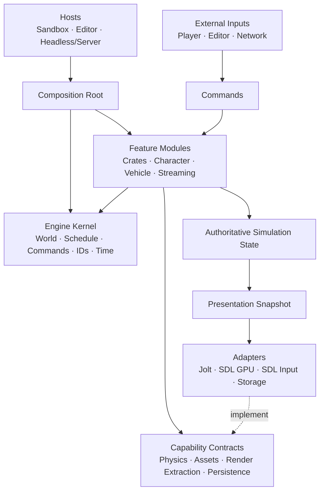

# Incinerator Engine Overhaul Plan

**Status:** The Apple Silicon macOS foundation is complete and accepted through
S11, IV0-IV5, IC0-IC5, and the open-world correction. S12 destination-driven
navigation and S13 authored population/activity are accepted through automated
native product evidence, performance measurement, schema-5 incident evidence,
cleanup, and the product-owner checkpoint. Secondary platforms and public multiplayer services remain
deferred. The neural-rendering proof completed RF10 as an external, unpromoted
`256×144 → 1280×720` technical trial. On 2026-08-17 the product owner paused
that track indefinitely. No learned model is installed or selected as game
content, and no later neural phase is authorized. Deterministic rendering is
the active product direction. ED1 structured developer workspace is complete.
DR1 implementation, automated/native validation, agent-native inspection, and
the product-owner visual walkthrough are complete. S14 ranged combat and S15
content-rich four-district expansion are accepted. ADR-029 and the Engine
Authoring Foundation plan establish EA0-EA5 as the active sequence before a
scripting decision, later gameplay pressure, and network productization. EA0
and EA0.5 are accepted. The local endpoint and canonical CLI schedule amendment
passed focused and aggregate automation, installed native Metal, LLM-agent,
architecture/security/dead-code/documentation, human usability, and
product-owner review. On 2026-08-30 the product owner eliminated the planned
MCP adapter because local coding agents always have shell access and authorized
Phase 7 to make the canonical CLI and repository-owned agent skill first-class.
Its implementation, automated, installed Metal, clean-context agent, and
comprehensive manual agent review pass, and the product owner accepted it on
2026-08-30. EA1-A implementation and machine acceptance are a complete
candidate; product-owner visual/usability review remains before EA1-B.

**Architecture:** Thin kernel + feature-owned vertical slices + capability adapters

**Last reviewed:** 2026-08-30

**Historical roadmap:** [`PLAN_001.md`](PLAN_001.md)

**Completed cleanup record:** [`CLEANUP_PLAN.md`](CLEANUP_PLAN.md)

**Living architecture review:**
[`ARCHITECTURE_REVIEW.md`](ARCHITECTURE_REVIEW.md)

**Multiplayer-first strategy:** [`MULTIPLAYER_PLAN.md`](MULTIPLAYER_PLAN.md)

**Current phase sequence:**
[`M6 accepted`](docs/validation/m6-transactional-authority-cycle.md)
→ [`MP6 accepted`](docs/validation/mp6-playable-multiplayer-room-flow.md)
→ [`S10 accepted`](docs/validation/s10-damage-death-respawn.md)
→ [`S11 accepted`](docs/validation/s11-npc-encounter-combat-response.md)
→ [`post-S11 automated closeout passed; manual acceptance exposed validation gaps`](docs/validation/post-s11-runtime-corrective-audit.md)
→ [`IV0-IV5 interaction validation and observability accepted`](docs/validation/gameplay-interaction-validation-and-observability.md)
→ [`IC0-IC5 incident capture and human closeout accepted`](docs/validation/human-test-incident-capture.md)
→ [`open-world spatial and vehicle-dynamics correction complete`](docs/design/open-world-spatial-diagnostics-and-playability.md)
→ [`S12 accepted`](docs/validation/s12-destination-driven-navigation.md)
→ [`S13 accepted`](docs/validation/s13-authored-population-and-sandbox-activity.md)
→ [`deterministic-rendering resumption audit complete`](docs/validation/deterministic-rendering-resumption.md)
→ [`DR1 accepted`](docs/validation/dr1-playable-deterministic-visual-fidelity.md)
→ [`S14 accepted`](docs/validation/s14-ranged-combat.md)
→ [`S15 accepted`](docs/validation/s15-content-rich-district-expansion.md)
→ [`EA0 accepted`](docs/validation/ea0-ownership-identity-transaction-boundary.md)
→ [`EA0.5 accepted`](docs/validation/ea0-5-local-developer-endpoint-and-canonical-cli.md)
→ `Phase 7 CLI agent contract accepted`
→ [`EA1-A machine candidate; product-owner review pending`](docs/validation/ea1-a-practical-textures-and-materials.md)
→ `EA1-B-EA5 pending`

**Active rendering direction:**
[`DR1 playable deterministic visual fidelity`](docs/design/dr1-playable-deterministic-visual-fidelity.md)

**Completed developer-workspace phase:**
[`ED1 structured developer workspace`](docs/design/ed1-structured-developer-workspace.md)
([validation](docs/validation/ed1-structured-developer-workspace.md))

**Paused experimental rendering track:**
[`RF10 retained externally and unpromoted; no neural continuation authorized`](docs/design/neural-rendering-pause.md)
([historical roadmap](docs/design/rich-fidelity-roadmap.md),
[historical implementation plan](docs/design/title-neural-renderer-implementation-plan.md))

**Purpose:** Source of truth for turning the current learning prototype into a robust, testable, game-specific engine.

---

## How to Use This Document

- Treat a playable, end-to-end feature as the primary unit of delivery.
- Check off work only after its acceptance criteria and slice contract pass.
- Keep cross-cutting build and safety work small, observable, and explicitly gated.
- Extract shared engine infrastructure only after a real slice requires it; prefer a second consumer before generalizing.
- Record architectural decisions in `docs/adr/` and link them from the decision register.
- Add newly discovered risks to the findings register before expanding scope.
- Keep the build matrix current whenever a toolchain, target, backend, or wrapper changes.
- Do not turn logical feature boundaries into microservices or runtime indirection without a demonstrated need.

Status conventions:

- `[ ]` Not started
- `[x]` Complete and verified
- **Blocked**: waiting on a decision or external dependency
- **Deferred**: intentionally outside the current slice
- **Proposed**: documented for review but not yet an accepted implementation
  contract

---

## 1. Objective

Create a game-specific engine capable of supporting a GTA-style 3D sandbox
whose likely primary experience is authoritative multiplayer while retaining
offline solo play. The accepted next architecture treats solo, listen-hosted,
and dedicated modes as different placements of one authority/session model.
Dedicated authority is canonical for public multiplayer, the open-source
GameNetworkingSockets flat C API/direct-IP path is the first remote transport,
and Steam compatibility remains an optional integration boundary. The accepted
direction is recorded in [`MULTIPLAYER_PLAN.md`](MULTIPLAYER_PLAN.md),
[ADR-016](docs/adr/016-authority-session-topology.md),
[ADR-017](docs/adr/017-network-identity-protocol-and-replication.md), and
[ADR-018](docs/adr/018-gamenetworkingsockets-and-steam-compatible-routing.md).

The overhaul must produce these separable products:

1. A small engine/runtime library with an intentional public API.
2. A sandbox or game host containing game-specific composition and content.
3. An optional editor/debug host built from the same commands and features.
4. A headless simulation host suitable for behavioral tests and authoritative servers.
5. SDL, Jolt, storage, and platform adapters that implement narrow capability contracts.
6. Feature modules that own behavior end to end rather than scattering it across global subsystem folders.
7. Offline neural-rendering experiment, evaluation, export, and promotion tools
   whose mutable artifacts remain separate from the runtime and selected game
   content.

The goal is not to finish a generalized engine before making a game. The engine should emerge from successive playable slices, with each slice proving the APIs and shared capabilities it needs.

---

## 2. Architecture Thesis

Incinerator will use a small horizontal kernel and vertically owned gameplay features.



ADR-025 adds a presentation-only refinement: a title-specific neural renderer
may consume versioned immutable raster inputs and produce final scene color.
The deterministic game remains authoritative; the conventional low-fidelity
render remains the fallback; and only an explicitly promoted model bundle may
enter runtime content. Mutable datasets, training runs, and checkpoints are
not engine state.

ADR-026 adds the model-origin constraint: every promotion-eligible learned
component begins from declared random initialization and is trained through the
repository-owned framework on title-owned, exactly paired reference/target
data. External pretrained models may inform research but cannot initialize,
teach, create targets for, or enter the product renderer.

### 2.1 Engine kernel

The kernel provides only capabilities that every or nearly every feature needs:

- world lifecycle;
- fixed-tick schedule and named phases;
- a fixed command phase and target-tick policy for feature-owned queues;
- stable runtime and persistent identity primitives;
- time/tick services;
- diagnostics and failure reporting;
- feature registration and composition;
- shared lifecycle hooks.

The kernel must not import SDL, Jolt, ImGui, concrete game features, or cooked game content.

### 2.2 Feature modules

Features are the default unit of code organization. A feature owns its behavior across ECS data, simulation, persistence, presentation, and tests.

Each feature may contain:

- components and tags;
- commands it accepts;
- events it emits;
- systems and their schedule placement;
- physics behavior expressed through a narrow capability;
- render-extraction data;
- serialization/versioning;
- assets, prefabs, or content declarations;
- optional editor extensions;
- headless behavioral tests and a visual smoke test.

Examples are `CrateFeature`, `CharacterFeature`, `VehicleFeature`, and `WorldStreamingFeature`.

Feature boundaries are logical and compile-time boundaries, not isolated processes. Features may share one Flecs world and one schedule.

### 2.3 Capability contracts

Feature code depends on narrow, gameplay-shaped capabilities rather than concrete backends. Examples:

- create/destroy/query a rigid body;
- cast a character shape;
- resolve a typed asset handle;
- append a render-extraction record;
- read/write a versioned state record;
- enqueue a chunk-load request.

Do not design broad, hypothetical interfaces that mirror all of SDL or Jolt. Add capability surface when a slice demonstrates the need.

### 2.4 Adapters

Adapters implement capability contracts:

- the engine-owned JoltC adapter implements physics capabilities;
- SDL input produces high-level input commands;
- SDL GPU consumes render snapshots and upload requests;
- filesystem/package storage implements content and persistence capabilities;
- ImGui submits editor commands and reads diagnostics.

Adapters never own gameplay policy and never import private feature implementation.

### 2.5 Hosts and composition roots

Hosts select which adapters and features are present:

- **Sandbox:** runtime + renderer + input + current game features.
- **Editor:** sandbox capabilities + editor extensions and authoring commands.
- **Headless tests:** runtime + selected features + deterministic/fake adapters where useful.
- **Server:** runtime + authoritative features + persistence/networking, without renderer or editor.

Composition happens explicitly at startup. There must be no global service locator or universal `EngineContext` that gives every system mutable access to every subsystem.

---

## 3. Dependency and Interaction Rules

These rules are architectural acceptance criteria, not suggestions.

1. Hosts may depend on the kernel, features, capability contracts, and adapters.
2. Features may depend on the kernel and capability contracts.
3. Adapters may depend on contracts and third-party libraries.
4. The kernel and contracts may not depend on adapters, hosts, editor code, or game features.
5. Adapters may not depend on private feature implementation.
6. Feature-to-feature interaction must use an explicit shared contract, command, event, relationship, or shared component—not arbitrary access to another feature’s private state.
7. Editor and networking code submit the same typed commands used by local gameplay where semantics match.
8. Rendering consumes presentation snapshots/render extraction; it does not write authoritative simulation state.
9. Structural ECS mutations occur through deferred commands at declared schedule boundaries.
10. Worker-thread and Jolt callbacks publish bounded data/events; they do not directly mutate ECS, editor, renderer, or gameplay state.
11. Server/headless targets must compile without SDL GPU, ImGui, renderer assets, or editor dependencies.
12. A feature’s public surface is intentionally small; files inside the feature are private by default.

### Commands, events, and queries

- **Command:** a request to change state at a safe boundary, such as `SpawnCrate`, `EnterVehicle`, or `SetTransform`.
- **Event:** an immutable fact that already occurred, such as `BodyContacted`, `VehicleEntered`, or `ChunkActivated`.
- **Query:** a read of current state with no hidden mutation.

Do not use one mechanism for all three roles.

---

## 4. Feature Module Contract

Every vertical slice exposes one startup registration entry point conceptually equivalent to:

```zig
pub const CharacterFeature = struct {
    pub fn register(registry: *FeatureRegistry) !void {
        // Register only this feature's components and scheduled systems.
    }
};
```

S0 proved this minimum registry contract:

- deterministic registration;
- declared fixed schedule phases;
- component/tag registration and named system registration;
- startup freeze with registration rejected afterward;
- headless composition without renderer/editor hooks.

Typed command/outcome queues, persistence, render extraction, configuration,
and cleanup are feature-owned APIs, not central registries. Host-specific
inclusion happens at composition. Runtime enable/disable, unregistration,
dynamic discovery, and capability metadata remain deferred until a real slice
requires them.

### Feature definition of done

A feature is complete only when:

- its behavior works end to end through commands and scheduled systems;
- it can be constructed and tested headlessly;
- it has a visual/runtime smoke test when presentation is relevant;
- spawn/despawn and resource cleanup are verified;
- state that must persist has versioned serialization;
- failure and cancellation behavior are defined;
- performance measurements exist for its expected scale;
- it introduces no prohibited dependency edges.

---

## 5. Target Repository Shape

The exact file layout may evolve, but dependency direction should resemble:

```text
src/
  engine/
    root.zig
    kernel/
      world.zig
      schedule.zig
      commands.zig
      identity.zig
      time.zig
      diagnostics.zig
    contracts/
      physics.zig
      assets.zig
      rendering.zig
      persistence.zig

  adapters/
    sdl_platform/
    sdl_gpu/
    jolt/
    storage/

  features/
    crates/
    character/
    vehicle/
    world_streaming/

  hosts/
    sandbox.zig
    editor.zig
    headless.zig
    server.zig
```

Do not create every directory up front. Slice 0 should establish only the minimum real structure, and later slices should validate or revise it.

---

## 6. Current Baseline

The repository now contains a small feature-authoring kernel, a complete S11
authoritative sandbox composition shared across solo, listen, dedicated, and
headless placements, and the cold M3 operational authority product. The visual
host composes cooked
two-district GPU residency, interaction, navigation/population, diagnostics,
replay, profiling, and durable authoring; the cold product composes only
logical authority and operational lifecycle:

- `src/root.zig` exposes backend-neutral contracts plus the type-erased
  `Runtime`/startup registry used by game features.
- `src/main.zig` composes visual input, camera, GPU resources, renderer, debug
  UI, and one opaque embedded placement; it does not own or mutate the concrete
  authority `Simulation` directly.
- `src/hosts/headless.zig`, `src/session/authority.zig`, and
  `src/hosts/simulation.zig` prove the same logical sandbox authority behavior
  with no SDL/editor/renderer edge.
- The prototype `GameWorld`, borrowed Flecs/Jolt path, direct ECS render query,
  Scene/Gizmo mutation tools, and their compatibility seams are removed.
- `CrateFeature`, `CharacterFeature`, `VehicleFeature`, `DistrictFeature`,
  `InteractionFeature`, `NpcFeature`, `VitalsFeature`, and
  `NpcEncounterFeature` independently own their typed commands, outcomes,
  persistence records, lifecycle, systems, or presentation extraction. The
  population planner, durable NPC replacement policy, and normal-product
  encounter lifecycle owner retain narrower composition-owned responsibilities.
- A private snapshot module owns the current schema-15 snapshot values, canonical encoding, cold
  preflight, cross-feature identity/relationship validation, and exact world
  fingerprints. The live authority owns transactional capture/restore and one
  shared physics step; all feature records restore together without private
  coupling, and feature-owned tuning is authoritative.
- The Jolt adapter now exposes a narrow CharacterVirtual capability with
  bottom-anchored capsules, world-qualified handles, slope/ground state, and
  explicit update/destruction semantics.
- The public pure fixed-step accumulator proves 240/80 Hz presentation cadence
  and the 250 ms anti-spiral policy independently of SDL's wall clock.
- Historical ReleaseFast S0 through S3-A characterizations and the S3-B
  cooked/staged/GPU resource baseline are preserved as dated records; their
  phase-only measurement executables are not current workflows.
- A sandbox-owned action latch bridges frame-scoped SDL state to tick-scoped
  character commands without losing or replaying edges/deltas.
- The upgraded application builds in Debug and ReleaseFast, with and without
  the editor, on Apple Silicon macOS.
- MSL shader artifacts and reflection data are generated from cache-backed
  outputs. Apple Silicon macOS/Metal is the sole current platform target;
  Linux/Windows and their shader paths are fully deferred with no gates.
- The sandbox installs and loads the small provenance-recorded S3 cooked fixture
  through an explicit content root; the unreferenced game-owned demo GLBs were
  removed from the engine repository.
- Reusable district contracts own bounded values and structural validation;
  `src/sandbox/district_recipe.zig` owns concrete installed coordinates,
  collision fixtures, and the exact two-district navigation policy.
- S4 provides bounded structured diagnostics, immutable first-fault retention,
  same-cohort replay with category-first divergence, renderer-neutral physics
  evidence, and fixed profiling/Metal overlay ownership.
- S5 through S8 established typed durable authoring, exact two-district
  catalogs, cross-district carry ownership, cooked-route NPC authority,
  Snapshot V7/replay cohort 5, and a measured 64-NPC/65-controller scale
  contract. S10/S11, the post-S11 streamed-route correction, and ADR-022's
  spatial-object/vehicle-tuning change advance the current durable state to
  Snapshot V12 and replay schema 12. Protocol revision 14 removes the invalid
  residency-gated drop meaning without a compatibility decoder. Replay records
  authority-owned vitals and NPC-replacement orchestration so lethal
  encounter/repopulation cycles and explicit drop purpose remain inside the
  exact replay boundary. The
  `world-config-v5` domain remains unchanged.
- Automatic listen/dedicated bootstrap uses six NPCs, one per authored route
  node. The 64-NPC value remains the synthetic scale and saturation ceiling;
  the normal embedded product separately seeds one playable hostile through a
  narrow host-managed owner that correlates its authority-owned death and
  replacement lifecycle.
- M3 provides a genuinely cold three-file headless product, exact bounded
  startup admission, one-world process ownership, two generational synthetic
  producers, signal/lag/storage/fault lifecycle gates, and routine/long
  ReleaseFast soak budgets. It introduces no transport or secondary platform.

### 6.1 Verified build matrix

| Configuration | Verified result | Remaining requirement |
|---|---|---|
| Zig 0.16.0 Debug, editor enabled, Apple Silicon macOS | Pass | Keep as the primary development gate |
| Zig 0.16.0 Debug, editor excluded | Pass; zgui/ImGui are not compiled or linked | Preserve with a clean-cache CI check |
| Zig 0.16.0 Debug and ReleaseFast tests | Pass; aggregate kernel, contracts, feature, simulation, headless, Jolt, visual-host, input/resource, and shader suites | Preserve in CI |
| Zig 0.16.0 ReleaseFast, editor excluded | Pass | Preserve in CI |
| macOS Metal runtime smoke | Pass, including the installed ReleaseFast Mach-O launched from `/tmp` | Preserve the serialized local Tier-1 readiness gate; do not promote graphical smokes to hosted CI until WindowServer/Metal reliability is proven |
| Relocatable macOS non-GPU install probe | Pass from an unrelated working directory | Preserve as the deterministic hosted relocation check |

### 6.2 Dependency baseline

| Component | Exact current contract | Notes |
|---|---:|---|
| Zig | 0.16.0 | Exact archive checksums are enforced in CI; `.zigversion` records the developer contract |
| SDL | wrapper `0.5.3+SDL3.4.14` at `fb2d799c...` | Static linkage selected; target/optimization propagated from the root build |
| Jolt | 5.5.0 at `23dadd0e...` | Built from source through the engine-owned JoltC package |
| JoltC | `amerkoleci/joltc@52d8c98...` | 32-bit object-layer ABI assertions enabled; single precision; cross-platform determinism explicitly off |
| zgui | `0b468ccd...` | Lazy and absent when `-Deditor=false`; engine adapter compiles its backend against SDL 3.4.14 headers |
| zmath / zmesh / zstbi / zflecs | Exact tested commits in `build.zig.zon` | Linkage/features are explicit; Flecs C/Zig ABI options match and `flecs.c` has one owner |
| shaderc / SPIRV-Cross | vcpkg baseline `cd61e1e...`; shaderc 2026.2; SPIRV-Cross 1.4.350.0 | Exact Apple Silicon macOS GLSL → SPIR-V → MSL and reflection toolchain; secondary-platform manifests are removed |

---

## 7. Guiding Principles

1. **Vertical slices deliver value.** Shared infrastructure exists to serve a demonstrated slice.
2. **Builds are evidence.** Debug success does not imply Release, cross-target, packaging, or clean-checkout success.
3. **Ownership is visible in types.** Owning handles live in explicit owner aggregates; copy-safe views and IDs are non-owning. Slice-owned registries eventually replace convention-only owner moves.
4. **Simulation state is serializable.** Runtime state does not depend on GPU pointers or process-local identifiers.
5. **Mutation happens at declared boundaries.** Gameplay, editor, networking, streaming, and workers submit commands/events.
6. **Simulation and presentation are distinct.** Rendering consumes extracted snapshots.
7. **Dependencies are adapters, not architecture.** Flecs, Jolt, SDL, and ImGui remain behind narrow seams.
8. **Headless operation is an architectural test.** Core behavior runs without SDL GPU or ImGui.
9. **Failure paths are first-class.** Partial initialization, cancellation, device loss, malformed assets, and destruction are tested.
10. **Rule of two.** Keep slice-specific logic local until a second real consumer demonstrates a shared abstraction.
11. **No speculative generality.** Prefer a concrete, narrow API that can evolve over a broad “future-proof” interface.
12. **Decisions are versioned.** Superseded ADRs are marked, not left “Accepted.”

---

## 8. Decision Register

| ID | Decision | Status | Required before |
|---|---|---|---|
| D-001 | Initial product scope: prove the sandbox and server-shaped authority locally before networking | Accepted in ADR-007 and delivered through M3; multiplayer-first successor is accepted under D-018 through D-020 | Network/state architecture |
| D-002 | Initial hosts: sandbox and headless; optional in-process editor; server later | Accepted in ADR-007 | Slice 0 |
| D-003 | Exact Zig 0.16.0 toolchain and coordinated wrapper cohort | Implemented | Every build/CI change |
| D-004 | Engine-owned JoltC 5.5 build package plus narrow engine adapter; expand capabilities per slice | Implemented for rigid bodies, CharacterVirtual, and the integrated S2 real-Jolt four-wheel capability | Future physics slices |
| D-005 | Main thread owns ECS mutation/GPU submission; callbacks publish bounded data | Accepted in ADR-008 | Async assets/contact events |
| D-006 | Allocator and memory-budget strategy | Implemented through M3: bounded logical/content workers and visual ownership, fixed feature/router queues, tracked allocator peaks/final-live bytes, absolute process RSS, snapshot/envelope ceilings, and per-slice measured budgets; future slices must add their own cohorts | Future slices |
| D-007 | Physics owns dynamic-body simulation transforms; presentation reads interpolated snapshots | Implemented for S0 in amended ADR-005 | Slice 0 scheduling/interpolation |
| D-008 | Stable entity ID and serialization model | Implemented through the composition-owned schema-15 snapshot, canonical crate/character/vehicle/district/interaction/NPC/encounter/population/replacement state, authoritative tuning, explicit persisted-route modes, validated relationships, and four-district logical reconstruction; live multi-world atomic replacement is outside the accepted one-world-per-process M3 model | Save/restore |
| D-009 | Apple Silicon macOS/Metal is the only current platform; Linux/SteamOS and Windows are future/deferred with no current gates | Implemented in amended ADR-007; active secondary-platform paths are removed and create no abstraction requirement | Explicit secondary-platform product decision |
| D-010 | Measured entity, body, controller, contact-evidence, draw, queue, memory, streaming, persistence, and fixed-tick budgets | Implemented through M3 with S8 representative population scale plus routine/long one-world authority soaks and automatic ceilings | Future slices extend their own measured budgets |
| D-011 | Thin-kernel + feature-module architecture | Accepted by this plan | Slice 0 |
| D-012 | Commands/events/queries as cross-boundary interaction model | Accepted by this plan | Slice 0 |
| D-013 | Source assets, cooked assets, and runtime content packaging policy | Accepted in ADR-009; runtime consumes explicit-root versioned cooked bundles, while source import is offline/editor-only and S3-A procedural data is conformance content | Streaming slice |
| D-014 | Bounded diagnostics, immutable inspection, and same-build replay contract | Accepted for S4; no remote telemetry platform or mutable editor service locator | S4 |
| D-015 | Durable save-slot storage and greenfield schema compatibility policy | Accepted for S5; unsupported cohorts may be rejected until a stability promise exists | S5 |
| D-016 | One simulation world per process and macOS-local server-shaped readiness; deployment platforms remain a future decision | Accepted for M3; replacing/forking zflecs remains an explicit alternative if a later product requires multi-world processes | M3/S9 |
| D-017 | Post-M3 greenfield consolidation: current cohorts only, separate product/validation compositions, sandbox-owned content policy, owned editor, minimal macOS dependency graph | Completed under `CLEANUP_PLAN.md`; no compatibility, secondary-platform, or multiplayer scope | Next gameplay phase |
| D-018 | Authority is a role: solo uses embedded local authority, optional private listen mode co-locates client and authority, and canonical public dedicated mode runs the same authority headlessly | Accepted in [ADR-016](docs/adr/016-authority-session-topology.md) | MP1 client/authority separation |
| D-019 | Network identity/protocol/replication are explicit and feature-owned; durable saves, replication snapshots, prediction history, and accepted-ingress replay remain distinct | Accepted in [ADR-017](docs/adr/017-network-identity-protocol-and-replication.md) | MP2 protocol implementation |
| D-020 | Use open-source GameNetworkingSockets through its flat C API, prove direct IP first, keep dedicated authority canonical, and preserve optional non-vendored Steamworks P2P/SDR compatibility | Accepted in [ADR-018](docs/adr/018-gamenetworkingsockets-and-steam-compatible-routing.md) | MP2 transport implementation |
| D-021 | Validate gameplay as one causal temporal journey through typed scenarios, bounded interaction traces, continuous invariants, readable product feedback, semantic Metal visibility, and shared topology/fault execution | Accepted in [ADR-020](docs/adr/020-gameplay-interaction-validation-and-observability.md); IV0-IV5 complete | Additional gameplay slices |
| D-022 | Persist human-test evidence as bounded per-run incident bundles with anomaly bookmarks, grep-friendly streams, trailing real-swapchain screenshots, concise LLM handoff, and replay attachments | Accepted in [ADR-021](docs/adr/021-local-human-test-incident-bundles.md); IC5-A through IC5-I, including long gameplay/window/replay/cost, deterministic failure hardening, bounded-object/budget/playable-boundary corrections, and the schema-3 -5/+2 eight-anchor visual contract, are implemented and human-validated for macOS solo under the [corrective plan](docs/design/incident-evidence-reliability-and-boundary-corrections.md). | Extend the same evidence quality when a future product phase makes listen/dedicated human sessions routine |
| D-023 | NPCs retain stable semantic destinations while a shared deterministic bounded planner derives transient routes, distinguishes waiting/blocked/unreachable, and accepts physical displacement without snap-back | Accepted and implemented in [ADR-023](docs/adr/023-semantic-destinations-and-navigation-recovery.md), the [S12 plan](docs/design/s12-destination-driven-navigation.md), [evaluation world](docs/design/s12-navigation-evaluation-world.md), and [accepted evidence](docs/validation/s12-destination-driven-navigation.md) | Complete; retained by S13-S15 |
| D-024 | Stable authored population membership owns role, cyclic activity intent, slot claims, combat disposition, and replacement across disposable NPC actors | Accepted and implemented in [ADR-024](docs/adr/024-authored-population-intent-and-activity-slots.md), the [S13 plan](docs/design/s13-authored-population-and-sandbox-activity.md), the [population evaluation world](docs/design/s13-population-evaluation-world.md), the [accepted S13 evidence](docs/validation/s13-authored-population-and-sandbox-activity.md), and the [performance baseline](docs/performance/s13-baseline.md) | Complete; expanded by S15 |
| D-025 | Game-specific neural rendering is a presentation capability with a versioned buffer ABI, explicit fallback, external experiment lifecycle, and human-promoted immutable model bundles | Accepted in [ADR-025](docs/adr/025-game-specific-neural-rendering-boundary.md); completed through the retained external RF10 trial; no model promoted | Paused indefinitely; explicit product-owner restart required |
| D-026 | Promotion-eligible neural-renderer weights and learned dependencies are title-specific, trained from random initialization on title-owned exact pairs, and reproduced through the engine framework; pretrained models remain comparisons only | Accepted in [ADR-026](docs/adr/026-from-scratch-title-neural-renderer.md), the [north star](docs/design/title-neural-renderer-north-star.md), and its [phase-gated implementation plan](docs/design/title-neural-renderer-implementation-plan.md) | Retained policy if the paused track is explicitly restarted |
| D-027 | One finite-ammunition handgun is authoritative across solo/listen/dedicated placement; clients submit intent, authority derives current-state semantic/Jolt hits, and vitals owns damage/death | Accepted and implemented in [ADR-027](docs/adr/027-authoritative-ranged-combat.md) and the [S14 validation ledger](docs/validation/s14-ranged-combat.md) | Future weapon slices and measured lag-compensation decision |
| D-028 | The current sandbox is one exact four-district 2×2 cohort; the composition owns continuous flat support, districts own obstacles/decoration/navigation, and the admitted 32-node graph remains sufficient until measured content proves a navmesh or crowd need | Accepted and implemented in [ADR-028](docs/adr/028-content-rich-four-district-cohort.md), the [phase plan](docs/design/s15-content-rich-district-expansion.md), [evaluation world](docs/design/s15-four-district-evaluation-world.md), [accepted validation](docs/validation/s15-content-rich-district-expansion.md), and [performance baseline](docs/performance/s15-baseline.md) | Complete; establishes EA0-EA5 baseline |
| D-029 | Reusable runtime capabilities, reusable engine tooling, game runtime/content, and game tooling are separate owners; typed UI and local AI clients share owner-defined authoring transactions; scripting remains evidence-gated | Accepted in [ADR-029](docs/adr/029-engine-game-authoring-boundary.md); EA0, EA0.5, and Phase 7 are accepted; EA1-A has a complete machine candidate in its [validation ledger](docs/validation/ea1-a-practical-textures-and-materials.md) | Complete EA1-A product-owner review, then EA1-B-EA5 and final G1 proof |

### Decision notes

#### D-001: Product scope

Even if the first product is single-player, preserve two inexpensive future-facing properties:

- serializable, GPU-independent simulation state;
- separation between authoritative simulation and presentation snapshots.

If genuine MMO remains the target, authoritative simulation, replication, interest management, persistence, and operational tooling become early product work rather than a late networking feature.

The post-M3 product assessment now considers multiplayer the likely primary
experience. `MULTIPLAYER_PLAN.md` therefore establishes the
client/authority/session boundary before another major gameplay slice. This
does not retroactively change what D-001 delivered; it is an accepted successor
direction under D-018/D-020.

#### D-004: Physics binding

The prototype `zphysics` dependency has been removed. `src/adapters/physics/jolt_c.zig` is the only raw C import, and `src/physics.zig` exposes engine-owned rigid-body types. The engine-owned build package exact-pins Jolt 5.5 and JoltC, compiles upstream ABI assertions, and is tested without SDL/editor linkage.

S1 proved a narrow CharacterVirtual capability without exposing raw Jolt
shapes, filters, pointers, or enums. S2 Stage A now proves a real four-wheel
`VehicleConstraint` capability with engine-neutral configuration/state,
world-qualified handles, explicit native owner rollback, fixed front-drive
tuning, logical wheel-motion reconstruction, and no per-vehicle step. S2 now
integrates it through one neutral composition-owned shared step and a narrow
driver-authority port. The adapter still does not expose generic constraints or ragdoll APIs;
later slices must prove those surfaces. Logical game state is serialized and
reconstructed rather than treating opaque Jolt state as a persistence contract.

Cross-platform deterministic Jolt compilation is explicitly disabled. The future online direction is an authoritative server, not peer lockstep; enabling the option later requires measured behavior and performance evidence.

#### D-009: Platform priority

Apple Silicon macOS with Metal is the only current platform target. It receives
all build, test, gameplay, editor, performance, failure, packaging, installed
runtime, and CI investment.

Linux/SteamOS and Windows are future product possibilities only. They have no
current cross-build, shader, headless, runtime, packaging, CI, or compatibility
gates, and they must not motivate multi-platform abstractions. Active
secondary-platform paths are removed. A future platform or Linux server begins
with a separate decision and an explicit porting milestone.

Vendored `third_party/joltc-zig` retains upstream OS/compiler conditionals as
dependency-internal portability code. Those branches are not engine platform
options or support claims; the top-level graphs reject unsupported targets
before dependency resolution.

---

## 9. Delivery Roadmap

| Stage | End-to-end outcome | Status |
|---|---|---|
| M0 | Reproducible baseline and blocking decisions | Complete |
| M1 | Trustworthy Apple Silicon macOS build, shader, dependency, CI, and packaging gate | Complete for the macOS-only scope; all secondary-platform work is deferred |
| M2 | Immediate ownership and correctness hazards removed | Complete; the later streamed-content lifecycle and evidence were completed in S3 |
| S0 | Crate lifecycle slice proves the kernel and feature contract | Complete; later multiplayer backpressure work is complete through M4/M5 and one-world-per-process remains an accepted constraint |
| S1 | Character walks around one block | Complete; independent architecture, correctness, and build/evidence reviews pass with no remaining P0/P1/P2 finding |
| S2 | Player enters and drives one vehicle | Complete; real Jolt vehicle, driver authority, Snapshot V3, procedural presentation, native Metal lifecycle smokes, ReleaseFast baseline, and independent reviews pass |
| S3 | One district/chunk loads and unloads asynchronously | Complete; procedural/headless ownership, cooked/Metal residency, host proximity, cancellation/drain, repeated installed lifecycle evidence, and independent reviews pass |
| S4 | A developer can inspect, capture, and reproduce a sandbox fault | Complete; all three stages and the final integrated diagnostics/replay/visualization review pass with no remaining actionable P0/P1/P2 finding |
| S5 | Transform authoring supports command, undo, durable save, restart, and restore | Complete; full macOS/editor/cold-restart evidence and independent review pass |
| S6 | Two authored districts cook, install, select, and stream deterministically | Complete; exact catalog admission, two-slot logical/visual authority, durable/replay cohorts, native overlap/drain evidence, and independent reviews pass |
| S7 | Persistent interaction and cross-district world ownership are proven | Complete; transactional authority, save/replay, native Metal, 128-cycle measurement, and independent review pass |
| S8 | A bounded navigation-driven population crosses streamed districts safely at representative scale | Complete and independently reviewed |
| M3 | A server-shaped headless product is operationally ready for external producers | Complete and independently reviewed |
| S9 / MP0-MP5 | Establish one multiplayer-first authority model, prove two clients, and network the completed gameplay surface | Complete for the Apple Silicon macOS foundation scope; M5 subsequently closed the residual embedded-solo facade |
| M4 | Multiplayer foundation is ready for future gameplay slices | Complete and accepted on Apple Silicon macOS |
| M5 | Embedded solo becomes a cohesive placement of the same client/authority model before another gameplay slice | Complete and accepted on Apple Silicon macOS |
| M6 | Bounded ingress and prepared derivatives use one fail-stop atomic-publication cycle while delivery/storage retain separate lifecycles | Complete, independently reviewed, and accepted on Apple Silicon macOS |
| MP6 | Graphical create/join/ready/connect/reconnect/close works through solo, constrained listen/LAN, and dedicated direct-IP placements | Complete, independently reviewed, and accepted on Apple Silicon macOS |
| S10 | Players and NPCs use authoritative vitals, death cleanup, and generational avatar respawn | Complete, independently reviewed, and accepted on Apple Silicon macOS |
| S11 | A hostile NPC perceives, selects, chases, attacks, disengages, dies, and is safely replaced with visible authoritative feedback | Complete, independently reviewed, and accepted on Apple Silicon macOS |
| Post-S11 correction | Repair playable movement/facing/blockers/wheels, close discovered route/delivery/headless/product-bootstrap/lifecycle seams, and repeat the macOS evidence matrix | Complete and accepted; later IC5-H/IC5-I evidence and boundary corrections are separately recorded |
| IC5 | Make human anomaly capture, replay, handoff, and gameplay-boundary evidence trustworthy under ordinary and destructive conditions | Complete and accepted through schema 3, fresh human bundles, installed Metal, replay, failure hardening, and physical gameplay acceptance |
| Open-world corrective | Preserve traversal and dynamic-object continuity while exposing district/NPC intent and objectively characterizing vehicle handling | Complete and human-accepted; ADR-022 and the vehicle-dynamics report record the current contract |
| S12 | One NPC retains a semantic destination through branch choice, content waiting, topology revision, physical obstruction, displacement, encounter interruption, restore, replay, and network placement | Complete and accepted; automated focused, performance, schema-4 incident, installed Metal, evaluation-world, and product-owner evidence pass |
| S13 | Twelve stable authored population members perform role-driven activities, contend for slots, fight, die, and replace safely | Complete and accepted; automated product, schema-5 incident, scale, performance, Metal, and product-owner evidence pass |
| ED1 | One structured, metadata-addressable developer workspace replaces scattered overlay tools | Complete and accepted; docked layouts, startup control, incident-aligned time, editor-on/off builds, and product-owner evidence pass |
| DR1 | The ordinary deterministic product has one readable lit material path, coherent evaluation world, Render Lab, and semantic render evidence | Complete and accepted; native Metal journey, incident evidence, editor-on/off aggregates, and product-owner visual walkthrough pass |
| S14 | One authoritative finite-ammunition handgun works across solo, listen, and dedicated placements | Complete and accepted; automated/native, ordinary-product, and continuous mouse-look follow-up pass |
| S15 | One content-rich four-district cohort supports cross-axis traversal, authored activity, deterministic content admission, and measured four-scene residency | Complete and accepted; automated/native and product-owner evidence pass |
| EA0 | Engine/game/tooling ownership, asset identity, and typed authoring transaction boundary are executable | Complete and accepted |
| EA0.5 | Developer-only local typed endpoint and canonical CLI use the same selection, viewport, authoring, persistence, and capture owners as ImGui | Complete and accepted; final human correction unified renderer bounds, ImGui gizmo, and retained hit-region visibility across Character/Free Camera transitions |
| Editor Phase 7 | Canonical CLI publishes a first-class machine catalog and guided results; a repository-owned skill teaches safe shell-agent workflows without duplicating commands | Complete and accepted by the product owner on 2026-08-30 |
| EA1 | Practical texture/material import, assignment, authoring, and evidence | EA1-A import/runtime/inspection machine candidate complete; product-owner review pending. EA1-B not started |
| EA2 | Vehicle archetypes, live revisioned tuning, and local AI/developer control | Approved; implementation not started |
| EA3 | Authored directional sun and point-light capabilities | Approved; implementation not started |
| EA4 | Game-owned map assets and construction workflow | Approved; implementation not started |
| EA5 / G1 | A separately built game consumes explicit engine/runtime and engine-tooling boundaries | Approved; implementation not started |
| NR0 | A paired deterministic scene produces an evaluated title model, explicit promotion, installed macOS inference, truthful fallback, diagnostics, and measured evidence | NR0-A through NR0-D accepted; NR-0001/2 unpromoted, NR-0003 comparison-only; no model selected. ADR-026 requires the next candidate lineage to start from random initialization. |

M0–M2 are foundational cross-cutting gates. S0–S8 are end-to-end vertical
slices. M3 is a narrow pre-network readiness gate, not a speculative server
framework. The earlier monolithic/conditional S9 has been decomposed into the
MP0-MP5 program in `MULTIPLAYER_PLAN.md`; the topology, protocol, GNS transport,
dedicated-first public placement, direct-IP-first proof, optional Steam
compatibility, player target, and starting rates are accepted. MP0-MP5 and M4
now prove the client/authority boundary, real GNS placement, prediction,
impairment, accepted-ingress replay, feature-owned replication, bounded district
relevance/deltas, and open room admission. M5 closes the deliberately retained
embedded-solo physical and semantic cohesion gap before a new gameplay slice.
That M5 gate is complete and accepted.
M6 now hardens bounded ingress, derivative publication, delivery, and
durable-decision boundaries without moving network I/O or blocking storage into
the simulation tick. MP6 now makes the completed room core playable and proves
a constrained localhost/LAN listen placement plus dedicated ticketed parity
without Steam/NAT/public-service scope. S10 now closes the next product slice:
authoritative melee, shared player/NPC vitals, death, typed ownership cleanup,
dead reconnect, and generational safe avatar respawn.
S11 now applies those accepted boundaries to
authority-owned NPC perception, hostility, deterministic target selection,
pursuit, telegraphed melee, damage reaction, death, and safe population
replacement while retaining explicit firearm, lag-compensation, public-service,
and MMO deferrals. Its accepted contract and evidence are recorded in
[`S11 Playable NPC Encounter And Combat Response`](docs/design/s11-npc-encounter-combat-response.md)
and the
[`S11 Acceptance Record`](docs/validation/s11-npc-encounter-combat-response.md).
The post-S11 correction then closes playable movement/facing/blocker/wheel,
streamed-route, reliable-delivery, persistent-headless, presentation, and
ordinary product-bootstrap/lifecycle gaps. Automatic listen/dedicated bootstrap
now uses six authored NPC nodes, while 64 remains the synthetic scale ceiling
and its historical co-location pressure is resolved by S13's separate
sixteen-controller physical cohort. Final corrective acceptance is recorded in the
[`Post-S11 Runtime Corrective Audit`](docs/validation/post-s11-runtime-corrective-audit.md).
Shared diagnostics, storage, content, rendering, and server-shaped capabilities
are extracted only as concrete slices prove their consumers.

---

## 10. M0 — Baseline and Blocking Decisions

### Work

- [x] Exact-pin Zig 0.16.0 in `.zigversion`, package metadata, documentation, and CI archive checks.
- [x] Record and run clean-checkout Debug build and test commands.
- [x] Capture ReleaseFast and cross-target failures as regression cases.
- [x] Record a minimal native Metal runtime smoke test.
- [x] Resolve D-001 through D-005 before their dependent slices begin.
- [x] Define the initial host set and composition roots for D-002.
- [x] Mark ADR-002 superseded by the feature-oriented architecture decision.
- [x] Amend ADR-004 to document quaternion storage rather than Euler storage.
- [x] Reconcile ADR-005 with D-007 transform authority.
- [x] Define supported and explicitly unsupported host/target combinations.

### Acceptance criteria

- [x] A new developer can install the exact toolchain without relying on Homebrew’s latest Zig.
- [x] Debug build and tests are reproducible from a clean source copy.
- [x] Blocking decisions have an owner and ADR.
- [x] No accepted ADR contradicts current policy without a superseded marker.

---

## 11. M1 — Toolchain, Build, Shader, CI, and Packaging Gate

### 11.1 Dependency configuration

- [x] Forward `.target` and `.optimize` to every dependency that consumes them.
- [x] Verify native macOS artifacts use the requested target and optimization mode.
- [x] Make `-Deditor=false` exclude zgui/ImGui compilation and linkage.
- [x] Remove the incompatible zphysics debug path and explicitly defer its JoltC replacement.
- [x] Make dependency features explicit rather than relying on defaults; align Flecs C/Zig ABI options and compile zgui's backend against the selected SDL headers.

### 11.2 Build correctness

- [x] Make intended optimization modes build or document explicit exclusions.
- [x] Make tests depend on every generated input they embed.
- [x] Add a clean-checkout test without generated source-tree shaders or prior caches.
- [x] Eliminate source-tree mutation from build steps.
- [x] Replace host-specific filesystem commands and undeclared shader outputs with cache-backed `LazyPath` artifacts.
- [x] Ensure `zig fmt --check` passes.

### 11.3 Shader/backend contract

- [x] Complete and validate the locked SDL_shadercross/DXC offline path alongside the exact shaderc/SPIRV-Cross cohort.
- [x] Use `main` for generated SPIR-V and `main0` for generated MSL.
- [x] Move the primitive vertex UBO to SPIR-V set 1.
- [x] Generate DXIL and validate its `DXBC` container before advertising the D3D12 path.
- [x] Advertise only the embedded shader format and explicitly select the compatible implemented driver.
- [x] Validate current SPIR-V entry points, resource counts, sets/bindings, block sizes, stages, and vertex interfaces through reflection.
- [x] Query the claimed window’s swapchain format, select a supported depth format, and supply both to every scene/editor pipeline.
- [x] Preserve the offline MSL contract and macOS Metal runtime smokes.
- **Fully deferred by platform policy:** Linux/SteamOS and Windows compilation,
  shaders, headless behavior, runtime, packaging, and CI. Removed experimental
  paths remain available in repository history only.

### 11.4 CI and packaging

- [x] Define formatting, Debug, ReleaseFast, clean-test, and Apple Silicon
  macOS workflow gates; record the first hosted macOS run.
- [x] Remove Linux/Windows jobs and macOS-hosted cross-target checks after the
  platform scope was narrowed to macOS only.
- [x] Add reflected shader-contract validation.
- [x] Add a non-GPU package/install probe that runs outside the repository root.
- [x] Remove the bootstrap host’s working-directory/game-content dependency; define the real runtime content-root/VFS contract under D-013 when a slice needs content.
- [x] Keep the bootstrap package procedural, with no runtime assets to install or cook.
- [x] Include required source, shader, local dependency, tool, CI, and documentation paths in `build.zig.zon`.
- [x] Gate Zig-filtered source-package membership and execute the headless test graph from the extracted package so `.paths` and file-mode drift cannot escape checkout-only tests.
- **Deferred by owner:** select and add the engine `LICENSE`. No redistribution/release claim is permitted until then.
- [x] Remove the unreferenced/unprovenanced game-owned demo GLBs from the engine
  repository; retain only self-authored conformance fixtures with provenance.
- [ ] Record third-party notices before distribution.
- **Deferred to the separately licensed game:** choose Git LFS or an artifact
  store when real large game source assets exist.

### 11.5 Coordinated dependency migration

- [x] Preserve the Zig 0.15.2 failure/baseline evidence before the greenfield cutover.
- [x] Select a tested Zig 0.16 cohort for SDL and Zig wrappers.
- [x] Upgrade SDL to the selected 3.4.12 package cohort.
- [x] Port engine/build APIs to Zig 0.16.
- [x] Replace zphysics with the exact-pinned Jolt 5.5/JoltC adapter under D-004.
- [x] Re-run the local matrix and exact-pin every selected revision.

### Acceptance criteria

- [x] Debug and ReleaseFast pass on the primary platform.
- [x] Clean tests pass without hidden generated artifacts.
- [x] Apple Silicon macOS passes offline MSL and native Metal validation.
- [x] The installed macOS visual runtime launches outside the repository from
  `/tmp`, completes the S1 Metal behavior contract, and tears down cleanly.
- [x] Zig support is an exact tested contract.

---

## 12. M2 — Immediate Safety and Correctness Gate

M2 fixes proven hazards. It does not attempt to finish the future engine architecture.

### 12.1 Ownership and failure safety

- [x] Remove freely copied owning `Texture` values and the debug-texture double/triple release.
- [x] Release caller-owned Jolt shape references after successful body creation.
- [x] Create replacement depth resources before releasing active resources.
- [x] Make partial renderer and glTF initialization transactional.
- [x] Destroy initialized glTF meshes on every later failure.
- [x] Remove the unsafe legacy debug-batch path; a future JoltC debug renderer starts from a new lifetime model.
- [x] Remove the obsolete debug-renderer teardown ordering path with that deferred feature.
- [x] Add correct unwinding after process-level Jolt initialization, including multi-world runtime leases and world-qualified handles.
- [x] Prevent body recreation from destroying the old body until replacement succeeds; the editor now replaces box shapes in place.

### 12.2 Input, transforms, and platform behavior

- [x] Always maintain physical input state, including release and focus-loss handling.
- [x] Gate gameplay actions with ImGui `WantCapture*`, not backend event recognition.
- [x] Correct Euler argument order/conversion and add axis-specific plus combined-angle tests.
- [x] Stop named Flecs spawns from aliasing multi-primitive entities; root lookup identities are validated and unique.
- [x] Use body-origin position rather than center-of-mass position for synchronization.
- [x] Transform normals into the declared lighting space.
- [x] Prevent minimized/backpressured rendering from busy-spinning; track the
  main-window minimized/restored state, suspend simulation/presentation while
  minimized, resynchronize the clock, and pass the installed native lifecycle
  smoke across a measured 750 ms dwell.

### 12.3 Error policy and tests

- [x] Distinguish skipped/minimized frames from fatal renderer failures.
- [x] Propagate or centrally report physics and GPU submission failures.
- [x] Add focused failure injection at real production SDL/Metal and Jolt
  initialization ownership transitions, then prove a healthy lifecycle can
  restart in the same process. Per-upload GPU cancellation/failure seams are
  deferred to S3, where the upload queue and asset cancellation policy exist.
- [x] Add create/destroy/recreate tests for bodies and resources, including cross-world/stale body handles.

### Acceptance criteria

- [x] Allocator-backed/fault-sweep tests and real same-process restart smokes
  find no known shape, mesh, texture, or covered partial-initialization leak.
- [x] Resize/resource failures preserve valid subsystem state.
- [x] Repeated body/resource lifecycle tests do not produce stale handles or double release at covered boundaries.
- [x] Input capture/focus transitions do not leave stuck state.
- [x] Current demo behavior remains functional after the safety work on native Metal.

---

## 13. S0 — Crate Lifecycle Slice

### Outcome

Rebuild one falling crate through the target architecture. A command spawns it, physics simulates it, presentation interpolates it, state can be serialized/restored, and a command despawns it without leaking. The same feature runs visually and headlessly.

This is the first proof of the engine architecture and replaces a speculative “engine skeleton” phase.

### Feature-owned scope

- `Crate` components and tags;
- `SpawnCrate`, `DespawnEntity`, and optional impulse commands;
- collision/lifecycle events needed by the slice;
- scheduled crate/physics synchronization systems;
- render-extraction record;
- serialized state;
- headless tests and visual smoke test.

### Minimum shared capabilities pulled by S0

- [x] Replace template `src/root.zig` with the minimum intentional runtime API.
- [x] Create sandbox and headless composition roots.
- [x] Define the minimum `FeatureRegistry`/registration contract.
- [x] Define named schedule phases and a deferred command boundary.
- [x] Separate process Jolt runtime from per-world physics state.
- [x] Define narrow rigid-body create/query/destroy capability methods required by crates.
- [x] Add coordinated entity/body spawn and despawn.
- [x] Define runtime ID versus persistent ID semantics for the slice.
- [x] Introduce the smallest typed/generational mesh and material handles needed by crates.
- [x] Make a minimal resource owner responsible for the crate’s GPU resources.
- [x] Represent transform authority explicitly for dynamic bodies.
- [x] Store previous/current transforms and interpolate presentation.
- [x] Define versioned crate/world serialization sufficient for save/restore.
- [x] Ensure editor, renderer, and SDL are absent from the headless composition.

### Slice tests

- [x] Headless: spawn → tick → serialize → destroy → restore → tick → destroy.
- [x] Headless: run the same input/command timeline twice and compare expected state.
- [x] Lifecycle: repeat crate spawn/despawn returns entity/body counts to baseline; allocation sweeps and visual-owner tests cover owned cleanup boundaries.
- [x] Visual: native Metal renders the interpolated falling/tumbling crate at virtual 240 Hz and 80 Hz, processes a normal SDL quit, and reports clean shutdown.
- [x] Architecture: verify prohibited dependency edges are absent.

### Acceptance criteria

- [x] The public runtime can host the crate feature without importing sandbox code.
- [x] The feature owns its components, typed commands/outcomes, systems, persistence, and presentation; the startup registry registers only components/systems used by S0.
- [x] Headless execution requires no SDL GPU or ImGui linkage.
- [x] Rendering reads an interpolated snapshot and cannot mutate authoritative state.
- [x] Crate destruction coordinates entity, body, and resource lifetime correctly.
- [x] No broader interface was added without a use in this slice.
- [x] Initial tick, extraction, command/outcome, body-count, and teardown measurements are recorded at 0, 1, 128, and 1,024 crates.
- [x] Supported adapter-failure and malformed/non-finite/over-limit persistence cases are covered, including allocation-failure unwind and velocity representability.

### Historical S0 limitations at slice closure

- The current zflecs wrapper permits one owned world per process. A second
  candidate fails cleanly and leaves the live simulation usable, but successful
  atomic old/new world swapping is not yet possible.
- Command/outcome buffers were allocator-backed and unbounded at S0 closure.
  M3 subsequently replaced feature authority queues with fixed capacities and
  bounded external-producer admission. Network transport policy remains S9.

Evidence: [`docs/validation/s0-acceptance.md`](docs/validation/s0-acceptance.md)
and [`docs/performance/s0-baseline.md`](docs/performance/s0-baseline.md).

---

## 14. S1 — Character Slice

### Outcome

A player-controlled capsule walks, turns, jumps, and collides around one block. Behavior is driven by action commands, not SDL scancodes, and remains headless-testable.

### Feature-owned scope

- character components, controller state, and configuration;
- movement/jump/look commands;
- controller and grounded-state events;
- physics-query/controller systems;
- character presentation and camera intent;
- persistence and behavioral tests.

### Work pulled by the slice

- [x] Resolve character-controller coverage with an engine-owned Jolt
  CharacterVirtual adapter and real lifecycle spike.
- [x] Add high-level action mapping and a frame-to-tick latch outside the feature.
- [x] Add the narrow controller query/update capability required by the slice;
  do not expose a speculative general shape-cast API.
- [x] Keep grounded events backend-neutral; defer body-owner mapping until a
  gameplay consumer needs contacted entity identity.
- [x] Implement grounded movement, walkable/steep slope policy, jumping, stair
  and floor settings, and static/dynamic collision response.
- [x] Define interpolated host-owned follow-camera composition without globals.
- [x] Add only the procedural capsule and typed resource slots required by S1.
- [x] Exercise crate/character coexistence and dynamic collision through the
  shared physics capability without private feature imports.
- [x] Bound long-fall velocity explicitly and reconstruct grounded contacts
  before first-tick actions after spawn/restore.
- [x] Persist simulation-relevant character tuning and canonical yaw while
  leaving host capacity and presentation assets outside authoritative state.

### Acceptance criteria

- [x] The same action-command stream produces expected headless results.
- [x] Character code imports no SDL event, ImGui, or renderer backend APIs.
- [x] Character and crate features coexist without private feature coupling.
- [x] Presentation remains smooth across differing render/simulation rates.
- [x] Character spawn/despawn cleans up all associated state.
- [x] Grounded save/restore preserves an immediate jump and accepted snapshots
  remain byte-stable under canonical character state/tuning.

Evidence: [`docs/design/s1-character-slice.md`](docs/design/s1-character-slice.md),
[`docs/validation/s1-acceptance.md`](docs/validation/s1-acceptance.md), and
[`docs/performance/s1-baseline.md`](docs/performance/s1-baseline.md).

---

## 15. S2 — Vehicle Slice

### Outcome

One vehicle can be spawned, entered, driven, exited, destroyed, and restored. Character/vehicle interaction uses explicit commands, relationships, and events.

### Feature-owned scope

- chassis/wheel/occupancy/control components;
- spawn, enter, exit, drive, and destroy commands;
- ownership/occupancy and lifecycle events;
- vehicle physics systems and presentation extraction;
- tunable vehicle configuration and persistence;
- headless and visual tests.

### Work pulled by the slice

- [x] Land or implement the required Jolt Vehicle API capability.
- [x] Model native body, wheel, constraint, listener, tester, and handle ownership; presentation assets remain with the visual stage.
- [x] Preserve body-origin versus center-of-mass semantics in construction and state queries.
- [x] Add validated suspension, wheel, steering, fixed front-drive, and braking data at the engine-neutral boundary.
- [x] Extract the shared physics step from the crate capability into a neutral composition-owned capability before registering `VehicleFeature`.
- [x] Transfer control authority between character and vehicle explicitly through a narrow gameplay driver port.
- [x] Extend persistence only for state the vehicle slice requires through strict Snapshot V3 DTOs and logical reconstruction.
- [x] Extract only the driver-mode/authority contract proven by the character and vehicle pair; keep broader possession and locomotion local.

### Acceptance criteria

- [x] Vehicle lifecycle leaks no bodies, constraints, shapes, entities, or assets.
- [x] Character enters/exits through public contracts without private module access.
- [x] Save/restore preserves required gameplay state, including occupied and unoccupied byte-stable logical state.
- [x] Vehicle behavior is stable under the selected tick and one-step collision policy in the covered real-Jolt scenarios.
- [x] Server/headless composition can simulate the vehicle without presentation code.

Complete evidence: [`docs/design/s2-vehicle-slice.md`](docs/design/s2-vehicle-slice.md),
[`docs/validation/s2-headless-acceptance.md`](docs/validation/s2-headless-acceptance.md),
and [`docs/performance/s2-baseline.md`](docs/performance/s2-baseline.md).

---

## 16. S3 — Streamed District Slice

### Outcome

Approaching one boundary loads a district/chunk asynchronously; leaving it unloads its entities, bodies, and assets safely. Cancellation and memory backpressure are exercised.

S3 is deliberately staged. S3-A proves asynchronous CPU preparation, owner-thread
commit, collision ownership, unload, and persistence without pretending that
procedural geometry is the production content path. S3-B adds cooked content
and renderer-owned GPU residency. S3-C adds proximity policy and complete
installed native evidence. Only completion of all three closes S3.

### S3-A — Procedural/headless ownership foundation

**Status:** Complete. Full S3 subsequently closed through S3-C.

#### Feature-owned scope

- one chunk identity and `absent/loading/cancelling/active` state;
- request, cancel, and unload commands with typed outcomes/events;
- generation-safe completion commit at the fixed-tick boundary;
- one persistent district entity, up to eight owned static bodies, and one
  immutable logical draw;
- logical V1 district persistence inside the strict composition-owned Snapshot
  V4 envelope;
- real worker, fake-backed feature tests, real-Jolt collision, diagnostics, and
  bounded lifecycle tests.

#### Work pulled by S3-A

- [x] Decide the source/cooked/resident policy under D-013 in ADR-009.
- [x] Enforce Runtime and loader lifecycle owner-thread affinity.
- [x] Define a renderer/ECS/Jolt-neutral fixed-capacity district build and
  worker port.
- [x] Run one real, joined background worker with generation-safe cancellation,
  single-job backpressure, and no worker access to Runtime, Flecs, Jolt, SDL,
  renderer, or editor state.
- [x] Implement `DistrictFeature` over narrow loader and static-body ports with
  command-before-completion ordering and transactional activation/unload.
- [x] Compose the real worker and Jolt static bodies; wake moving bodies whose
  streamed support disappears.
- [x] Introduce the typed presentation handle carried by the logical district
  draw without making residency an activation prerequisite; S3-B widened this
  to one scene generation rather than flattening mesh/material relationships.
- [x] Add strict Snapshot V4 logical district save/restore without persisting
  tickets, worker state, physics handles, or presentation resources.
- [x] Exercise real cancellation, stale generations, collision, unload,
  repeated cycles, body/entity cleanup, and byte-stable restore headlessly.
- [x] Record the S3-A ReleaseFast measurement and finish independent reviews.

#### S3-A acceptance criteria

- [x] Repeated procedural load/unload cycles return entities and bodies to the
  exact baseline without stale generations or detached work.
- [x] Cancellation after a real worker starts and cancellation after publication
  are both safe and deterministic.
- [x] Only the simulation owner thread commits entities/bodies; activation is
  independent of presentation-handle residency.
- [x] A dynamic body collides with the district and resumes falling when its
  streamed support unloads.
- [x] Snapshot V4 restore reconstructs logical ownership and is immediately
  byte-stable.
- [x] ReleaseFast evidence records request-to-active ticks, cancellation,
  activation/unload, steady tick/extraction distributions, bounded bytes/counts,
  and cleanup without noisy timing thresholds.

Complete design contract: [`docs/design/s3-district-streaming.md`](docs/design/s3-district-streaming.md)
and [`docs/adr/009-runtime-content-and-streaming.md`](docs/adr/009-runtime-content-and-streaming.md).

### S3-B — Cooked content and GPU residency

- [x] Define a versioned cooked manifest, schema cohort, integrity metadata,
  explicit content root, and structured I/O/validation failures.
- [x] Add a tiny self-authored, provenance-recorded glTF cook input preserving
  the nodes, transforms, instances, mesh/material relationships, and textures
  required by the slice.
- [x] Install cooked output beneath `share/incinerator/content` and prove runtime
  lookup outside the repository root.
- [x] Make renderer-owned generational registries the sole streamed-district
  GPU resource owners.
- [x] Add fallback resolution, bounded staging, batched submission,
  nonblocking fence polling, upload budgets, and safe pre/post-submit
  cancellation.
- [x] Evaluate render queues, culling, hardware instancing, and LOD; the
  measured one-scene fixture does not justify adding them in S3-B.

### S3-C — Boundary policy and native evidence

- [x] Add host-owned proximity hysteresis without importing character or
  vehicle features into `DistrictFeature`.
- [x] Run installed cooked-content/Metal load, cancel, unload, and reload smokes
  from `/tmp` above and below the fixed tick rate.
- [x] Record repeated lifecycle timing/peak profiles and repeat final full-S3
  independent reviews.

### Full-S3 acceptance criteria

- [x] Repeated cooked load/unload cycles leave no stale CPU/GPU handles or
  leaked resources.
- [x] Cancellation during decode and before/after GPU submission is safe.
- [x] Simulation remains responsive while cooked content streams and GPU fences
  are polled nonblockingly.
- [x] CPU, staging, upload, and resident GPU volumes stay within recorded budgets.
- [x] A multi-node, instanced, textured glTF fixture renders with authored transforms.
- [x] Installed/cooked content works outside the repository root.

---

## 17. S4 — Developer Diagnostics and Reproducibility Slice

### Outcome

A developer can inspect a complete load → cancel → reload district
lifecycle, capture its authoritative ingress, reproduce its logical behavior
headlessly on the same supported cohort, and inspect physics/presentation
alignment without reaching into private Flecs, Jolt, SDL, or feature state.

S4 is staged so diagnostics, replay, and visualization each close one bounded
developer workflow instead of becoming an open-ended tooling subsystem.

### S4-A — Structured diagnostics and live inspection

- [x] Add a fixed-capacity backend-neutral diagnostic journal with severity,
  category, code, tick/frame/thread context, persistent identity where
  applicable, correlation IDs, and visible overflow accounting.
- [x] Retain the immutable first runtime fault with phase, system, tick, and
  structured error context instead of retaining only a faulted bit.
- [x] Compose typed read-only feature/adapter diagnostic snapshots explicitly;
  do not expose raw Flecs/Jolt/SDL state or a mutable universal context.
- [x] Feed stderr/JSON, headless tests, and an ImGui console/timeline from the
  same diagnostic contracts.
- [x] Add host-owned pause, single tick, controlled time scale, and conditional
  capture without changing authoritative fixed delta or persistent state.
- [x] Expose queue occupancy/high-water marks, entity/body counts, and district
  worker/logical/GPU lifecycle plus upload/resident byte accounting.

#### S4-A acceptance

- [x] The S3-C load → cancel → reload lifecycle is inspectable through the
  same typed snapshots and journal in headless and ImGui hosts.
- [x] Saturation follows explicit bounded drop/reject policy, increments visible
  counters, and cannot corrupt simulation.
- [x] ImGui inspection is read-only. Any authoritative mutation uses a typed
  feature command; host-only pause/step/time-scale controls remain outside save
  state and never change fixed delta.
- [x] Editor-disabled/headless builds retain structured diagnostics without
  linking ImGui or SDL GPU.
- [x] The installed production fault loop retains the first runtime error,
  freezes authoritative/content/GPU progress with a resident district scene,
  renders inspect-only, consumes SDL quit, and returns the original error.

### S4-B — Same-build flight recorder and replay

- [x] Define separate simulation, world-configuration, and content cohort
  fingerprints for the current toolchain/build, explicit Jolt worker count,
  constructed world parameters, and S3 cooked bundle identity.
- [x] Admit capture only at a typed cold replayable boundary before the first
  authoritative command/tick. Do not treat the then-current Snapshot V5 as a mid-run Jolt
  continuation checkpoint; reject unsupported capture points structurally.
- [x] Record a bounded versioned flight-recorder envelope containing bootstrap
  commands, tick-addressed semantic commands at the `Simulation.submit*`
  boundary, nondeterministic logical ingress at its consumption tick, and
  canonical per-tick category digests.
- [x] Replay captures headlessly and report the first divergent tick/category.
- [x] Capture every authoritative mutation while excluding host-only pause and
  presentation timing that cannot change tick-addressed logical state.

#### S4-B acceptance

- [x] A captured current-feature scenario replays to the same logical digest at
  every tick on the exact supported cohort; altered ingress identifies the
  exact first divergent tick.
- [x] Corrupt, oversized, incompatible, and truncated captures fail
  structurally before constructing or partially applying authoritative state.
- [x] Replay introduces no cross-platform or bit-identical Jolt guarantee.

### S4-C — Physics visualization and focused profiling

- [x] Implement bounded renderer-neutral debug primitives and a Jolt-adapter
  extraction of shapes, bounds, contacts, centers of mass, and velocities under
  ADR-006's ownership/teardown rules.
- [x] Expose fixed named CPU phase spans, draw counts, streaming/upload spans,
  and the existing memory/count budgets. Use Instruments and Metal capture for
  deep Apple-platform profiling instead of creating a generic tracing service.
- [x] Prove one current crate/character/vehicle/district contact-alignment
  scenario through adapter/headless assertions and the installed Metal
  render-command path; pixel and physical-display output remain explicit
  nonclaims.
- [x] Keep remote telemetry services and generic profiler infrastructure outside
  this slice.

#### S4-C acceptance

- [x] Physics debug extraction exports no raw Jolt types, survives repeated
  enable/disable/teardown, and adds no renderer/editor dependency to headless
  artifacts.
- [x] Diagnostics and visualization change no authoritative state, save bytes,
  body mode, lifecycle behavior, or release ownership.
- [x] Debug, ReleaseFast, installed Metal, and source-package gates pass for all
  three S4 stages.

Complete governing decision and staged design:
[ADR-010](docs/adr/010-developer-diagnostics-replay-and-debug-visualization.md)
and [S4 developer diagnostics](docs/design/s4-developer-diagnostics.md).

---

## 18. S5 — Persistent Authoring and Durable Save Slice

### Outcome

A crate selected by persistent identity can be relocated through a typed
transaction, undone, redone, atomically saved to disk, restarted, restored, and
observed in simulation and presentation without violating physics authority.

### Feature-owned scope

- editor selection and transaction state;
- authoring commands and change sets;
- undo/redo and persistence events;
- one optional crate-authoring editor extension;
- diagnostics and editor integration tests.

### Work pulled by the slice

- [x] Add the first typed authoring relocation command; do not reintroduce any
  direct editor-to-Flecs/Jolt mutation path.
- [x] Add transactional change sets and undo/redo.
- [x] Define relocation velocity, wake, and interpolation-history semantics so
  logical, physics, and presentation state commit together.
- [x] Add a narrow filesystem save-slot adapter with temporary-write/commit
  semantics, recovery, and structured I/O/incompatibility failures.
- [x] Record schema, build, and content cohort identifiers. Under the greenfield
  policy unsupported versions may be rejected; migration shims begin only
  after a compatibility promise exists.
- [x] Make selection robust to deletion and handle invalidation.
- [x] Preserve physics body mode/properties during manipulation.
- [x] Separate debug inspection from persistent authoring.
- [x] Register only the crate extension pulled by this slice; later features
  register optional extensions only when a concrete authoring consumer needs them.
- [x] Keep future LLM/CLI tooling on the same feature command schema while
  requiring M3 transaction-to-owner routing before another producer is admitted.

### Acceptance criteria

- [x] Transform edit → undo → redo → atomic save → process restart → restore
  passes and canonical re-save is byte-stable.
- [x] Injected write/rename failure leaves the previous committed save loadable;
  malformed and incompatible saves fail structurally.
- [x] Physics body, logical pose, velocity policy, and interpolation history
  remain coherent after every transaction and rollback.
- [x] Hiding/closing the editor never changes authority or body state unexpectedly.
- [x] Editor builds can be excluded completely from runtime/server hosts.
- [x] Editor code accesses features only through registered extensions, commands, events, and queries.

Governing decision and staged design:
[ADR-011](docs/adr/011-persistent-authoring-and-durable-save-slots.md) and
[S5 persistent authoring](docs/design/s5-persistent-authoring.md). Complete
evidence is recorded in the
[S5 validation record](docs/validation/s5-acceptance.md).

---

## 19. S6 — Multi-District Content Workflow Slice

### Outcome

Two small self-authored adjacent districts are declared in one narrow catalog,
cooked deterministically, installed independently of the repository, selected
by coordinate, and repeatedly streamed through stable logical keys.

### Work pulled by the slice

- [x] Define a versioned fixed-capacity content catalog mapping coordinates and
  semantic IDs to cooked bundle keys and declared dependencies.
- [x] Add a second self-authored, provenance-recorded district source package.
- [x] Make catalog/cooking deterministic and dependency-aware; one changed
  source invalidates only its declared dependency closure.
- [x] Extend district ownership only as required for adjacent overlap and
  hysteresis; do not create a general VFS, CDN, asset database, or platform
  format abstraction.
- [x] Extend the minimal S4 exact-cohort fingerprint, which S5 records in
  durable saves, over the canonical multi-district catalog while initially
  retaining the single-bundle replay/save identity. The later greenfield
  cleanup deliberately removed that transitional identity rather than carrying
  compatibility forward.
- [x] Report duplicate keys/coordinates, missing dependencies, cycles,
  incompatible cohorts, corrupt bundles, and cook failures structurally.
- [x] Preserve source/cooked/resident separation and engine/game packaging
  separation. Development hot reload remains evidence-driven and optional.

### Acceptance criteria

- [x] Identical inputs produce byte-identical bundles and catalog; a one-source
  change recooks the exact declared closure.
- [x] Invalid catalogs and incompatible/corrupt bundles fail before activation.
- [x] Both districts load/unload repeatedly within explicit worker, logical,
  CPU, GPU, and registry budgets, including adjacent-boundary overlap.
- [x] Installed content works from `/tmp` with no repository-relative lookup.
- [x] Engine packaging contains only permitted/provenanced fixtures, not
  separately licensed game-owned development content.

Staged implementation and current evidence:
[S6 design](docs/design/s6-multi-district-content.md) and
[S6 validation record](docs/validation/s6-acceptance.md). S6-A canonical
catalog/admission, S6-B fixed two-slot logical authority, and S6-C visual
overlap/native closeout are complete. Both independent reviews report no
remaining actionable P0/P1/P2 findings.

---

## 20. S7 — Interaction and World-Ownership Slice

**Status:** Complete. The bounded ownership decision, staged checklist, and
final evidence
are recorded in [ADR-013](docs/adr/013-feature-owned-carry-interaction-and-district-ownership.md),
[the S7 design](docs/design/s7-interaction-ownership.md), and
[the S7 validation record](docs/validation/s7-acceptance.md). The versioned
resource characterization is [the S7 baseline](docs/performance/s7-baseline.md).

### Outcome

The character collects one persistent world object, carries it logically
across a streamed boundary, and drops it transactionally under the destination
district's ownership. Save, replay, restore, and district lifecycle transitions
preserve the object without duplication or loss.

### Work pulled by the slice

- [x] Add typed collect/drop commands and outcomes with authoritative proximity,
  holder, destination, ownership, stale-ID, and duplicate checks.
- [x] Define inventory-held versus district-owned persistence and transfer
  entity/physics/district ownership transactionally.
- [x] Make input, editor, replay, and future networking producers of the same
  semantic commands rather than privileged mutation paths.
- [x] Exercise save/restart/restore, S4 capture/replay, district unload/reload,
  presentation, and cancellation while the object crosses ownership bounds.
- [x] Measure a declared bounded interaction workload including commands,
  entities, bodies, persistence bytes, and lifecycle cleanup.

### Acceptance criteria

- [x] Invalid range, unauthorized/stale/duplicate collect, invalid drop, and
  unloaded destination are typed rejections with no partial mutation.
- [x] Source-district unload cannot destroy or duplicate a held object; drop
  commits all ownership/body state together or rolls back fully.
- [x] Capture/replay and save/restart/restore preserve holder and district
  ownership exactly.
- [x] Repeated collect → cross-boundary → drop → unload cycles return
  every entity, body, queue, and presentation resource to its expected owner or
  exact baseline.
- [x] Headless and installed native Metal behavior pass.

---

## 21. S8 — Population, Navigation, and Scale Slice

**Status:** Complete and independently reviewed. The accepted boundary, staged checklist, capacities,
and nonclaims are recorded in
[ADR-014](docs/adr/014-bounded-district-navigation-and-feature-owned-npc-population.md),
the [S8 design](docs/design/s8-navigation-population.md), and the
[S8 acceptance record](docs/validation/s8-acceptance.md).

### Outcome

One navigation-driven NPC patrols across the two authored districts while a
bounded population runs the same proven logical behavior at representative
scale. District unload/reload, save/replay/restore, and lifecycle cleanup
preserve navigation and ownership without introducing a general AI framework.

### Work pulled by the slice

- [x] Extend cooked district content with only the bounded navigation data
  required by one patrol route, with structural validation and explicit bytes.
- [x] Add a feature-owned NPC lifecycle and typed goal/locomotion commands using
  narrow navigation and character/physics capabilities rather than private
  feature imports.
- [x] Transfer NPC district ownership transactionally when the patrol crosses a
  streamed boundary; define unload, cancellation, and restore policy for an NPC
  at or between boundaries.
- [x] Add a fixed-capacity population controller that instantiates the same
  proven patrol behavior for a declared scale workload.
- [x] Keep behavior trees, crowd simulation, generic navmesh APIs, traffic,
  combat AI, and procedural population systems outside the slice.
- [x] Exercise S4 diagnostics/replay, S5 durable restore, S6 content cohorts,
  and S7 ownership rules under the population workload.

### Acceptance criteria

- [x] The single patrol crosses both districts, survives unload/reload and
  restart/restore, and never loses or duplicates entity/body ownership.
- [x] Same-cohort replay preserves tick-addressed navigation commands and
  logical state transitions; no bitwise or cross-platform Jolt guarantee is
  implied.
- [x] Invalid navigation data, unreachable goals, stale NPC IDs, and capacity
  exhaustion produce bounded typed failures with no partial lifecycle commit.
- [x] The declared population/soak workload remains within measured queue,
  entity, body, navigation, persistence, tick, and memory budgets and returns
  every resource to its exact baseline.
- [x] Headless and installed native Metal behavior pass.

---

## 22. M3 — Pre-Server Readiness Gate

### Outcome

Without implementing networking, an installed server-shaped headless artifact
can accept bounded synthetic external producers, run and restore one
authoritative world per process, survive long virtual-time workloads, and shut
down cleanly. Apple Silicon macOS remains the only active platform.

### Work

- [x] Record and enforce one simulation world per process for the current
  zflecs cohort; keep replacement/forking as a future explicit alternative.
- [x] Bound every externally reachable command/outcome/event queue and define
  typed reject/backpressure/load-shed semantics.
- [x] Before admitting CLI, automation, or any second authoring producer, add
  bounded transaction-to-owner registration and explicit outcome delivery;
  preserve S5's fail-closed rule that unrelated outcomes are never discarded.
- [x] Split cold headless/server-shaped build dependency resolution from visual
  packages, shaders, editor, GPU, and visual content.
- [x] Add server-shaped configuration, required content fingerprints,
  signal-driven graceful shutdown, durable restore, and fixed-tick catch-up
  policy without creating transport or account services.
- [x] Inventory authoritative state and trust boundaries for future S9.
- [x] Run a versioned long-duration virtual-tick soak with synthetic producers
  and explicit allocation, queue, entity, body, and tick budgets.

### Acceptance criteria

- [x] The installed headless artifact launches outside the repository without
  SDL GPU, renderer, editor, shader, or visual-content dependencies.
- [x] Saturation remains bounded and typed with no unbounded allocation growth.
- [x] The one-world process model is tested through restart/failure recovery;
  canonical durable shutdown/restart restores exact state.
- [x] The soak finishes within declared budgets and leaves clean ownership.
- [x] No network transport, replication, prediction, account system,
  distributed persistence, Linux server port, or MMO operations are introduced.

---

## 23. S9 — Multiplayer-First Authority Program

**Status:** MP0-MP5, the M4 Apple Silicon macOS foundation, and the broader MP1
embedded-solo physical/semantic cohesion work completed by M5 are implemented
and accepted, as recorded in
[`MULTIPLAYER_PLAN.md`](MULTIPLAYER_PLAN.md).

The earlier conditional S9 correctly identified the need for two clients, one
authoritative server, prediction/reconciliation, interest management,
join/reconnect, fault injection, and exact cohort rejection. The product
direction now makes that boundary an early prerequisite for substantial new
gameplay rather than one late vertical slice.

The detailed program is deliberately maintained outside this already large
historical roadmap:

| Phase | Outcome | Status |
|---|---|---|
| MP0 | Record product assumptions, budgets, authority topology, identities, protocol, persistence, replication, transport, and deferrals | Complete initial architecture contract |
| MP1 | Existing solo sandbox becomes a client connected to an embedded authority through a typed local link | Character seam complete; whole-gameplay local/admin and physical cohesion subsequently completed and accepted in M5 |
| MP2 | Two macOS clients join one authoritative localhost server with sequenced character input and snapshots | Character slice implemented and audited over real GNS |
| MP2.1 | Monotonic reconnect and explicit terminal authority shutdown semantics are proven | Complete |
| MP3 | Local prediction/reconciliation and bounded latency/loss/reorder behavior are proven | Complete for bounded character slice |
| MP4 | Vehicle, interaction, district, and NPC replication plus district relevance are proven | Complete through MP4-A-E and architecture closeout |
| MP5 | Invite/party/room discovery connects players to listen or dedicated authority | Open-engine room/admission scope complete; proprietary Steam/listen productization remains deferred |
| M4 | The multiplayer foundation is accepted for subsequent gameplay slices | Complete on Apple Silicon macOS |

### Entry requirements

- [x] M3 cold authority, bounded external ingress, durable lifecycle, and soak
  are complete.
- [x] S4 diagnostics/replay, S5 durable storage, S6 content fingerprints, S7
  ownership, and S8 population/scale evidence are complete.
- [x] The current architecture assessment and weakness register are recorded in
  [`ARCHITECTURE_REVIEW.md`](ARCHITECTURE_REVIEW.md).
- [x] The staged multiplayer-first strategy is recorded in
  [`MULTIPLAYER_PLAN.md`](MULTIPLAYER_PLAN.md).
- [x] Authority-topology, protocol/replication, GNS transport, dedicated-first,
  direct-IP-first, and optional Steam compatibility decisions are accepted in
  ADR-016 through ADR-018.
- [x] Initial 2-8 player target/16-participant validation ceiling,
  join-in-progress/reconnect, no-host-migration policy, and 60 Hz authority/
  20 Hz replication starting rates are confirmed.
- [x] Quantitative impairment, bandwidth, relevant-entity, queue, baseline,
  decode, snapshot-age, and correction budgets are confirmed.

### Program-level guardrails

- Solo, listen, and dedicated placement must share one authority model; local
  delivery may avoid packet encoding but may not bypass semantic admission.
- The graphical client never becomes canonical authority for simulation,
  physics, NPCs, ownership, or durable saves.
- Durable saves, replication snapshots, prediction history, and replay
  evidence remain separate schemas/lifetimes.
- Feature-owned replication exposes semantic values, not raw Flecs components,
  Jolt state, runtime handles, or backend objects.
- The first implementation remains Apple Silicon macOS only and does not add
  secondary-platform constraints.
- The open engine and direct-GNS cold authority build without Steamworks;
  Steamworks remains a non-vendored optional game/platform integration.
- Accounts, distributed persistence, host migration, anti-cheat platforms,
  sharding, and MMO operations remain separately approved future programs.
- No generic RPC bus, automatic ECS replication, service locator, peer
  lockstep, or speculative transport/backend framework is introduced.

### M4 acceptance summary

- [x] Solo runs through the client/session/embedded-authority boundary; M4
  explicitly retains the broader local administration facade for M5.
- [x] Two clients use one authoritative server under a measured impairment
  envelope.
- [x] Join-in-progress and reconnect restore bounded relevant state.
- [x] Character, vehicle, interaction, district, and NPC authority remains
  consistent under stale/lost/reordered input.
- [x] Prediction is explicitly non-authoritative and converges to server state.
- [x] District relevance bounds per-client state and bandwidth.
- [x] Accepted-ingress replay identifies the first divergent authority category
  within the exact cohort.
- [x] Embedded, graphical-client, dedicated, validation, and package boundaries
  pass their independently checked macOS gates; listen remains an explicitly
  deferred product placement over the same contract.

---

## 24. M5 — Client/Authority Cohesion Gate

**Status:** Complete and accepted

**Design:**
[`docs/design/m5-client-authority-cohesion.md`](docs/design/m5-client-authority-cohesion.md)

**Acceptance:**
[`docs/validation/m5-client-authority-cohesion.md`](docs/validation/m5-client-authority-cohesion.md)

### Outcome

Before another gameplay slice, embedded solo becomes a cohesive placement of the
same authority-session behavior as dedicated play. The graphical client,
district streaming, developer tools, persistence, and authority runtime receive
narrow owned capabilities rather than sharing the broad legacy `App` and
`local_solo` forwarding surface.

### Work

- [x] Use one authority-session behavior for embedded and dedicated placement;
  remove the separate character-only local dispatcher and direct local gameplay
  bypasses.
- [x] Run embedded authority at the accepted 60 Hz independently of render/input
  cadence and retain the declared 20 Hz replication cadence.
- [x] Route character, vehicle, and carry gameplay through equivalent local and
  network semantic admission, ownership, sequencing, and outcome paths.
- [x] Split graphical, district-streaming, developer, durable-persistence, and
  embedded-authority ownership with explicit lifecycle/teardown.
- [x] Narrow the private authority surface and move persistence, replay,
  diagnostics, projection, and canonical snapshot implementation into cohesive
  private boundaries where this materially clarifies lifecycle or ownership;
  retain live world composition/restore/ticking together.
- [x] Delete obsolete forwarding APIs rather than preserving greenfield
  compatibility residue; do not create aliases for the removed facade.
- [x] Add executable architecture, order, parity, failure-unwind, playable,
  filtered source-package, and installed macOS gates while retaining the
  complete M4 regression.

### Acceptance criteria

- [x] Graphical and developer code cannot access Flecs, Jolt authority, private
  feature state, canonical save bytes, or save-slot commit directly.
- [x] Local delivery may skip encoding/socket work but cannot skip semantic
  admission; equivalent local/remote commands produce equivalent authority
  outcomes and replication.
- [x] Separate placement, authority-cycle, and nested runtime traces prove their
  real order, completion-aware failure prefixes, immutable first fault, and
  refusal to advance after that fault.
- [x] Solo/editor/save/replay/streaming/diagnostics retain automated installed
  scenario coverage, and the
  complete two-client M4 foundation remains green.
- [x] The filtered source package contains the M5 contracts, architecture gate,
  and evidence documents and executes its headless, persistence, snapshot, and
  session closure without checkout-only files.
- [x] Architecture, correctness, build, native macOS, and documentation reviews
  leave no unrecorded actionable P0/P1/P2 issue in M5 scope.

M5 did not claim a single transactional eight-stage ingress-to-publication
cycle. M6 now closes that boundary as recorded in
[`M6 Transactional Authority Cycle Acceptance`](docs/validation/m6-transactional-authority-cycle.md).
The accepted sequence after M6 is
[`MP6 Playable Multiplayer Room Flow`](docs/design/mp6-playable-multiplayer-room-flow.md),
then
[`S10 Damage, Death, And Respawn`](docs/design/s10-damage-death-respawn.md),
then the accepted
[`S11 Playable NPC Encounter And Combat Response`](docs/validation/s11-npc-encounter-combat-response.md).

---

## 25. Continuous Capability Extraction

These are not independent “finish the subsystem” milestones. Slices pull the minimum required work from them.

### 25.1 Kernel evolution

- feature registration and composition;
- schedule phases, deferred mutations, and access declarations;
- runtime/persistent identity;
- diagnostics and configuration;
- deterministic command/event queues;
- world lifecycle and the explicitly selected process/world model.

### 25.2 Rendering evolution

- render extraction and presentation snapshots;
- geometry/material/instance separation;
- actual-format pipeline descriptions and caching;
- render queues and deterministic sorting;
- culling, batching, instancing, and LOD based on evidence;
- GPU upload queues and deferred destruction;
- draw, visibility, upload, and GPU timing metrics.
- versioned low-fidelity appearance and auxiliary-buffer semantics when NR0
  begins;
- a neural presentation host and macOS adapter isolated from gameplay authority;
- exact promoted-model content loading, history reset, fallback, and incident
  evidence; and
- offline paired-capture/evaluation/promotion tools outside runtime dependency
  graphs.

### 25.3 Asset evolution

- typed generational handles;
- explicit loading states and registries;
- source/cooked separation;
- dependency tracking and safe unload/reload;
- worker decode and renderer-owned upload;
- fallback assets, cancellation, and diagnostics.

### 25.4 Persistence/network evolution

- versioned schemas and explicit compatibility policy; migrations only after a
  stability promise requires them;
- stable IDs and cross-entity references;
- chunk ownership and partial loading;
- snapshots, command logs, and replay where slices require them.

### Extraction rule

Before moving code from a feature into shared engine infrastructure, record:

1. the two or more consumers;
2. the invariant they genuinely share;
3. the narrower public API;
4. ownership and thread-affinity rules;
5. tests that remain valid for every consumer.

---

## 26. Findings Register

| ID | Finding | Priority | Target | Status |
|---|---|---:|---|---|
| F-001 | Public engine module is still a template | P0 | S0 | Resolved with the contract/kernel feature-authoring API |
| F-002 | Dependency target/optimization options are not propagated | P0 | M1 | Resolved |
| F-003 | Zig 0.16 and pinned cohort are incompatible | P0 | M1 | Resolved |
| F-004 | SPIR-V shaders use MSL entry point `main0` | P0 | M1 | Resolved |
| F-005 | Primitive vertex UBO uses invalid SPIR-V descriptor set | P0 | M1 | Resolved |
| F-006 | Windows D3D12/DXIL was not implemented | P0 | M1/C2 | Historical M1 experiment removed from the active macOS-only graph; any future Windows implementation starts with a new platform decision and evidence contract |
| F-007 | GPU resource ownership permits double/triple release | P0 | M2 | Resolved with explicit `OwnedTexture` owners and copy-safe borrowed views |
| F-008 | Jolt shape references leak on successful body creation | P0 | M2 | Resolved |
| F-009 | No coordinated entity/body despawn lifecycle | P0 | S0 | Resolved for CrateFeature with body-first destruction and invariant-gated entity cleanup |
| F-010 | Input edges/deltas are frame-scoped, not tick-scoped | P0 | S1 | Resolved with the sandbox action latch and zero/multi-tick tests |
| F-011 | Presentation interpolation is not implemented | P1 | S0 | Resolved for CrateFeature with previous/current pose history and shortest-arc normalized extraction |
| F-012 | Debug triangle-batch pool overwrites live batches | P1 | M2 | Superseded by removal/deferment |
| F-013 | Debug renderer is destroyed before retained batches | P1 | M2 | Superseded by removal/deferment |
| F-014 | Depth resize failure leaves a released texture handle | P1 | M2 | Resolved by create-then-commit replacement and state-transition test |
| F-015 | Process-global Jolt initialization is coupled to each world lifetime | P1 | M2/S0 | Resolved with adapter-private runtime leases and owner-thread contract |
| F-016 | JoltC exposes character/vehicle/ragdoll APIs, but the narrow engine adapter has not proven those capabilities or opaque state persistence | P0 | D-004/S1/S2 | CharacterVirtual resolved in S1; S2 Stage A resolves the narrow real-Jolt vehicle capability and declared logical reconstruction limit; ragdoll remains slice-scoped |
| F-017 | ImGui event recognition is mistaken for input capture | P1 | M2 | Resolved with physical/gameplay state separation and `WantCapture*` routing |
| F-018 | No safe schedule or mutation boundary | P0 | S0 | Resolved with frozen named phases, tick-targeted typed commands, and terminal infrastructure fault policy |
| F-019 | Transform authority contradicts ADR-005 | P0 | D-007/S0 | Resolved for dynamic crates with explicit physics authority and post-step publication |
| F-020 | Global physics capacities and representative active/contact budgets remain hard-coded or incompletely measured | P1 | D-010/S8/M3 | Resolved: named 10,240-body, 65,536-pair, 10,240-contact-constraint, 128-CharacterVirtual, and 4,096 contact-evidence budgets; world preflight, typed Jolt exhaustion mapping, contact-scratch saturation, S8 64-NPC native evidence, and M3 mixed-world soak are measured |
| F-021 | glTF loader drops scene graph, transforms, skins, animation | P1 | S3 | Resolved for S3-B by removing the runtime loader: the cooker preserves the required nodes/transforms/instances/materials/textures and rejects unsupported skins/animation/extensions |
| F-022 | glTF error unwinding leaks GPU resources | P1 | M2 | Resolved with mesh-first transactional prefix cleanup and explicit texture ownership |
| F-023 | Asset uploads synchronously wait per resource | P1 | S3 | Resolved for streamed districts with bounded batched submission and query-only fence polling; unrelated procedural startup helpers remain synchronous and outside the streamed-content claim |
| F-024 | Bootstrap package omits required inputs and uses cwd-relative game content | P0 | M1 | Resolved for procedural bootstrap; D-013 owns future content |
| F-025 | Swapchain/depth formats are assumed | P1 | M1 | Resolved by querying the claimed swapchain and selecting a supported depth format for renderer and ImGui pipelines |
| F-026 | Euler constructor argument order is wrong | P1 | M2 | Resolved with matching zmath forward/inverse conventions and combined-angle tests |
| F-027 | Named Flecs spawns alias multi-primitive entities | P1 | M2 | Resolved with fallible, validated root lookup identities and duplicate rejection |
| F-028 | Physics sync mixes center-of-mass and body origin | P1 | M2/S2 | Resolved |
| F-029 | Model normals are not transformed into lighting space | P2 | M2 | Resolved with an inverse-transpose world-space normal matrix and reflected 128-byte model UBO |
| F-030 | Main loop can busy-spin minimized/backpressured | P2 | M2 | Resolved with explicit main-window suspension, bounded SDL waits, clock resynchronization, the independent unavailable-swapchain path, and installed native minimize/restore evidence |
| F-031 | Editor can leave bodies kinematic while hidden | P1 | M2/S5 | Resolved in S5: the optional editor emits typed relocation requests only; hide/close/exclusion authority invariants and native Metal evidence pass |
| F-032 | Scale recreation destroys body before replacement | P1 | M2/S5 | Superseded by removing direct Scene/Gizmo world mutation; future scale authoring is transactional feature work |
| F-033 | CI and behavior coverage are shallow | P0 | M1 | Resolved for Apple Silicon macOS; secondary platforms are outside the current contract under D-009 |
| F-034 | Engine license is not selected | P0 | Owner/release | Deferred by owner; distribution blocked |
| F-035 | Accepted ADRs conflict with implementation | P1 | M0 | Resolved by amendments through 2026-07-09 |
| F-036 | Tracked game-owned GLBs lack recorded provenance and do not belong in the eventual engine distribution | P0 | D-013 | Open |
| F-037 | `.zigversion` does not activate Zig automatically; an unconfigured shell may still use 0.15.2 | P1 | M1 | CI enforced; developer activation open |
| F-038 | zflecs wrapper defaults produced different C and Zig ABI layouts in Release builds | P0 | M1 | Resolved with explicit debug, allocator, precision, addon, and layout options |
| F-039 | zgui compiled its SDL backend against SDL 3.2 headers while the engine linked SDL 3.4.12 | P0 | M1 | Resolved by engine-owned backend compilation against the selected SDL headers |
| F-040 | Flecs amalgamation compiled both through its imported module and a redundant static archive | P1 | M1 | Resolved; the imported module is the single C owner |
| F-041 | Zig package version remains the bootstrap placeholder `0.0.0` | P2 | Release | Open; assign the first real version before publishing |
| F-042 | Complete third-party notice texts and a per-platform binary SBOM are not assembled | P0 | Owner/release | Open; notices do not grant an engine license and remain required before distribution |
| F-043 | Raw body IDs can alias bodies in another/recreated world or after Jolt's 8-bit slot generation wraps | P0 | M2/S0 | Resolved with world qualification, an engine-owned 64-bit body serial map, and >256-reuse stale-handle tests |
| F-044 | Mesh and decoded-image byte-size arithmetic can overflow before GPU upload | P0 | M2 | Resolved with checked nonzero `usize` arithmetic and SDL `u32` bounds |
| F-045 | Renderer teardown can release resources with an acquired frame still live | P1 | M2 | Resolved by ending and submitting any live frame before resource teardown |
| F-046 | zflecs permits one owned world, preventing successful atomic old/new snapshot replacement | P0 | M3/S9 | Accepted as one authoritative world per process for M3; replacing/forking the wrapper requires a later explicit product need |
| F-047 | Flecs/Jolt finite native generations can revive long-lived stale handles | P0 | S0 | Resolved with engine-owned monotonic runtime/body serials and membership validation |
| F-048 | The headless boundary gate depended on executable shell-script mode and failed from Zig packages/Windows | P0 | M1/S0 | Resolved with a host-built Zig verifier and extracted-package headless test |
| F-049 | Command deferral/rejection depended on system order and expected stale commands faulted the world | P0 | S0 | Resolved with tick-targeted queue entries and typed rejected outcomes |
| F-050 | S0 design promised a public game-specific Simulation while the engine package exposes feature-authoring primitives | P1 | S0 | Resolved in the design brief: concrete crate composition is an internal conformance host |
| F-051 | S0 command/outcome buffers have no backpressure | P1 | M3/S9 | Resolved in M3: every feature and external producer edge has fixed reservations, typed rejection, diagnostics, full/reject/drain/reuse tests, and integrated ownership evidence |
| F-052 | Motion-type changes left Jolt bodies in the old collision/object layer | P0 | M2/S0 | Resolved with one motion-to-layer mapping and a static-to-dynamic landing regression |
| F-053 | Teardown/rollback swallowed body-destruction failures and could discard the only live handle | P0 | S0 | Resolved by preserving body-first ordering and treating cleanup failures as terminal invariant violations before entity removal |
| F-054 | Public `RuntimeId` exposed the raw Flecs entity value despite the backend-neutral API claim | P0 | S0 | Resolved with a public runtime-token/serial handle and a kernel-private serial-to-Flecs index |
| F-055 | Side-effecting cleanup inside debug assertions disappeared in ReleaseFast | P0 | M2/S0 | Resolved with unconditional index/body removal, release-safe invariant failures, and an explicitly owned sandbox ground handle |
| F-056 | A valid V1 velocity could be silently clamped by Jolt during restore | P0 | S0 | Resolved with engine-level linear/angular magnitude limits matching the configured Jolt representation and boundary tests |
| F-057 | Visual S0 still depended on the prototype `GameWorld` and borrowed Flecs/Jolt ownership | P0 | S0 | Resolved by one owned `Simulation` composition and deletion of the compatibility/editor mutation path |
| F-058 | Outcome FIFO used quadratic front removal at the measured 1,024-crate cap | P1 | S0 | Resolved with a compacting cursor FIFO; measured bulk drain fell from roughly 0.36–0.38 ms to 0.001–0.004 ms and streaming retention is bounded |
| F-059 | A cold headless-only build still resolves visual package dependencies even though its source graph and binary are isolated | P2 | M3/S9 | Resolved in M3: `-Dproduct=headless` branches before visual resolution and passes isolated-package/cache extracted Debug and ReleaseFast builds plus source/import/marker/linkage/install allowlists |
| F-060 | Pinned JoltC CharacterVirtual settings initialization leaks its fallback empty-shape settings path | P0 | S1 | Resolved by explicitly constructing the exact Jolt 5.5 settings and releasing every caller-owned capsule/decorator reference |
| F-061 | CrateFeature owned the world snapshot schema, clock, namespace, and identity cursor, preventing clean second-feature persistence | P0 | S1 | Resolved with feature-owned V1 records and a composition-owned V2 envelope with cross-feature identity validation |
| F-062 | Unbounded character gravity eventually exceeded the engine/Jolt velocity contract and faulted a healthy runtime | P1 | S1 | Resolved with validated terminal-fall policy, final representability saturation, and a 3,600-tick diagonal free-fall regression |
| F-063 | A grounded restored CharacterVirtual began `in_air`, losing an immediate jump and emitting a synthetic landing event | P1 | S1 | Resolved by refreshing contacts during controller creation and comparing original/restored first-tick jump continuation |
| F-064 | Restore-time character config could silently change collider and locomotion behavior for the same snapshot | P2 | S1 | Resolved with required authoritative `CharacterConfigV1`; only host capacity and presentation assets remain restore inputs |
| F-065 | Accepted non-canonical yaw was normalized during restore, breaking snapshot byte stability | P2 | S1 | Resolved with canonical `[-pi, pi)` record validation, negative-zero rejection, and exact-bit restore tests |
| F-066 | Release events from an ImGui platform window could clear a main-window gameplay hold | P2 | S1 | Resolved by main-window filtering key/button releases and secondary-window regressions |
| F-067 | The S1 measurement percentile test was compile-only and CI did not verify distribution fields or post-despawn state | P2 | S1 | Resolved by executing the tool test, reporting cleanup counts, and strengthening the CI schema smoke |
| F-068 | Historical Windows execution fails on the first Flecs identity component write | P1 | Future Windows port | Recorded only; Windows has no current gates or support claim, so investigate only if a future product decision selects Windows |
| F-069 | The normal visual host treated the valid vehicle `driver_carrying` rejection as fatal even though feature authority stayed healthy | P1 | S7 | Resolved by narrowly classifying expected interactive domain rejections, recording them in the bounded diagnostic journal, and retaining fatal handling for authority failures |

---

## 27. Verification Strategy

### 27.1 Required build checks

- clean Debug and ReleaseFast builds;
- clean tests and formatting;
- macOS MSL/reflection shader contract checks;
- installed-runtime smoke test outside the repository;
- headless host build and world smoke test;
- editor/headless dependency exclusion checks plus the implemented M3 cold
  server-shaped product exclusion gate.

### 27.2 Vertical slice contract

Every slice must include, as applicable:

- one headless end-to-end behavioral test;
- one visual/runtime smoke test;
- spawn/despawn/resource lifecycle verification;
- serialization/restore or an explicit statement that the slice owns no persistent state;
- failure/cancellation behavior;
- performance measurements at the intended scale;
- dependency-graph/architecture fitness checks.

### 27.3 Architecture fitness checks

- Kernel imports no SDL, Jolt, ImGui, host, or game-feature implementation.
- Server/headless builds link no renderer/editor libraries.
- Adapters do not import private feature code.
- Feature-private modules are not imported across feature boundaries.
- Structural mutations occur only in allowed phases/command application.
- Rendering cannot mutate authoritative simulation data.
- Worker callbacks cannot directly mutate ECS/gameplay/editor state.

### 27.4 Performance measurements

Timed ReleaseFast characterizations cover S0 through S3-A. S3-B records the
cooked/staged/GPU resource boundary in
[`docs/performance/s3b-baseline.md`](docs/performance/s3b-baseline.md), and S3-C
adds installed streaming lifecycle/cadence evidence in
[`docs/performance/s3c-baseline.md`](docs/performance/s3c-baseline.md). S4-C's
[`docs/performance/s4c-baseline.md`](docs/performance/s4c-baseline.md) is a
bounded physics-debug and fixed-profile resource record, not a new timed
performance budget. Each existing `measure-s*` target emits versioned JSON,
and CI gates schema, declared workload behavior, bounded counts/bytes, and
cleanup—not noisy wall-time thresholds.

Record evidence rather than relying only on target numbers:

- simulation time per tick;
- active/total bodies and contacts;
- command/event queue sizes and latency;
- render-extraction time;
- visible/culled entities and draw calls;
- upload bytes and queue latency;
- resident CPU/GPU asset memory;
- chunk load/unload latency;
- snapshot size/bandwidth if multiplayer is active.

---

## 28. Immediate Next Actions

1. [x] Resolve D-001: single-player sandbox first; future authoritative online/MMO remains an aspiration.
2. [x] Write the D-011/D-012 ADR describing feature registration, dependency rules, and commands/events/queries.
3. [x] Choose the exact Zig baseline/migration policy under D-003.
4. [x] Complete the focused Jolt binding spike and select the engine-owned JoltC 5.5 path under D-004.
5. [x] Complete the final macOS M1 environment check. Hosted run `29211872146`
   passed every macOS job step. Linux/SteamOS and Windows are fully deferred and
   no longer have cross-build, shader, headless, runtime, packaging, or CI gates.
6. [x] Close M2’s production-path initialization failure-injection and native
   minimize/restore evidence without adding speculative backend frameworks.
7. [x] Write a short S0 design brief naming `CrateFeature` data, commands, systems, required capabilities, and tests.
8. [x] Implement the S0 kernel/contracts, crate feature, Jolt composition, V1 persistence, typed visual-resource owner, and isolated headless host.
9. [x] Accept one simulation world per process for the M3 server-shaped gate;
   replacing/forking zflecs remains a future explicit alternative.
10. [x] Record below/above-simulation-rate native visual smoke, graceful teardown, and initial tick/extraction/queue measurements at the exact S0 cap.
11. [x] Complete and independently review the S1 CharacterVirtual slice,
    including action latching, shared-world collision, interpolation,
    authoritative tuning persistence, headless/visual evidence, and a fresh
    ReleaseFast characterization.
12. [x] Create the reviewed S1 milestone commit before beginning the next slice.
13. [x] Close the small local macOS-focused M1/M2 evidence set: installed visual
    launch, native minimize/restore behavior, and the highest-value production
    initialization/failure seams.
14. [x] Complete the bounded S2 vehicle design and real-Jolt capability spike,
    including ownership rollback, world-qualified handles, body-origin state,
    explicit drivetrain policy, logical wheel-motion reconstruction, and
    Debug and ReleaseFast macOS evidence.
15. [x] Implement `VehicleFeature` against fake vehicle and driver ports, then
    compose the smallest spawn → enter → drive → exit → destroy → restore
    slice over a neutral shared physics step.
16. [x] Complete the macOS-first S2 native presentation/input/camera smoke with
    procedural chassis and wheel assets.
17. [x] Record the ReleaseFast one-vehicle characterization and complete the
    final independent S2 review before beginning S3.
18. [x] Close the S3-A procedural/headless foundation with its ReleaseFast
    measurement, source-package proof, full macOS test matrix, and independent
    architecture/correctness/build review.
19. [x] Implement S3-B: self-authored cook input, versioned
    installed cooked bundle, explicit content root, generational resource
    registry, fallback rendering, and nonblocking Metal upload/cancellation.
20. [x] Complete S3-C only after S3-B: host-owned proximity hysteresis,
    installed `/tmp` native lifecycle smokes, end-to-end budgets, and final S3
    review.
21. [x] Implement and independently review S4-A structured diagnostics/live
    inspection, S4-B same-build capture/replay, and S4-C bounded physics
    visualization/focused profiling.
22. [x] Implement and independently review S5 typed authoring, bounded
    undo/redo, and atomic durable save/restart/restore.
23. [x] Implement and independently review S6 deterministic two-district
    catalog/cooking/install/streaming and cohort fingerprints.
24. [x] Implement and independently review S7 interaction ownership plus
    cross-district collect/drop, replay, and durable restore.
25. [x] Implement and independently review S8 bounded NPC lifecycle,
    navigation, cross-district ownership, and representative scale/soak.
26. [x] Close and independently review M3 bounded external-producer queues,
    cold headless dependency isolation, durable lifecycle, and soak. At M3
    closure, keep S9 multiplayer and all secondary platforms deferred.
27. [x] Reassess the post-M3 architecture for modern feature ownership,
    physical cohesion, schedule/ECS pressure, client/authority separation, and
    a likely multiplayer-first product; record the living findings in
    `ARCHITECTURE_REVIEW.md`.
28. [x] Decompose the former conditional S9 into the MP0-MP5/M4 strategy in
    `MULTIPLAYER_PLAN.md` and draft ADR-016/ADR-017 without treating
    open product assumptions as accepted decisions.
29. [x] Accept the authority, protocol, dedicated-first, GNS/direct-IP-first,
    Steam-compatibility, player-target, join/reconnect, host-migration, and
    starting-rate decisions in ADR-016 through ADR-018.
30. [x] Record the remaining quantitative impairment, bandwidth, entity,
    queue, baseline, decode, snapshot-age, and correction budgets.
31. [x] Implement the first MP1 character client/authority separation and typed
    local solo-session boundary while preserving the complete Debug and
    product/validation evidence; retain broader admin/save and physical
    decomposition as explicit follow-up rather than hiding it behind a facade.
32. [x] Implement and audit the MP2 direct-IP character slice: pinned GNS, cold
    authority, presentation-only graphical client, two-client join-in-progress,
    authoritative input/snapshots, admission failures, timeout, reconnect,
    diagnostics, and final-binary boundary.
33. [x] Implement MP3 bounded character prediction/reconciliation and the
    deterministic impaired-link acceptance matrix before adding more networked
    gameplay features.
34. [x] Implement MP4-A1 authoritative vehicle replication: correlated
    enter/exit, lossy owned driving input, chassis/driver snapshots, graphical
    presentation, reconnect/seat contention, deterministic faults, and mixed
    accepted-ingress replay.
35. [x] Complete MP4-A2's explicit local vehicle responsiveness decision and
    resolve the blocked disconnect-exit policy before MP4-B carry replication.
36. [x] Complete MP4-B through MP4-E: authoritative carry interaction,
    acknowledged district relevance, relevant NPC projection, and prioritized
    bounded delta replication with overload recovery.
37. [x] Complete the open-engine MP5 room/admission boundary and accept the M4
    Apple Silicon macOS multiplayer foundation while preserving explicit
    Steam/listen/public-service deferrals.
38. [x] Complete and independently review M5 client/authority cohesion using
    `docs/design/m5-client-authority-cohesion.md`; do not begin another gameplay
    slice until the acceptance record is fully evidenced.
39. [x] Implement and independently review M6 in
    `docs/design/post-m5-transactional-authority-cycle.md`; claim fail-stop
    atomic publication, not rollback of an already-stepped Flecs/Jolt world.
40. [x] After M6 acceptance, implement and independently review the graphical
    MP6 room flow in `docs/design/mp6-playable-multiplayer-room-flow.md`,
    including constrained localhost/LAN listen and dedicated direct-IP play.
41. [x] After MP6 acceptance, implement and independently review the S10
    authoritative damage/death/respawn slice in
    `docs/design/s10-damage-death-respawn.md`.
42. [x] Implement S11 phase by phase from
    `docs/design/s11-npc-encounter-combat-response.md`: first freeze its
    ownership, ordering, capacity, persistence, and attack-commitment contract;
    then prove perception/pursuit, NPC melee through vitals, death/replacement,
    presentation/debugging, replay/reconnect/faults/scale, and installed
    solo/listen/dedicated graphical acceptance before independent review.
43. [x] Close the post-S11 runtime corrective pass: unify semantic facing,
    restore authoritative wheel presentation, make blocker visibility and
    collision share one recipe, validate spawn/navigation clearance, repair
    graphical multiplayer input and projection-lane timing, preserve streamed
    route intent across inactive content, decouple logical reliable publication
    from wire drain, complete persistent-headless replacement transactionally,
    correlate restored persistent-headless NPC combat damage/death exactly,
    retain accepted combat presentation, add a normal-product encounter seed,
    correlate the normal product's authority-owned local character
    death/despawn/respawn lifecycle,
    restore the cold headless graph's exact S11 contract imports,
    record the six-NPC automatic product cohort versus the 64-NPC synthetic
    ceiling, and then repeat the independent audit plus full macOS evidence
    matrix. Implementation is complete; check this item only after the final
    evidence table is populated.
44. [x] Close IC5-G after implementing IC5-A through IC5-I from
    `docs/design/incident-evidence-reliability-and-boundary-corrections.md`:
    schema-2 evidence truth, trailing visual capture, cross-boundary causal
    state, replay/inspector/skill reliability, district prefetch, and NPC
    relevance repairs, bounded vehicle/carry continuity and capability evidence,
    budget-safe handoff, truthful drop/route/death presentation, and the long human-style
    normal/resize/minimize/rapid-flag/replay journey plus paired capture-cost
    measurement and deterministic destructive/failure matrix are implemented
    and measured. Obtain the physical macOS shortcut,
    district continuity, NPC/vehicle continuity, and evidence-usability checkpoint.
45. [x] Complete the physical-checkpoint correction in
    `docs/design/playable-boundary-and-vehicle-npc-collision-correction.md`:
    remove the recipe perimeter that hid distance conditions, preserve valid
    residency/relevance repairs, make collision-driven NPC owner transfer
    rebase route intent instead of faulting authority, persist exact retained
    fault ownership in incident streams, and obtain a fresh open-traversal plus
    sustained vehicle-contact Metal pass.
46. [x] Correct the open-world interaction boundary and complete the first
    measured handling/diagnostic cohort: make carryable spatial coordinates
    independent of district residency, remove dead placement fallbacks and
    protocol reasons, add district/NPC intent visualization plus non-fatal
    progress telemetry, adopt 1600x900 and wider/spaced sandbox presentation,
    express tire friction explicitly, and preserve deterministic real-Jolt
    stopping/turn/slip/slalom/skid/rollover characterization in a report and
    reusable tuning skill.

### Current next product sequence

DR1, S14, S15, EA0, and EA0.5 are accepted. The product owner eliminated the
planned MCP adapter and authorized Phase 7's first-class CLI agent contract in
the [Editor Interaction and Agent Control Plan](EDITOR_INTERACTION_AND_AGENT_CONTROL_PLAN.md).
Its machine-readable catalog, guided result envelope, repository skill,
installed workflow, and product-owner stop review are complete. EA1-A is now
the active product checkpoint. Its candidate evidence is recorded in the
[EA1-A validation ledger](docs/validation/ea1-a-practical-textures-and-materials.md);
the historical CLI evidence remains in the
[Phase 7 validation ledger](docs/validation/editor-interaction-phase-7-cli-agent-contract.md).

47. [x] **S12 — Destination-driven navigation and recovery implementation.**
    Implemented under
    [ADR-023](docs/adr/023-semantic-destinations-and-navigation-recovery.md),
    the [phased implementation plan](docs/design/s12-destination-driven-navigation.md),
    and the [higher-fidelity evaluation-world specification](docs/design/s12-navigation-evaluation-world.md).
    Let an NPC own a semantic destination while the navigation slice resolves
    a route across admitted district graphs, replans after physical
    displacement or topology change, and distinguishes waiting, blocked, and
    structurally unreachable without teleporting. Prove the same authority
    behavior in solo, listen, and dedicated placements. Do not add Recast,
    crowd simulation, or a generic behavior tree. Automated acceptance is
    recorded in
    [the S12 validation ledger](docs/validation/s12-destination-driven-navigation.md);
    its product-owner checkpoint is accepted. A first human incident found the historical 20/24 m NPC
    interest cutoff was still active in the small evaluation world. The
    authority now selects typed `full_world` NPC publication consistently for
    solo/listen/dedicated sandbox placements while retaining bounded interest
    only as an explicit future scale policy.
48. [x] **S13 — Authored population and sandbox activity.** Implementation,
    automated acceptance, and the ordinary-product checkpoint are complete.
    The accepted implementation is recorded under
    [ADR-024](docs/adr/024-authored-population-intent-and-activity-slots.md),
    the
    [phased implementation plan](docs/design/s13-authored-population-and-sandbox-activity.md),
    and the
    [population evaluation-world specification](docs/design/s13-population-evaluation-world.md).
    It introduces stable authored population members, three pedestrian roles,
    explicit combat disposition, short deterministic cyclic activity programs,
    capacity-one activity slots, sufficient spawn/navigation placement,
    bounded safe replacement, and Population Lab plus incident evidence.
    Activity owns why a semantic destination is selected; S12 navigation
    continues to own how it is reached. The planning target is 12 ordinary and
    16 authored-stress members with 24 spawn slots and 16 activity slots.
    Session-index candidate selection and persistent-ID-ranked hostility were
    removed without compatibility. A-F035/A-F037 are resolved for the declared
    12/16 cohorts; 64 remains logic/projection pressure only. Do not add a
    behavior tree, StateTree, GOAP,
    navmesh, crowd solver, LLM agent, relevance cutoff, or generic AI framework
    without measured product pressure.

**Paused experimental track — neural rendering:** [x] RF10 is the retained
external, unpromoted stopping point. Preserve its code, contracts, tests,
documentation, and external evidence, but do not continue NR6, NR7, promotion,
or installed learned content without an explicit product-owner restart. The
[pause decision](docs/design/neural-rendering-pause.md) is authoritative over
older historical “next phase” language.

49. [x] **ED1 — Structured developer workspace.** Replaced independently
    positioned editor windows with one docked macOS developer workspace,
    executable panel metadata and examples, deterministic LLM-addressable
    startup layouts/panel focus, and an incident-aligned UTC/wall/tick/frame
    status line. Upgrade only the SDL/zgui cohort required by the phase and
    preserve the existing typed request and editor-disabled boundaries. See
    the
    [phase plan](docs/design/ed1-structured-developer-workspace.md) and
    [validation record](docs/validation/ed1-structured-developer-workspace.md).
50. [x] **DR1 — Playable deterministic visual fidelity.** Implementation,
    automated/native validation, agent-native inspection, and the product-owner
    visual walkthrough are accepted. The phase establishes an honest ordinary-
    product baseline, converges primitive and loaded-model presentation on one
    small deterministic scene-light/material contract, improves authored
    sandbox silhouettes/environment readability, adds Render Lab and semantic
    render evidence, and validates the full S12/S13 gameplay journey on native
    Metal without changing simulation or collision truth. See the
    [phase plan](docs/design/dr1-playable-deterministic-visual-fidelity.md) and
    [validation record](docs/validation/dr1-playable-deterministic-visual-fidelity.md).
51. [x] **S14 — Ranged combat vertical slice.** Implementation, automated and
    native acceptance, continuous mouse-look follow-up, and product-owner
    promotion are complete. One
    authoritative hitscan handgun now owns equip/holster/fire/reload and finite
    ammunition state across solo/listen/dedicated placement, current-state
    semantic targets plus Jolt obstruction, vitals damage/death, tick-ordered
    reconnect projection, accepted-ingress replay, source-aware feedback,
    schema-5 incident evidence, and graphical Metal acceptance. Lag
    compensation remains a measured follow-up rather than an entry
    abstraction. See
    [ADR-027](docs/adr/027-authoritative-ranged-combat.md), the
    [phase plan](docs/design/s14-ranged-combat.md), and the
    [validation ledger](docs/validation/s14-ranged-combat.md).
52. [x] **S15 — Content-rich district expansion.** Implementation,
    automated/native acceptance, and the product-owner walkthrough are
    complete. Built under
    [ADR-028](docs/adr/028-content-rich-four-district-cohort.md), the
    [implementation plan](docs/design/s15-content-rich-district-expansion.md),
    [four-district evaluation world](docs/design/s15-four-district-evaluation-world.md),
    and [validation ledger](docs/validation/s15-content-rich-district-expansion.md).
    Author one exact 2×2 cohort with four cooked districts, 32-node cross-axis
    navigation, north-row population anchors, singular flat support ownership,
    complete solo/listen/dedicated publication, and measured four-scene
    residency. Do not add a navmesh or crowd solver unless this authored
    content produces a repeatable failure the current graph cannot express.
    The [performance baseline](docs/performance/s15-baseline.md) records four
    simultaneous Metal scenes, 32-node route pressure, 24 physical activity
    placements, and two-rate product evidence.
53. [x] **EA0 — Ownership, identity, and transaction boundary.** Implementation,
    automated/native acceptance, and product-owner review are complete. Under
    [ADR-029](docs/adr/029-engine-game-authoring-boundary.md), the four-owner
    dependency manifest is executable, stable authoring target/asset identity
    and the typed revisioned change envelope are public contracts, and crate
    authoring proves the shared authority path without a generic CVar/property
    system. See the [implementation plan](docs/design/ea0-ownership-identity-transaction-boundary.md)
    and [validation ledger](docs/validation/ea0-ownership-identity-transaction-boundary.md).
54. [x] **EA0.5 — Local developer endpoint and canonical CLI.** Implementation,
    focused/aggregate automation, installed native Metal, LLM-agent operation,
    architecture, security, dead-code, documentation, human usability, and
    product-owner review are complete. EA0's historical
    contracts-only/no-transport scope remains preserved. The discarded MCP
    plan created no implementation. Phase 7 CLI agent-contract work is accepted.
    See the
    [implementation plan](EDITOR_INTERACTION_AND_AGENT_CONTROL_PLAN.md) and
    [validation ledger](docs/validation/ea0-5-local-developer-endpoint-and-canonical-cli.md).
55. [x] **Phase 7 — First-class CLI agent contract and skill.** The
    implementation, structural coverage, editor-on/off aggregates, installed
    Metal shell-agent journey, documentation, Skill validation, and
    product-owner stop review pass. See the
    [validation ledger](docs/validation/editor-interaction-phase-7-cli-agent-contract.md).
56. [ ] **EA1 — Practical textures and materials.** EA1-A now extends the
    offline glTF/cooked/GPU proof into real project-owned GLB/glTF plus PNG/JPEG
    import, deterministic dependency/asset identity, runtime material sampling,
    Content Browser/Inspector, CLI parity, and native automation. Product-owner
    EA1-A review remains. EA1-B material response, assignment, Material Lab,
    revert, durable commit, and final incident acceptance have not started.
57. [ ] **EA2 — Vehicle archetypes and live developer control.** Add admitted
    archetype identity, per-archetype tuning/presentation, Vehicle Lab, safe
    authority-tick reconfiguration, and one process-local CLI/LLM adapter over
    the same typed transactions and vehicle-dynamics measurements.
58. [ ] **EA3 — Authored lighting.** Make the game-owned sun preset editable,
    add stable point lights, Lighting Lab/gizmos, UI/agent transactions,
    persistence, and complete render/incident evidence without adding a render
    graph or speculative shadow framework.
59. [ ] **EA4 — Game-owned map authoring.** Replace hard-coded layout editing
    with a versioned placed-asset map, reusable engine selection/transform/
    collision/navigation/streaming tools, a game-owned urban construction kit,
    deterministic cooking, and a map-authoring skill.
60. [ ] **EA5 / G1 — Open-engine/separate-game proof.** Build the game as a
    separate composition and content package; separate engine/game identities,
    configuration, tools, third-party notices, and the retained no-license-
    grant disposition without stabilizing a speculative public runtime ABI.
61. [ ] **Scripting decision gate.** Add no VM by default. Review concrete
    mission/trigger/dialogue or rapid-iteration pressure after EA5 and write a
    separate ADR/vertical slice only if data plus Zig composition is
    insufficient.
62. [ ] **S16 — Traffic and ambient vehicle activity (proposed).** Use the new
    vehicle archetypes and map/road data as a small authored gameplay pressure
    slice before adding a generic traffic or crowd framework.
63. [ ] **MP7+ — Network productization when the gameplay loop warrants it.**
    Add private Internet/Steam-compatible routing, then dedicated deployment,
    operational security, and public services as separate programs. Do not
    combine NAT/relay, hosting, accounts, matchmaking, anti-cheat, or MMO
    operations into one phase.

---

## 29. Progress Log

| Date | Change | Evidence |
|---|---|---|
| 2026-07-09 | Created initial overhaul plan from validated codebase review | Architecture, subsystem, build, dependency, and governance audit |
| 2026-07-09 | Reorganized roadmap around thin kernel, feature modules, capability adapters, and vertical slices | Strategy review against current Flecs/Bevy/Unreal modular architecture patterns |
| 2026-07-09 | Accepted product, platform, compatibility, host, architecture, and initial thread-affinity decisions; licensing remains pending by owner choice | ADR-007, ADR-008, amended ADR-002/004/005, exact Zig baseline in README |
| 2026-07-09 | Cut over the technical cohort to exact Zig 0.16.0, SDL 3.4.12, Jolt 5.5/JoltC, and exact Zig wrapper commits | Native Debug/ReleaseFast, 24/24 tests, editor exclusion, Linux/Windows GNU cross-links, Jolt ABI assertions, isolated physics test |
| 2026-07-09 | Replaced source-tree shader side effects with cache-backed target artifacts and reflected contracts | Correct SPIR-V/MSL entry points, SDL descriptor sets, explicit Metal/Vulkan drivers, locked shader-tool manifest, shader test |
| 2026-07-09 | Added multi-platform CI definitions and a relocatable procedural bootstrap install probe | macOS/Linux/Windows jobs, exact Zig archive hashes, exact vcpkg baseline, `--verify-install` outside repository root; hosted runs pending |
| 2026-07-09 | Implemented Windows-default D3D12/DXIL with an explicit Vulkan fallback and a locked minimal host-tool graph | Official SDL_shadercross/DXC generation, `DXBC` artifact tests, Windows GNU cross-link; hosted/native runtime evidence pending |
| 2026-07-09 | Closed wrapper-cohort ABI and header splits | Explicit Flecs C/Zig configuration with one C owner; zgui backend compiled against SDL 3.4.12; native Metal and Linux/Windows editor cross-builds pass |
| 2026-07-09 | Added ReleaseFast tests and a filtered Zig source-package membership gate | 24/24 Debug and ReleaseFast tests, portable package verifier, actionlint pass |
| 2026-07-09 | Completed a cold install of the full exact shader-tool manifest | All 20 vcpkg packages, including DXC, SDL_shadercross, shaderc, glslang, and SPIR-V tools, installed from the locked baseline |
| 2026-07-09 | Implemented the M2 ownership, lifecycle, input, transform, and error-safety slice | 65/65 Debug and ReleaseFast tests; native Metal editor smoke; checked resource sizes; transactional glTF/depth; world-qualified Jolt handles; SDL format negotiation; Linux/Windows cross-links |
| 2026-07-09 | Implemented the S0 crate lifecycle vertical slice and public feature-authoring kernel/contracts | Typed deferred commands/outcomes; Flecs/Jolt transactional lifecycle; V1 logical save/restore; engine-owned stale-handle serials; immutable interpolation; one-slot visual owner; real/fake failure tests |
| 2026-07-09 | Added a genuinely isolated headless conformance graph and package gate | Native/Linux/Windows GNU headless compile with missing shader tools; no SDL/ImGui/asset symbols; extracted Zig source package runs the headless tests; portable host-built import verifier |
| 2026-07-09 | Closed the final S0 contract and release-safety audit | 95/95 Debug and ReleaseFast tests; opaque public runtime IDs; motion/layer transition regression; release-safe body/index teardown; native Metal and Linux/Windows GNU build evidence |
| 2026-07-10 | Cut the visual sandbox fully onto the owned S0 composition and removed the prototype bridge/editor mutation path | `GameWorld`, borrowed runtime/physics, direct render query, Scene/Gizmo tools, ImGuizmo, cylinder demo, and compatibility lease surface deleted |
| 2026-07-10 | Closed S0 persistence, failure, cadence, performance, and graceful visual evidence | 103/103 Debug and ReleaseFast tests; velocity representability; allocation/fault sweeps; versioned 0/1/128/1,024 measurements; native Metal 240/80 Hz auto-quit smoke |
| 2026-07-10 | Completed independent S0 architecture, correctness, and build/platform review | Initial edge findings corrected; targeted re-audits passed with no remaining actionable P0/P1/P2 S0 issue; accepted follow-on risks recorded in the acceptance document |
| 2026-07-12 | Completed and independently reviewed the S1 character vertical slice | 139/139 Debug, ReleaseFast, and editor-enabled tests; authoritative V2 character tuning/canonical yaw; terminal-fall and grounded-restore regressions; source package and Linux/Windows cross-builds; four native Metal cadence smokes; architecture/correctness/build reviews pass with no remaining P0/P1/P2 finding |
| 2026-07-12 | Prioritized Apple Silicon macOS/Metal as the sole current runtime-quality platform | ADR-007/D-009 amended: Linux/Windows retain cross-build, offline shader, and headless portability guards; native client investment becomes trigger-based before S3 content lock-in, secondary-client playtesting/release, or server work |
| 2026-07-12 | Closed the local Apple Silicon runtime-readiness and M2 evidence set | Installed ReleaseFast S1 Metal runtime launched from `/tmp`; real minimize/restore events with a 750 ms suspended dwell, authoritative input release, and clean resume; six SDL/Metal plus four Jolt initialization ownership failpoints followed by healthy same-process restarts; 146/146 Debug and ReleaseFast tests |
| 2026-07-12 | Completed the S2 Stage A vehicle design and real-Jolt capability | 153/153 Debug, ReleaseFast, and editor-enabled tests; 26/26 focused native adapter tests; narrow four-wheel contract; settle/contact/throttle/steer/brake behavior; body-origin and wheel-motion reconstruction; native ownership failpoints; >256 slot-reuse plus stale/foreign/recreated-world regressions; 16/16 source-package tests; Linux/Windows Vulkan cross-builds; independent review findings corrected |
| 2026-07-12 | Recorded the first complete hosted macOS contract | Hosted run `29211872146`: every macOS step green, including tests/builds, source package, install relocation, and the macOS-hosted headless boundary |
| 2026-07-12 | Narrowed platform scope from macOS-first with portability guards to macOS-only | Removed Linux/Windows CI jobs and cross-target checks; dormant secondary-platform code and historical evidence impose no current compatibility or abstraction requirement |
| 2026-07-12 | Completed the S2 backend-neutral feature and real headless composition | 177/177 Debug, ReleaseFast, and editor-enabled macOS tests; one composition-owned physics step; explicit character/vehicle driver port and transactional exit relocation; strict Snapshot V3 occupied/unoccupied byte-stable logical restore; exact driver rollback, adapter error isolation, same-tick authority ordering, allocation/adapter rollback, and relationship validation; 16/16 extracted source-package tests |
| 2026-07-12 | Completed and independently reviewed the S2 vehicle vertical slice | 179/179 Debug, ReleaseFast, and editor-enabled macOS tests; procedural chassis and canonical four-wheel rendering; exclusive outcome-driven character/vehicle controls and camera target; 720-tick native Metal collision/steering/exit smoke at 240 and 80 render Hz; installed ReleaseFast Mach-O from `/tmp`; three-trial ReleaseFast characterization; no remaining actionable P0/P1/P2 finding |
| 2026-07-12 | Split S3 into an honest procedural/headless foundation, cooked/Metal residency, and final boundary/native stages | ADR-009 and the S3 design contract keep source import offline, make logical activation independent of GPU residency, and retain cooked installation plus nonblocking Metal upload as explicit S3-B/C gates |
| 2026-07-12 | Completed and independently reviewed the S3-A procedural/headless district foundation | 212/212 editor-excluded Debug, ReleaseFast, and editor-enabled tests; 19/19 extracted source-package tests; bounded joined worker with TSan/stress evidence; explicit output backpressure; crate and CharacterVirtual support-removal regressions; Snapshot V4 byte-stable restore; three-trial ReleaseFast characterization with 24/24 clean cycles; no remaining actionable P0/P1/P2 finding; full S3 remains open for S3-B/C |
| 2026-07-12 | Completed and independently reviewed the S3-B cooked-content and Metal-residency boundary | Self-authored two-node instanced/textured glTF and provenance; deterministic explicit-LE 868-byte installed bundle; absolute content root and joined worker; scene-level generations; fallback plus one-batch nonblocking Metal upload; 344 staged CPU and 116 resident GPU bytes; 280/280 Debug, ReleaseFast, and editor-enabled tests; 28/28 extracted-package tests; installed `/tmp` verification and native Metal startup; no remaining actionable P0/P1/P2 finding; S3-C proximity/repeated lifecycle evidence remains open |
| 2026-07-13 | Expanded and approved the complete macOS-only pre-multiplayer program while explicitly deferring S9 | Roadmap sequences S3-C, staged S4 diagnostics/replay/visualization, S5 durable authoring, S6 multi-district content, S7 interaction ownership, S8 navigation/population/scale, and M3 server-shaped readiness |
| 2026-07-13 | Completed and independently reviewed S5 persistent crate authoring and durable save/restart | Typed post-physics relocation with exact undo/redo and replay; immutable optional editor extension; fail-closed one-producer ownership; exact-cohort envelope/world preflight; candidate and directory `F_FULLFSYNC`; installed Metal save cold-restored by a fresh editor-free process; 114/114 and 117/117 full Debug/ReleaseFast graphs with 464/464 tests, 62/62 aggregate macOS readiness, and no remaining actionable P0/P1/P2 finding |
| 2026-07-13 | Completed and independently reviewed S3-C and closed the full S3 streamed-district slice | Host-owned finite AABB hysteresis; deterministic in-decode cancellation; typed logical cancellation/unload; nonblocking Metal fallback/residency/drain; fail-closed scene generations; poisoned-environment installed `/tmp` smokes at 240/80 Hz; exact 344-byte staged CPU and 116-byte upload/resident peaks; 72/72 focused and 295/295 Debug, ReleaseFast, and editor-enabled tests; 28/28 extracted-package tests; no remaining actionable P0/P1/P2 finding |
| 2026-07-13 | Completed and independently reviewed S4-A structured diagnostics/live inspection | Fixed 256-entry runtime journal and one-shot freeze policy; immutable first fault; typed feature/worker/stream/GPU snapshots; optional host capabilities; compact text/JSON/headless/ImGui consumers; pause/step/scale controls; resident-district production fault-loop proof with frozen content/GPU progress and original-error return; 332/332 Debug, ReleaseFast, and editor-enabled tests; 31/31 extracted-package tests; 41/41 aggregate native macOS steps; no remaining actionable P0/P1/P2 finding |
| 2026-07-13 | Completed and independently reviewed S4-B same-cohort flight recording/replay | Cold typed admission; exact simulation/world/content/CPU/Jolt cohort; bounded canonical little-endian envelope; feature-owned per-tick digests; consumed asynchronous district ingress; hostile-input preflight before world acquisition; standalone SDL/editor/GPU-free verifier; exact command and valid district-ingress divergence; 369/369 Debug, ReleaseFast, and editor-enabled tests; 47/47 extracted-package tests; 46/46 aggregate native macOS steps; no remaining actionable P0/P1/P2 finding |
| 2026-07-13 | Completed and independently reviewed S4-C and closed the full S4 developer-diagnostics slice | Bounded renderer-neutral physics evidence and optional rigid-contact capture; fixed three-slot Metal overlay with six GPU/six transfer buffers and distinct copy/post-submit fence ownership; fixed phase/frame profiling; optional CPU/GPU diagnostics degradation; 420/420 Debug and ReleaseFast tests, 420/420 editor-enabled tests, 48/48 extracted-package tests, 37/37 installed native steps, and 47/47 aggregate ReleaseFast macOS readiness steps; 600 native draws/post-submit fences with zero primitive/backpressure drops; no remaining actionable P0/P1/P2 finding |
| 2026-07-13 | Completed S6-A canonical catalog, deterministic dependency-aware cooking, and exact admission | Fixed-capacity explicit-LE catalog with typed graph failures and closure queries; distinct provenanced east fixture; real west -> east -> catalog build edges; byte-identical repeat cooks; installed `/tmp` admission of both exact bundles; domain-separated catalog cohort with the legacy bundle fingerprint pinned at S6 close and intentionally removed by the later greenfield cleanup; 20/20 cooker steps and 18/18 content tests |
| 2026-07-13 | Completed S6-B fixed two-slot logical authority and cold persistence/replay integration | One loader over two canonical slots; two real-Jolt districts/six bodies; independent neighbor-preserving cancel/failure/unload/reload; transactional 0/1/2 restore; Snapshot V5 and replay cohort 3; catalog-backed two-district replay and fresh durable restore; extracted source package 59/59 steps and 95/95 tests; S6-C visual/native review remains |
| 2026-07-13 | Completed and independently reviewed S6-C and closed the full S6 multi-district slice | Exact west/east startup catalog contract; two fixed visual slots over one worker/registry; per-generation content/logical/GPU routing and recycling; truthful two-slot production diagnostics; three forward/reverse installed Metal overlap cycles at 240/80 Hz with exact two-scene/232-byte peak and complete drain; 493/493 tests across Debug/ReleaseFast/editor-off/on, 95/95 extracted-package tests; corrected rollback, diagnostics, cadence, and fail-fast findings; no remaining actionable P0/P1/P2 finding |
| 2026-07-13 | Completed and independently reviewed S7 interaction ownership and closed the slice | Feature-owned district/held/dormant carryable authority; transactional collect/drop and rollback; Snapshot V6/replay cohort 4; held+dormant cold restart; shared input/editor semantic mailbox; installed Metal lifecycle at 240/80 Hz; 128 real-Jolt ownership cycles with held-owner cancellation and 11,033 commands; 519/519 tests in all Debug/ReleaseFast/editor modes; 65/65-step extracted package and 72/72-step native readiness; no remaining actionable P0/P1/P2 finding |
| 2026-07-13 | Began S8 with an accepted bounded route/population contract | ADR-014 fixes cooked district route authority, feature-owned NPC lifecycle, 64-instance scale, CharacterVirtual capacity, persistence/replay cohorts, stage gates, and explicit AI/networking nonclaims before implementation |
| 2026-07-13 | Completed and independently reviewed S8-A cooked-route and standalone NPC authority | Recipe/bundle V2 exact route admission; generation-aware live access plus pure pre-authority traversal validation; bounded 64-NPC lifecycle and stateless producer; global 128 CharacterVirtual ceiling; retained-handle half-open transfer; compact hostile-record preflight; 541/541 full Debug and ReleaseFast tests; 158/158 extracted-package tests; no remaining actionable P0/P1/P2 finding |
| 2026-07-13 | Completed and independently reviewed S8-B composition, persistence, and replay | Snapshot V7 and replay cohort 5; exact 64-NPC/128-controller preflight; real-Jolt wait/cancel/cross/dormancy/resume/cold-restore lifecycle; full FIFO NPC output/event digest; installed exact-category replay divergence; active/waiting/dormant canonical durable restart; 547/547 editor-free Debug tests and focused Debug/ReleaseFast gates; review findings corrected with no remaining actionable P0/P1/P2 finding |
| 2026-07-13 | Completed and independently reviewed S8-C and closed the full S8 population/scale slice | Exact 64-identity installed Metal lifecycle at 240/80 Hz; direct Physics-global controller evidence; three-pair 16,384-tick ReleaseFast scale measurement with 0.491250 ms worst p99, 124,296-byte allocation delta, and 2,457,600-byte RSS delta; 4,096-tick replay; saturated FIFO recovery; 558/558 tests in all editor/optimization modes; 169/169 extracted-source tests; review findings corrected with no remaining actionable P0/P1/P2 finding |
| 2026-07-13 | Completed and independently reviewed M3 and closed the entire pre-multiplayer program | Cold Apple Silicon macOS product with exact three-file install and only `libSystem` dynamic linkage; one-world owner loop; exact config/content/save admission; two bounded generational producers; healthy saturation and retained fault evidence; real signal, lag, storage, corruption, restart, and committed-observability lifecycle matrix; three 32,768-tick ReleaseFast trials plus a 131,072-tick long run; 152/152 full Debug/ReleaseFast steps with 589/589 tests, 96/96 extracted-source steps with 193/193 tests, 26/26 cold-product steps with 51/51 tests, and 74/74 native macOS readiness steps; no remaining actionable P0/P1/P2 finding; S9 and secondary platforms remain deferred |
| 2026-07-13 | Completed and independently reviewed the post-M3 greenfield cleanup | Removed obsolete cohorts, aliases, demo art, deferred-platform paths, dead APIs, and unused dependency capabilities; separated normal client and validation compositions at compile time; made editor state instance-owned; moved installed content policy into the sandbox; shared bounded queue/cohort mechanics without a generic bus; exact Zig/native-target and binary/package boundaries enforced; final 169/169, 589/589 editor-free aggregates, 172/172 editor-enabled aggregate, 80/80 native readiness, 98/98 and 196/196 extracted source gate, and 32/32 and 52/52 extracted cold gate pass; no remaining actionable P0/P1/P2 finding |
| 2026-07-13 | Drafted the post-M3 architecture assessment and multiplayer-first strategy | Living weakness/pressure register; solo/listen/dedicated authority-role proposal; separate durable/replication/prediction/replay lifetimes; MP0-MP5/M4 delivery program; proposed ADR-016/ADR-017; no networking implementation or product decision implied |
| 2026-07-13 | Accepted the multiplayer authority, protocol, transport, and initial deployment direction | ADR-016/ADR-017 accepted; ADR-018 selects open-source GameNetworkingSockets through the flat C API, direct IP for the first dedicated two-client proof, dedicated authority as canonical for public rooms, optional later private listen/Steam P2P, optional non-vendored Steamworks compatibility, 2-8 player target with 16-participant validation ceiling, join-in-progress/reconnect, no host migration, and 60 Hz authority/20 Hz replication starting rates; quantitative MP0 budgets and implementation remain |
| 2026-07-13 | Implemented MP0 and the first MP1/MP2 authoritative character slice, then completed the MP2 audit | Central quantitative ceilings and impairment profiles; distinct session/account/participant/connection/replicated/sequence identities; generated exact build/content cohort; bounded codec/local link/client replicated world; solo character input through embedded session; pinned GNS 1.5.1 C ABI; cold authority and presentation-only graphical client; real two-client GNS proof for JIP, movement, acknowledgement, cohort rejection, disconnect/reconnect, zero callback drops; handshake/idle/oversize/malformed/duplicate-account coverage; visual-linkage boundary; residual MP1 physical cohesion and MP3/MP4 scope explicitly recorded |
| 2026-07-13 | Completed MP2.1 and MP3 character responsiveness/fault acceptance | Monotonic capped reconnect with terminal authority-stop semantics; welcome-anchored clock; bounded local horizontal prediction/reconciliation and remote interpolation; shared semantic lane policy; deterministic latency/jitter/loss/duplicate/reorder/blackout/bandwidth harness; stale-input and quota policy; 2,048-entry accepted-ingress journal replayed into a fresh one-world authority with category-first divergence; clean/three nominal/three adverse/blackout matrix; independent real-GNS shutdown processes; 199/199 and 618/618 full Debug/ReleaseFast gates; 63/63 and 31/31 MP3 Debug/ReleaseFast gates; extracted-source 98/98/196 plus cold 32/32/52 evidence |
| 2026-07-13 | Completed MP4-A1 authoritative vehicle replication | Reliable correlated enter/exit; unreliable sequenced ownership-checked driving input with neutral expiry; backend-neutral chassis/driver snapshots; graphical vehicle/input/camera presentation; real-GNS two-client contention plus reconnect-retained seat; deterministic clean/three nominal/three adverse/blackout matrix; mixed character/vehicle/action ingress replay into a fresh authority; 66/66 MP4 steps and 36/36 focused tests; 199/199 and 623/623 full Debug/ReleaseFast gates; extracted-source 98/98/196 plus cold 32/32/52 evidence; measurements trigger the focused MP4-A2 prediction decision |
| 2026-07-13 | Completed MP4-A2 bounded local vehicle responsiveness | Separate input-driven client predictor with 12-tick/200 ms horizon; acknowledged-input replay and measured position/quaternion/velocity correction; zero hard corrections outside blackout; collision-stop/dynamic-impact evidence; live `P` A/B and `F8` reconnect controls in the installed Metal client; real-GNS prediction reset/reinitialize; five collision-safe exit placements plus teardown-only forced seat release; installed Metal/GNS launch and bounded render passed; 68/68 MP4 steps and 41/41 focused tests; 201/201 and 628/628 full Debug/ReleaseFast gates; extracted-source 98/98/196 plus cold 32/32/52 evidence; MP4-B was the next checkpoint and was completed on 2026-07-14 |
| 2026-07-14 | Completed MP4-B through MP4-D | Reliable authoritative carry with contention/cleanup, acknowledged district baselines and hysteretic relevance, 64-NPC relevant projection at a measured lower rate, JIP/reconnect, real-GNS two-client evidence, bounded semantic types, and deterministic impairment regressions |
| 2026-07-14 | Completed MP4-E and closed MP4 architecture | Acknowledged full/delta state with explicit removals, bounded materialized history, byte/entity/event/baseline budgets, NPC-first degradation, full fallback/starvation recovery, semantic projection checks, and no unrecorded actionable P0/P1/P2 MP4 finding |
| 2026-07-14 | Completed open-engine MP5 and accepted M4 | Bounded room/invite/readiness/placement lifecycle; identity-bound one-time admission; direct-IP dedicated executable proof; service-independent admitted authority; full MP4/GNS/cold-boundary/installed-Metal aggregate; Steamworks, listen/NAT productization, public services, and host migration remain explicit deferrals |
| 2026-07-14 | Began M5 client/authority cohesion | Recorded the in-progress contract and pending evidence matrix to replace the broad embedded-solo facade, unify local/dedicated authority semantics and clock, separate graphical/streaming/developer/persistence owners, and retain complete playable M4 behavior without compatibility shims |
| 2026-07-14 | Recorded the post-M5 transactional authority pressure point | Kept M5's real nested placement/authority/runtime traces distinct from a future atomic eight-stage cycle; planned bounded mailbox batching, prepared derivatives, atomic publication, delivery leases, and queued durable decisions without putting transport or blocking storage inside the fixed tick |
| 2026-07-14 | Completed and independently reviewed M5 client/authority cohesion | One shared embedded/dedicated authority core; ordinary gameplay through semantic admission and correlated client results; replicated-only player presentation; opaque graphical support owners; private snapshot/diagnostic boundaries; CSPRNG/HMAC reconnect credentials; fault-latched authority mutation; 60 Hz authority and 20 Hz replication independent of presentation; focused, architecture, M4, full Debug/ReleaseFast, cold, source-package, and 81-step installed macOS gates; no unrecorded actionable P0/P1/P2 M5 issue, with atomic ingress/publication retained as the explicit post-M5 pressure point |
| 2026-07-14 | Researched and accepted the next planning sequence without claiming implementation | M6 now defines fail-stop atomic publication, class-reserved ingress, adapter leases, application receipts, and durable dispositions; MP6 defines a generation-safe graphical room coordinator plus constrained localhost/LAN listen and dedicated direct-IP play; S10 defines feature-owned vitals, authoritative melee, exactly-once death cleanup, and generational avatar respawn; all prior M0-M5/S0-S9/MP0-MP5 completion claims remain closed |
| 2026-07-14 | Completed and independently reviewed M6 transactional authority cycle | Class-reserved stable-prefix ingress; eight explicit fail-stop stages; preflighted admission with participant/nonce/credential rollback evidence; double-buffered participant/replication publication metadata; generational outbound leases; per-lane application delivery IDs and receipts; then-current 32-record reconnect replay after welcome confirmation; stage-seven durable dispositions with storage outside the tick; focused, source-package, cold, M4/M5, and installed Metal aggregate gates passed with no unrecorded actionable P0/P1/P2 M6 finding |
| 2026-07-14 | Completed and independently reviewed MP6 playable multiplayer room flow | Generation-safe sanitized room coordinator; bounded account-bound signed tickets; constrained listen composition with host typed local link and guest real GNS; ticketed dedicated parity; shared client-owned Metal presentation; selectable deterministic lifecycle impairment; two graphical clients walking, driving, carrying, reconnecting, and closing without migration; 153/153 extracted-source steps with 316/316 tests plus 32/32 cold steps with 52/52 tests; no remaining actionable P0/P1/P2 MP6 finding |
| 2026-07-14 | Completed and independently reviewed S10 authoritative damage/death/respawn | Backend-neutral bounded integer vitals for players/NPCs; deterministic overkill clamp and exactly-once death; protocol revision 10 health/life/incarnation projection; authority-derived Jolt-queried melee; typed vehicle/carry/character teardown; stable participant with disposable generational avatar; dead reconnect; three-second explicit collision/threat-aware respawn; reliable M6 gameplay results/life events; canonical dead-vitals restart; two-client graphical listen and dedicated proofs; complete inherited MP6/M6/M5/M4/package/cold/macOS regression; no remaining actionable P0/P1/P2 S10 finding |
| 2026-07-14 | Researched and planned S11 playable NPC encounter/combat response | Explicit authoritative NPC encounter owner; hard-coded event-driven state machine; sight/damage stimuli; deterministic target ranking; current cooked-route pursuit; telegraphed NPC melee through vitals; reaction/death/safe replacement; client-owned health/cooldown/hit/death presentation; selected-NPC debugging; replay/reconnect/fault/64-NPC scale and graphical solo/listen/dedicated acceptance; firearms, lag compensation, generic AI, Recast, Smart Objects, learned agents, public services, and MMO infrastructure remain deferred |
| 2026-07-14 | Initially completed and independently reviewed S11 playable NPC encounter/combat response | Feature-owned deterministic hostility, perception, pursuit/search/return, telegraphed NPC melee through vitals, reaction/death, durable delayed safe replacement with a new generation, protocol/snapshot/replay cohorts, client feedback, developer inspection and spatial overlays, graphical solo/listen/dedicated acceptance, inherited fault/reconnect/JIP proofs, and paired 64-NPC/16-participant ReleaseFast measurement. This initial closeout was superseded by the 2026-07-15 playable-runtime corrective audit and its explicit retained P2 findings. |
| 2026-07-15 | Completed the post-S11 playable-runtime corrective implementation and automated closeout; its then-pending manual pass became the IV input | Normalized character intent before protocol admission; unified facing and wheel presentation; shared blocker/spawn/navigation policy; repaired graphical look and independent projection clocks; transactional headless replacement through vitals registration plus exact restored NPC-combat damage/death consumption; explicit persisted-route modes with deferred pursuit restore; derived 172-publication/two-cycle 344-record reliable retention separated from the 16-message wire ceiling with slow-consumer retirement; one normal-product hostile seed plus exact NPC-caused local character death/despawn/respawn correlation; repaired cold-headless S11 contract imports; six-NPC automatic product bootstrap versus a 64-NPC synthetic ceiling; renderer-neutral combat feedback. Focused 113/113, native 83/83, Debug 248/248 with 862/862 tests, ReleaseFast, verify-S11, direct cold, and extracted 182/182 broad plus 32/32 cold gates passed. The later real-window pass exposed the validation gaps addressed by IV0-IV5 instead of reopening this historical implementation record. |
| 2026-07-15 | Completed and accepted IV0-IV5 gameplay interaction validation and observability | Manual acceptance findings converted into typed shared solo/listen/dedicated scenarios, continuous invariants, bounded causal traces, Gameplay Inspector and normal-product feedback, validation-only semantic Metal ID readback, deterministic clean/nominal/adverse/blackout/reconnect matrix, seeded fuzz, and 8,192/32,768-tick soaks. The matrix found and corrected cross-lane avatar lifecycle resurrection through authority-ticked life events and exact protocol revision 13. ADR/design/evidence ownership and an executable documentation/source-package audit preserve the rationale. |
| 2026-07-15 | Accepted the post-IV human-trace corrective and rendered closeout | The real-window JSON trace isolated unsafe district-edge drop placement, loss of the dead local projection, reason-domain collapse, and movement-trace flooding. The correction adds a retained noninteractive death proxy, safe deterministic drop/release placement, schema-2 typed reasons, semantic presentation traces, paced GNS ingress, causal rather than bitwise clean-repeat semantics, and bounded listen completion. A second rendered audit found the attacking NPC could occlude a dead proxy and the primitive product shader ignored combat material tint while the independent oracle accepted it; dead-avatar presentation separation, a reflected primitive tint uniform, and a 64-pixel death threshold close that gap. Final evidence is 198/198 aggregate steps with 246/246 tests, 58/58 two-rate installed Metal S11 steps, 148/148 focused session tests, and direct rendered collect/drop/melee/red-death/clean-shutdown acceptance. |
| 2026-07-17 | Completed IC5-H bounded-object continuity and evidence capability correction | Human evidence isolated an authority-live vehicle omitted by exact district projection until observer relevance changed. The current four-vehicle/four-carryable cohort is continuously projected with typed bounded/controlled/held/dormant reasons, stable identities and tombstones; vehicle chassis/wheels share semantic identity; manifests declare evidence capabilities; note+handoff is atomic; immutable chronological visual reports use indexed actual times; accepted-ingress replay compares the recorded server tick; focused, real-GNS/fault, semantic replay, best-effort Metal replay, and a fresh 2,166-tick installed journey pass. Its then-open failure hardening is completed by the later IC5-G matrix; the physical checkpoint remains open. |
| 2026-07-18 | Completed IC5-I automated and installed correction | Partitioned the 512 MiB recorder into a 384 MiB visual lane plus 128 MiB nonvisual reserve; immediate clipboard handoff with separate durable state; 15 FPS/64-slot trail and bounded Retina storage; corrected Jolt wheel sign, explicit player/cleanup drop purpose and replay cohort 11, ordinary-product route residency plus recipe-4 perimeter collision, replacement-owned NPC death presentation, collision-clamped follow camera, and dominant-color visual warnings. The final 2,148-tick Metal journey produced four complete incidents, 403 visuals, zero suspicious/failures/loss, durable replay/handoff, and exact semantic replay. Focused, 255-step aggregate, 83-step MP4, 182-step S11, and 53-step editor-install gates pass; direct human acceptance remains open. |
| 2026-07-18 | Completed autonomous IC5-G failure hardening | Added five explicit installed-product profiles for deterministic queue pressure, a 16 MiB visual lane, late writer-budget failure, screenshot submission failure, and screenshot fence failure. Every full gameplay journey publishes clipboard text once, creates an honestly partial bundle, passes strict profile-aware inspection, and semantically replays 2,148 ticks. The writer failure preserves all four anomaly markers/windows and replay while leaving only `LLM_HANDOFF.md` non-durable. `verify-incident-hardening` passes 49/49 steps; the full graph passes 255/255 with 932/932 tests and the extracted source-package graphs pass 182/182 with 410/410 plus 32/32 with 62/62. Only physical macOS acceptance remains. |
| 2026-07-19 | Expanded and validated the schema-3 human visual evidence window | The continuous 15 FPS product trail now covers five seconds before through two seconds after a flag using 80 bounded slots. Eight UI-inclusive anchors cover every whole second from -5 through +2 using seven history-only one-Hz slots and two flag-only slots, preventing rapid flags from consuming prehistory. The combined Retina download allocation remains below 176 MiB; actual indexed timestamps remain authoritative. A 2,214-tick Metal journey produced four complete incidents, eight anchors each, 387 visuals, zero loss/warnings, and a matching 2,154-tick replay; the five-profile failure gate passes 49/49. |
| 2026-07-19 | Implemented the recipe-5 open-boundary and vehicle–NPC authority correction | Removed the temporary collision/proxy perimeter and advanced every cooked/headless/replay cohort; made positional NPC ownership rebase route/encounter intent with local inactive/disconnected-content recovery; added exact retained runtime/authority fault records and consumers. Deterministic feature and real-Jolt contact regressions pass, as do 255/255 aggregate steps with 942/942 tests, extracted 182/182 broad plus 32/32 cold gates, and the 59-step Metal fault smoke. The product journey completed and replayed but retained dominant-green close-combat camera warnings, so targeted physical open-traversal/contact acceptance remains open. |
| 2026-07-19 | Accepted the physical open-boundary/contact checkpoint and completed the spatial-interaction, diagnostics, and vehicle-dynamics correction | Human testing confirmed open traversal and sustained vehicle/NPC contact. The follow-up removes carryable residency gating and obsolete fallbacks, proves drops at unauthored coordinates, adds active district/NPC target/progress evidence, uses a 1600x900 window with wider follow distances and spaced default actors, and records real-Jolt legacy/current stopping, turn, slip, slalom, skid, and rollover results in `docs/validation/vehicle-dynamics.md` plus the `incinerator-vehicle-tuning` skill. Snapshot/replay/protocol advance to 12/12/14 without compatibility decoders. |
| 2026-07-27 | Reconciled the accepted macOS baseline and proposed the next product sequence | Current human testing reports the game functioning well; IC5 and the playable-boundary checkpoint are closed in current-status records. S12 destination-driven navigation is the recommended next slice, followed by authored population, ranged combat, richer districts, the separate game-package proof, and only then broader network productization. |
| 2026-07-27 | Completed the repository-grounded S12 planning contract | Proposed ADR-023, a seven-phase implementation/acceptance plan, and a bounded higher-fidelity two-district urban evaluation world. The plan preserves existing authority owners, separates semantic destination from transient route, requires truthful waiting/blocked/unreachable evidence, replaces displacement snap-back with re-anchoring, and makes inspector/overlay/incident/replay proof part of acceptance. |
| 2026-07-28 | Implemented S12 destination-driven navigation and completed automated acceptance | Accepted ADR-023; added six semantic destinations, a deterministic weighted planner, lineage/status/recovery, two transactional seam gates, an installed two-district urban test world, Navigation Lab and overlays, schema-4 incident evidence, snapshot 13/replay 14/protocol 14, persistence/replay/fault/placement coverage, separated planner/real-Jolt measurement, and two-rate Metal acceptance. The focused gate passes 104/104 steps with 293/293 tests; the full `verify-s12` aggregate, source package/headless lifecycle, and all five installed incident-hardening profiles pass. The final human walkthrough and two preserved incident captures remain. |
| 2026-07-28 | Corrected premature NPC projection removal found by the first S12 human incident | Healthy schema-4 evidence and matching 7,353-tick replay proved a live NPC was intentionally omitted at roughly 29.5 m by the historical 20/24 m cross-district interest policy. Current solo/listen/dedicated sandbox placements now select explicit `full_world` NPC publication with typed diagnostic reason; bounded hysteresis remains opt-in and tested for a later measured scale phase. Focused session/S12, serialized full `verify-s12`, editor product, and validation gates pass. Exact graphical re-execution completed 7,500 ticks with 490/490 NPC samples authority-present/replicated/presented/drawn through 67.9 m; fresh human continuity confirmation remains. |
| 2026-07-28 | Completed repository-grounded S13 research and planning | Proposed ADR-024, an eight-phase implementation/acceptance plan, and a bounded two-district population evaluation world. The plan introduces stable population-member identity across actor replacement, three authored roles, explicit hostility, deterministic cyclic activity programs, activity-slot reservations, sufficient spawn slots, live-NPC separation, Population Lab/incident evidence, and separate 12/16/64 product/physical/synthetic cohorts. It deliberately defers behavior trees, StateTree, GOAP, Recast/Detour, ORCA/RVO, generative agents, LOD/relevance work, S15 expansion, and service scope until measured pressure exists. |
| 2026-08-01 | Completed S13 implementation and automated acceptance | Added the twelve-member authored product roster, sixteen-member real-Jolt placement cohort, stable member/actor-generation lifecycle, explicit roles and hostility, deterministic activity/slot ownership, safe replacement, protocol/snapshot/replay/incident cohort break, Population Lab, schema-5 evidence, installed 240/40 Hz Metal proofs, paired incident-cost measurement, and a `verify-s13` aggregate. Removed the standalone replacement/product-encounter path, resolved A-F035/A-F037 for declared scope, and retained 64 only as synthetic logic/projection pressure. Final ordinary-product human walkthrough remains before full S13 acceptance. |
| 2026-08-05 | Accepted and scaffolded the NR0 game-specific neural-rendering direction | ADR-025 separates deterministic authority, presentation-only neural inputs/runtime, mutable external experiment runs, and deliberately promoted immutable game-content bundles. Added the July 2026 research record, feasibility and evaluation-scene plans, experiment/tool/model/fixture boundaries, empty validation/performance ledgers, and a repository-owned agent skill. No renderer code, training dependency, model weight, or runtime acceptance is claimed. |
| 2026-08-17 | Paused neural rendering after RF10 and completed deterministic-product resumption audit | Integrated the completed RF10 history without promoting or installing a learned model; made the pause authoritative; restored the inactive conventional scene from RF10's centered fixed `640×360` extent to the full drawable; repaired the incident journey's coincidental hostile encounter; passed 286/286 repository steps with 987/987 tests and the 265/265 S13 aggregate with 341/341 tests; recorded DR1 as the next proposed product slice. Final S12/S13 product-owner walkthrough remains. |
| 2026-08-17 | Completed ED1 structured developer workspace | Replaced per-tool placement with one docked main-window workspace and central product passthrough; added complete executable metadata for all twelve panels, deterministic presets/exact startup panels/focus/guide, incident-aligned UTC/wall/tick/frame identity, and exact SDL 3.4.14/current-zgui pins; four installed Metal layout launches and an editor-inclusive incident capture passed; the final editor-enabled aggregate passes 288/288 steps with 991/991 tests and the editor-disabled aggregate passes 285/285 with 991/991, including install, package, replay, validation, and headless boundaries. DR1 is next. |
| 2026-08-18 | Completed and accepted DR1 deterministic visual fidelity | Added one normal-bearing lit product path, explicit renderer-neutral scene light/material contracts, coherent evaluation-world markings and multipart silhouettes, Render Lab, and schema-5 render-state evidence; deleted superseded flat product factories. Native validation exposed and repaired SDL 3.4.14 Metal's inverted fence query plus incorrect later-submission fence ownership, then corrected the long journey's blind-spot combat approach and coasting vehicle script. The repaired 2,256-tick Metal journey enters/re-enters the vehicle, traverses both districts, proves death/respawn and hostile replacement, persists four complete anomalies and replay, and has zero screenshot misses/fence failures. Editor-on/off aggregates pass 995/995 tests. The full S13 closure then caught and repaired stale raw-color use in the graphical network client plus the semantic visibility pass's obsolete position/color requirement; its five Metal incident profiles and real-GNS listen/dedicated encounter processes pass. The product owner accepted the visual walkthrough on 2026-08-18. |
| 2026-08-18 | Completed and accepted S14 ranged combat | Added a feature-owned finite-ammunition handgun contract, protocol 16/replay 17 cohort break, current-state authority hitscan with semantic player/NPC volumes and Jolt obstruction, vitals-owned firearm damage/death, exact shot correlation, reconnect and accepted-ingress replay, tick-ordered client weapon projection, solo/listen/dedicated manual controls, handgun/tracer/HUD presentation, Gameplay Inspector and schema-5 firearm evidence, and updated incident-diagnostics skill. Acceptance found and repaired stale reload projection, an incomplete MP4 replay mapping, and missing listen-host weapon/shot consumption. Focused 167-test session/room evidence, two-client real-GNS listen/dedicated journeys, two-rate installed Metal depletion/reload/kill/replacement smoke, the 283/283-step `verify-s14` gate with 354/354 tests, and current editor-on/off repository aggregates with 1,003/1,003 tests pass. A native SDL follow-up also proves click-to-capture continuous look, captured gameplay clicks, Escape release, and free-Escape quit. The product owner promoted S15 on 2026-08-18. |
| 2026-08-18 | Completed S15 implementation and automated acceptance | Accepted ADR-028 and replaced the current two-district cohort with four deterministic cooked bundles and one canonical dependency-diamond catalog; advanced recipe 8, population catalog 2, snapshot 15, replay 18, and protocol 17 without compatibility readers; installed a 32-node/64-edge four-seam circuit, 24 destinations/activity slots, 32 spawn slots, and three ordinary starting members per district; made the composition ground the sole flat support body; published four logical/visual/diagnostic slots; and added offline root translation plus exact headless/relocation admission. The installed Metal product holds four scenes at 10,112 GPU bytes and its 240/40 Hz journeys retain all twelve members, all four districts, and cross-row identity. `verify-s15` passes 191/191 steps with 428/428 tests; the editor-enabled aggregate passes 300/300 with 1,004/1,004 tests. The measured planner p99 is 1.522 ms and 24 real-Jolt activity placements admit with zero rejection/separation violation. Product-owner walkthrough remains. |
| 2026-08-18 | Accepted the S15 product-owner checkpoint | The product owner reported the four-district product verified and supplied no corrective finding. S15 is complete; its automated/native evidence and human checkpoint are reconciled in the validation ledger. |
| 2026-08-18 | Accepted the Engine Authoring Foundation roadmap | ADR-029 defines separate engine-runtime, engine-tooling, game-runtime/content, and game-tooling owners. EA0-EA5 now sequence typed authoring identity, practical textures/materials, vehicle archetypes plus local AI control, authored sun/point lights, game-owned map construction, and the final separately built game proof. Scripting remains an evidence-gated post-EA5 decision; S16 traffic is proposed afterward and MP7+ remains deferred. |
| 2026-08-19 | Completed the EA0 implementation and automated/native acceptance candidate | Added validated stable asset/run/authoring identities, revisioned typed transaction metadata, strict authored-change evidence, endpoint lifecycle/discovery values without transport, and one explicit executable four-owner manifest. Migrated crate edit/undo/redo and replay cohort 19 through the shared authority contract, exported exact typed values/digests to diagnostics and schema-5 incidents, and replaced Camera/Stats backend borrowing with immutable host projections. Closeout repaired stale S15 validation assumptions in standalone save/replay, incident combat replacement, S14 target correlation, MP2 relevance, S11 dedicated pursuit/lifetime, and cold asynchronous fixture settling. EA0 ownership checks pass 6/6 with 4/4 negative tests; editor-on/off aggregates pass 305/305 and 302/302 with 1,022/1,022 tests; the complete S15 automated/native gate passes 305/305 with 395/395 tests. Product-owner crate/editor checkpoint remains; EA1 has not started. |
| 2026-08-29 | Accepted EA0 and authorized the EA0.5 schedule amendment | The product owner accepted the corrected selection-driven crate Inspector, gizmo, Free Camera, mouse-capture, and Escape-routing workflow. EA0 is closed with its original lifecycle/discovery-contract-only boundary intact. EA0.5 moves the local developer endpoint and canonical CLI ahead of EA1 as a separate phase. |
| 2026-08-29 | Completed the EA0.5 implementation and focused automated candidate | Added the developer-only macOS Unix-domain socket, atomic discovery, protocol cohort and manually registered typed schemas, reusable client, installed `incinerator-dev` JSON CLI, graphical-main-thread owner dispatch, producer-correlated transaction/save/capture results, and incident-manifest/frame evidence. `zig build`, `test-developer-endpoint`, `test-sandbox-developer-host`, and `verify-ea0-ownership` pass. Final aggregate, installed native Metal, human/LLM-agent, architecture/security, dead-code/documentation, and product-owner stop review remain; Phase 7 MCP and EA1 have not started. |
| 2026-08-29 | Completed the EA0.5 machine-verifiable closeout | Hardened discovery ownership across concurrent/crashed runs, bounded requests/responses/discovery at measured limits, protected external undo/redo lineage, and classified the sandbox-aware transport truthfully as game tooling. Editor-on passes 318/318 steps and 1,238/1,238 tests; editor-off passes 313/313 and 1,102/1,104 with two designed skips; installed native S5 authoring/save cold verifiers pass 90/90 and 85/85; and the final native Metal CLI run proves all schemas, selection/camera, edit/stale/undo/redo, complete 112-artifact capture, committed save, and clean socket retirement. The inherited repository-wide S3 readiness smoke still expects the pre-S15 one-scene residency and fails after the accepted four-scene cohort; this is recorded without expanding EA0.5. Human usability and product-owner acceptance remain; Phase 7 MCP and EA1 have not started. |
| 2026-08-30 | Accepted EA0.5 after the final human editor-affordance correction | The product owner confirmed the local developer-control stage complete. Human review found that yellow selection bounds survived a Free Camera→Character transition after the gizmo disappeared. One explicit editor-visible/Free-Camera projection now controls renderer bounds, ImGui handles, and synchronous hit regions while preserving semantic selection and inactive draft state. Mode changes, editor hiding, focus loss, and minimization clear active/stale gizmo projection. Focused editor/gizmo gates pass 147/147 tests; editor-on passes 318/318 with 1,245/1,245; editor-off passes 313/313 with 1,105/1,107 and two designed skips; native SDL routing and the 160-frame installed Metal smoke pass. Phase 7 MCP is unblocked but separately authorization-gated; EA1 has not started. |
| 2026-08-30 | Eliminated MCP and authorized Phase 7 first-class CLI agent usability | Local coding agents are guaranteed shell access, so MCP adds integration cost but no required capability. The canonical `incinerator-dev` client remains the sole agent-control product. Phase 7 now owns a machine-readable installed operation catalog, agent bootstrap, explicit terminal/structured-next result guidance, a repository-owned skill with progressive authoring/persistence references, structural drift tests, and clean-context installed workflow evidence. It adds no endpoint operation, generic property/command framework, remote access, or second mutation authority. |
| 2026-08-30 | Completed the Phase 7 CLI agent-contract implementation and acceptance candidate | Added an offline 22-operation catalog plus live bootstrap; exhaustive typed-command/schema mapping; separate full-metadata catalog digest; synchronous/admitted/poll-until-terminal effects; guided JSON envelopes; project Skill and AGENTS routing; explicit EA0 game-tooling classification; and a new validation ledger. Focused CLI contract/grammar passes 8/8, complete endpoint 39/39, editor-on 318/318 with 1,246/1,246, editor-off 313/313 with 1,106/1,108 and two designed skips, validation 46/46, and the installed Metal shell-agent journey completed move/poll/reinspect/capture/undo/save/stopped-discovery over 5,626 frames. Product-owner stop review remains before EA1. |
| 2026-08-30 | Completed comprehensive Phase 7 manual agent review and repaired the discovered usability gaps | Exercised all 22 installed operations, all effect classes, live/stopped lifecycle, selection/camera projection, move/stale/undo/redo/restoration, save, capture, missing-result, and typed-failure paths across two native Metal runs. Corrected the skill's dynamic-physics interpretation; made typed endpoint/terminal failures preserve JSON while exiting nonzero; reconciled optional `--json` across help/catalog; and forwarded canonical committed snapshot bytes through the existing persistence owner. The repaired installed run proves exit-1 `owner_unavailable`, `stale_revision`, and missing-result responses; exit-0 admission/pending/success; a 21,059-byte canonical payload in a 21,251-byte envelope; restored crate state; and correlated capture. Focused CLI passes 9/9, complete endpoint 40/40, editor-on passes 318/318 with 1,247/1,247, and editor-off passes 313/313 with 1,107/1,109 and two designed skips. Product-owner stop review remains before EA1. |
| 2026-08-30 | Accepted Phase 7 and authorized EA1-A | The product owner accepted the first-class CLI agent contract after its complete automated, installed Metal, clean-context, comprehensive manual agent, architecture, security, dead-code, and documentation review. Phase 7 is closed. EA1-A practical import and runtime materials plus the first real Content Browser integration are authorized; EA1-B remains separately gated. |
| 2026-08-30 | Completed the EA1-A machine acceptance candidate | Added host-only GLB/glTF import with rooted embedded/external PNG/JPEG, optional base-color maps, explicit encoding/color/sampler/UV metadata, dependency-sensitive deterministic cooking, measured bundle limits, and stable game-owned scene/mesh/material/texture identities. Project-owned brick and cargo textures render through renderer-owned SDL GPU texture/sampler residency, including the live crate. Content Browser/Inspector and protocol-cohort-2 CLI expose the same separate durable asset catalog. Focused, filtered-source, editor-on 1,256/1,256, editor-off 1,112/1,114 with two designed skips, installed-product, and native Metal automation pass. Product-owner visual/usability review remains before EA1-B. |
| 2026-08-30 | Corrected the EA1-A false visual-acceptance claim | Product review found no recognizable brick wall despite green residency/draw counters. Exact CLI camera placement and a correlated product frame exposed collapsed `(0,0)` UVs on every project landmark face plus a destructive material tint. Both project landmark meshes now use per-face `0..1` UVs and neutral base-color factors. Cook verification rejects degenerate textured UV spans and non-neutral project texture factors. A fresh installed Metal capture at the southwest depot visibly confirms brick courses, windows, and lintels; product-owner EA1-A review remains open. |
