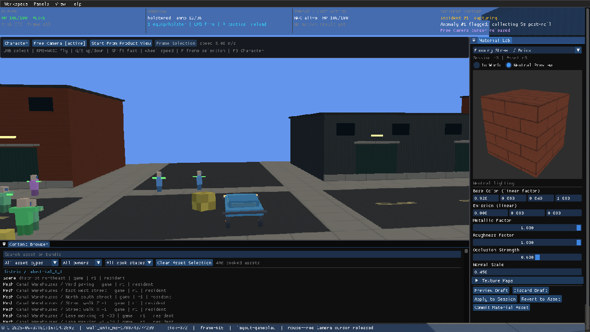
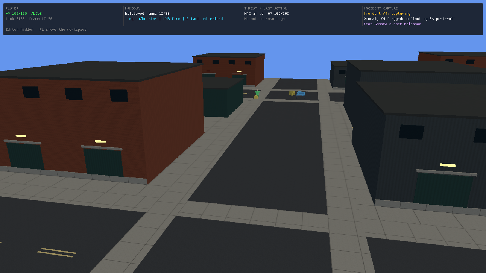

# EA1-B: Material Authoring and Fresh Industrial World

Implemented for Apple Silicon macOS on 2026-09-06. The product owner explicitly
authorized this phase and replacement of the previous evaluation scene. Its
preservation gate, dimensions, and fixture limits do not constrain this world.
[ADR-029](../adr/029-engine-game-authoring-boundary.md) and the
[design](../design/ea1-b-industrial-demo.md) record the updated ownership.

## Delivered

- Full opaque conventional material response: base color, metallic/roughness,
  normal, occlusion, and emission, with optional maps and correct color spaces.
- Stable game material and mesh identities, typed texture dependencies,
  revisioned material values, and explicit mesh bindings.
- One authoring owner for Material Lab and `incinerator-dev`: inspect, preview,
  clear preview, apply, revert, commit, and assignment. Another producer's
  preview and stale revisions reject explicitly.
- Atomic `materials.icmat` writes. A commit saves only the requested material
  or mesh binding; unrelated session edits remain uncommitted. Failed writes
  preserve revisions. Installed runtime builds read the library without an
  editor owner or filesystem mutation capability.
- Material Lab's neutral cube uses the same shader and maps as the world.
  Controls have visible labels at the default panel width. Material/mesh
  selection focuses Material Lab without opening another tab over it.
- A completely new game-owned industrial neighborhood: original geometry and
  textures, road and sidewalk proportions, warehouse and garage frontage,
  loading yards, windows, markings, and lamps. Collision comes from the same
  building dimensions. Connected navigation, destinations, spawns, and passive
  population placements replace the former scene data.

The installed catalog contains 4 scenes, 312 meshes, 36 materials, and 144
textures. Its initial footprint is 128 × 128 metres. These are authored content
counts and dimensions, not new world or asset limits. Scene upload/resident
arrays allocate to actual mesh, material, texture, vertex, index, and instance
counts. Spatial value capacities are composed from the game's generated layout.

## Native and live-owner evidence

[Recorded CLI transactions and restart inspection](ea1-b-material-authoring/native-journey.json).





The native SDL/Metal acceptance exercises actual ImGui item rectangles and
queued SDL events, in Character and Free Camera modes. It edits roughness,
previews, applies, reverts, commits, and reopens the library through the shared
owner. Escape during a held slider cancels the draft; later frames cannot
reapply the cancelled value before pointer release. The focused gate passes
73 tests, including the existing floating-panel pointer journey.

The installed CLI journey discovered IDs and revisions from the current run,
then previewed and cleared a brick material change, applied it, rejected a stale
revision, and committed it. It previewed a different material on a building
shell, applied the binding, and committed it. A fresh product run retained both
saved asset revisions (r3) and exact values. Source regeneration preserves the
canonical material library. Rebuilding installs it for ordinary runtime use.

The final brick tint is linear `[0.92, 0.88, 0.84, 1]`. The Foundry Street
Building 2 shell uses the local Painted Steel material. These are ordinary
saved game assets, not validation-only overrides.

The first native capture identified a Metal resource-order defect: translated
MSL indices followed first use rather than declared GLSL bindings. Shader
translation now preserves decorations, and tests inspect generated Metal
binding indices as well as SPIR-V reflection. Native captures also verify
sRGB output and neutral preview presentation.

The street capture exposed missing texture minification. Textures now generate
complete mip chains and use filtered mip sampling. Residency accounts for all
mip texels while transfer accounting retains only uploaded base-level bytes.
The final Metal images verify that distant brick walls no longer show the
previous broad interference bands.

[Correlated render evidence](ea1-b-material-authoring/render-evidence.json)
records a disposable material preview changing the frame's material hash and
clear-preview restoring the original hash. Both material-change events were
captured in full (2,881 and 2,316 bytes); saved asset values remained unchanged.
Render-state evidence uses the first periodic sample at or after each capture.

## Verification

Run the native gate separately from other native window tests: those processes
share macOS focus and the physical pointer.

```sh
zig build -Deditor=true test --summary all
zig build -Deditor=true test-editor-pointer-macos --summary all
zig build -Deditor=false -Doptimize=ReleaseFast --summary all
zig build -Deditor=true -Dincident-capture=true -Doptimize=ReleaseFast --summary all
zig build -Deditor=true verify-source-package --summary all
```

The final editor aggregate passes **1,281/1,281 tests** (323/323 build steps).
Editor-disabled ReleaseFast builds pass 72/72 steps; editor-enabled ReleaseFast
with incident capture passes 76/76.

The aggregate covers deterministic repeated cooking, complete dependency
closure, map color-space roles, collision/visual agreement, navigation, physical
population placement, save/replay, headless linkage, owner boundaries, typed
protocol/schema/catalog parity, and renderer contracts. The source-package gate
extracts the package and runs its renderer-free contracts plus the headless
product and lifecycle checks. Package evidence includes 447 extracted tests,
56 headless-product tests, and the process lifecycle gate.

## Workflow

```sh
python3 game/industrial/generate.py
zig build run -Deditor=true -- --editor-panels=material_lab,content_browser --editor-focus=material_lab
```

Choose a material or mesh in Content Browser. Edit a draft, preview it in the
world or neutral lighting, Apply to Session, then Commit Material Asset (or
Commit Assignment). Revert restores the saved asset as a new session revision.
`zig build run` sets the explicit source-game material directory. To author from
an installed editor, set `INCINERATOR_MATERIAL_ROOT` to that directory. Without
it, previews/session edits remain available and commits report unavailable.

Agents start with `incinerator-dev agent bootstrap`, then `agent catalog`.
The executable catalog is authoritative for current operation syntax. Discover
current targets and revisions; use the returned run guard; inspect after every
mutation. Material commits are independent of the simulation save slot.

## Intentional contract changes and diagnostic scope

This is a breaking cohort: district recipe 9, district bundle format 4/schema 5,
network protocol 19, deterministic visual schema 2, developer protocol 3 and
agent contract 4 with six endpoint schemas. Old cooked scene content, replay
cohorts, and scene-specific acceptance images are historical. The new logical
content fingerprint is recorded in `config/headless-content.json`; no legacy
scene fallback is installed.

Incident `material_change` records carry producer, typed request/outcome,
revisions, before/after values or bindings, and tick/frame correlation.
`render_state.material_state_sha256` hashes the mesh/material IDs and material
values actually submitted for the frame. Material/texture inspection reports
maps, color spaces, dimensions, dependency identities, and residency.
Material edits affect presentation and are not simulation ingress; logical
accepted-ingress replay does not replay an authoring session. Graphical
comparison requires the matching authored material library.

## Next work

EA2 adds game-owned vehicle archetypes and tuning/visual bindings through the
same authoring pattern. EA3 adds authored lighting; this stage still uses the
existing sun/ambient world light, with no local-light illumination, shadows,
or environment reflections. EA4 adds a general placed-asset map workflow over
the game-owned industrial kit. EA5/G1 proves a separately built game consuming
the engine. Characters and vehicles still use the retained primitive visual
presentation. This is a material/world foundation, not a finished realistic
city or open-world traffic simulation. Neural rendering remains paused.
